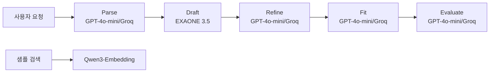

# 🤖 Job-Pocket 모델 선정 근거

> **문서 목적**: Job-Pocket이 사용하는 3종 LLM(EXAONE 3.5, GPT-4o-mini, GPT-OSS-120B)과 임베딩 모델의 선정 기준, 대안 비교, 역할 분담 원칙을 기술한다.
> **작성일**: 2026-04-22
> **버전**: v0.2.0

---

## 1. 선정 기준

### 1.1 기준 항목

모델 선정 시 다음 5가지 항목을 종합 평가했다:

**한국어 품질**: 자소서는 한국어 문어체에 대한 민감도가 높다. 영어 중심 모델은 어색한 표현, 번역체, 조사 오류가 빈번하다.

**추론 품질 vs 지연**: 생성 품질과 응답 시간의 트레이드오프다. 사용자 경험상 30초 이내 응답이 허용 한계다.

**비용**: 개발 단계에서는 토큰 비용이 크지 않지만, 운영 규모 확장 시 누적 비용이 큰 이슈가 된다.

**라이선스**: 상업 사용 허용 여부. 특히 자체 배포(Serverless 등) 시 중요하다.

**배포 유연성**: 클라우드 API 사용과 자체 호스팅 모두를 지원해야 다양한 환경에 대응할 수 있다.

### 1.2 역할별 모델 할당 전략

단일 모델로 모든 단계를 처리하는 대신, **단계별로 강점이 다른 모델을 조합**하는 전략을 택했다:

- 한국어 뉘앙스가 중요한 초안 생성 → 국산 한국어 특화 모델
- 빠르고 정확한 구조화 파싱·첨삭·평가 → 안정적인 범용 모델
- 선택적 고품질 옵션 → 대형 OSS 모델 (Groq의 빠른 추론 활용)

---

## 2. 모델 매트릭스

### 2.1 채택 모델 요약

| 역할 | 모델 | 파라미터 | 배포 | Temperature |
|---|---|---|---|---|
| 초안 생성 | EXAONE 3.5 7.8B | 7.8B | RunPod Serverless / Ollama 로컬 | 0.9 |
| 첨삭 (기본) | GPT-4o-mini | 미공개 | OpenAI API | 0.55 |
| 첨삭 (선택) | GPT-OSS-120B | 120B | Groq API | 0.65 |
| 임베딩 | Qwen3-Embedding-0.6B | 0.6B | 백엔드 컨테이너 내부 (CPU) | — |

### 2.2 역할 분담의 근거



Draft 단계는 창의적 문장 생성이 핵심이며 한국어 문어체 감각이 중요하다 → EXAONE 3.5.

Parse/Refine/Fit/Evaluate 단계는 구조화된 입출력, 안정적 품질, 낮은 지연이 핵심이다 → GPT-4o-mini.

사용자가 품질을 우선시하면 GPT-OSS-120B(Groq)로 전환 가능하다.

---

## 3. EXAONE 3.5 7.8B (초안 생성)

### 3.1 개요

LG AI Research가 공개한 한국어 특화 LLM이다. 7.8B 파라미터 규모로, 32K 컨텍스트 윈도우를 지원한다. 한국어/영어 이중 언어 모델이며, 한국어 말뭉치 비중이 타 영어 중심 모델보다 훨씬 높다.

### 3.2 선정 이유

**한국어 자소서의 문어체 정확도**: GPT-4나 Claude 같은 최상위 모델은 한국어 구사도 충분히 하지만, "자소서다운 담백한 톤"의 미세한 뉘앙스에서 국산 모델이 더 자연스럽다. 특히 "실현하겠습니다" → "기여하고 싶습니다"처럼 한국 자소서 관용구 회피가 더 잘 된다.

**상업 사용 라이선스**: EXAONE 3.5 7.8B는 Research License를 통해 공개되어 상업 활용이 가능한 범위가 명확하다. 이는 자체 배포 필수 요건이다.

**자체 배포 가능성**: 7.8B 규모는 24GB VRAM GPU 하나로 FP16 추론 가능하다. RunPod A10/A40 급에서 비용 효율적으로 서빙할 수 있다.

### 3.3 배포 방식

두 가지 경로로 사용한다:

**로컬 개발**: Ollama로 실행 (`exaone3.5:7.8b`). 개발자가 로컬 GPU로 빠르게 테스트 가능.

**프로덕션**: RunPod Serverless Endpoint. `runpod-flash` 데코레이터로 `exaone_infer` 함수를 Serverless로 배포하며, 요청이 없을 때 과금되지 않는다.

```python
# backend/services/exaone_infer.py
# @Endpoint(
#     name="exaone-infer-prod",
#     gpu=RUNPOD_GPU,
#     datacenter=RUNPOD_DATACENTER,
#     volume=get_runpod_volume(),
#     dependencies=["torch", "transformers>=4.43"],
# )
async def exaone_infer(data: dict):
    model = AutoModelForCausalLM.from_pretrained(
        "/runpod-volume/exaone-3.5-7.8b",
        torch_dtype=torch.float16,
        ...
    ).to("cuda")
    ...
```

모델 가중치는 RunPod Volume에 미리 업로드되어 콜드 스타트 시 로드된다. 동일 컨테이너 재호출 시 전역 변수 캐싱으로 재로드 비용을 줄인다.

### 3.4 Temperature 0.9의 이유

Draft 단계는 다양한 초안 후보를 탐색하고, 이후 품질 검증(`score_local_draft`)이 필터 역할을 한다. 높은 temperature는 재시도 시 다른 방향의 초안을 생성하여 재생성 성공률을 높인다.

---

## 4. GPT-4o-mini (첨삭·평가 기본)

### 4.1 선정 이유

**비용 효율**: GPT-4o 대비 1/10 수준의 토큰 비용으로 상당한 품질을 제공한다. 개발 단계의 반복 테스트 부담이 낮다.

**안정적 출력 형식**: JSON 구조화 출력(Parse 단계)과 고정 템플릿 출력(Evaluate 단계)에서 GPT 계열은 지시 준수율이 매우 높다. Instruction tuning 품질이 국산 모델보다 더 성숙하다.

**낮은 지연**: 평균 응답 시간이 EXAONE 대비 빠르다. 4단계(Parse, Refine, Fit, Evaluate)를 모두 합산하면 지연 누적이 크기 때문에 단계당 지연이 중요하다.

**한국어 정확성**: 한국어 문법·맞춤법 정확성은 EXAONE보다 오히려 안정적이다. "틀린 한국어"를 거의 생성하지 않는다.

### 4.2 대안 비교

| 옵션 | 장점 | 단점 | 평가 |
|---|---|---|---|
| GPT-4o-mini (선택) | 비용·지연·품질 균형 | OpenAI 의존 | ★★★★★ |
| GPT-4o | 최고 품질 | 비용 10배 | 과다 투자 |
| Claude Haiku | GPT-4o-mini보다 한국어 우수 | 접근성 낮음 | 대안 검토 가능 |
| Gemini Flash | 빠름 | 한국어 품질 편차 | 품질 미달 |

### 4.3 Temperature 0.55의 이유

일관성과 변동성의 균형점이다. 너무 낮으면(0.3 이하) 첨삭 문장이 기계적이고 반복적이 된다. 너무 높으면(0.8 이상) 원본 초안의 방향이 흔들린다.

---

## 5. GPT-OSS-120B via Groq (첨삭·평가 선택)

### 5.1 선정 이유

**Groq의 초저지연 추론**: 일반 GPU 서빙 대비 10배 빠른 토큰 생성 속도를 제공한다. 120B 모델임에도 GPT-4o-mini 수준의 응답 시간에 가깝다.

**오픈소스 라이선스**: GPT-OSS는 OpenAI가 공개한 오픈 웨이트 모델이다. 자체 호스팅 옵션이 존재하며, 벤더 락인 위험이 낮다.

**사용자 선택권**: 기본 모델로 부족함을 느끼는 사용자에게 "고성능 옵션"을 제공하여 사용성을 개선한다. Frontend의 사이드바에서 `"GPT-OSS-120B (Groq)"` 선택 가능하다.

### 5.2 활용 범위 제한

Draft 단계에는 GPT-OSS-120B를 사용하지 않는다. Draft는 한국어 문어체 품질이 우선이므로 EXAONE이 더 적합하다. GPT-OSS-120B는 Refine/Fit/Evaluate에만 적용된다.

```python
def choose_refine_llm(selected_model: str):
    if "GPT-OSS-120B" in selected_model:
        return llm_groq
    return llm_gpt
```

### 5.3 Temperature 0.65의 이유

120B 규모는 7.8B EXAONE보다 출력이 더 보수적이다. 약간 높은 temperature(0.55 → 0.65)로 창의성을 보완하여 문체 다양성을 확보한다.

---

## 6. Qwen3-Embedding-0.6B (임베딩)

### 6.1 선정 이유

**한국어 성능**: Qwen3 시리즈는 중국어·영어 중심이지만 한국어 처리도 평균 이상이다. MTEB 벤치마크의 한국어 하위 태스크에서 경쟁력 있는 점수를 보인다.

**경량성**: 0.6B 파라미터로 CPU 추론에 적합하다. Backend 컨테이너 내부에서 GPU 없이 운영 가능하여 인프라 단순성을 확보한다.

**1024차원 출력**: 벤치마크 결과 대비 차원 크기가 적절하다. 더 큰 차원(1536, 2048)은 검색 정확도 이득이 작은 반면 저장·연산 비용이 크다.

**정규화 임베딩**: `normalize_embeddings=True` 옵션으로 L2 norm이 1로 정규화되어, FAISS의 L2 distance가 cosine similarity와 동치가 된다. 한국어 텍스트 유사도 비교에서 cosine이 안정적인 결과를 보인다.

### 6.2 대안 비교

| 모델 | 차원 | 크기 | 한국어 품질 | 선정 여부 |
|---|---|---|---|---|
| Qwen3-Embedding-0.6B (선택) | 1024 | ~1.2GB | 우수 | ★ |
| BGE-M3 | 1024 | ~2.3GB | 우수 | 대안 |
| KoSimCSE | 768 | ~420MB | 매우 우수 | 구버전 |
| OpenAI text-embedding-3-small | 1536 | API | 우수 | 비용 이슈 |
| ko-sroberta-multitask | 768 | ~430MB | 우수 | 대안 |

### 6.3 CPU 선택의 이유

임베딩 추론은 자소서 검색 쿼리 1건당 1회 발생한다. 쿼리 빈도가 높지 않고(사용자가 자소서 생성을 연속으로 하지는 않음), 0.6B 모델의 CPU 추론은 1초 이내로 충분히 빠르다. GPU 할당이 불필요하여 인프라 비용을 절감한다.

상세 임베딩 분석은 `docs/wiki/model/embedding.md`를 참조한다.

---

## 7. 비용 분석

### 7.1 예상 비용 (월간, 사용자 1000명 기준)

| 항목 | 월간 사용량 추정 | 단가 (대략) | 월간 비용 |
|---|---|---|---|
| GPT-4o-mini 입력 | 10M tokens | $0.15 / 1M | $1.5 |
| GPT-4o-mini 출력 | 3M tokens | $0.60 / 1M | $1.8 |
| Groq GPT-OSS (선택) | 10% 사용자 | 사용량 기반 | ~$5 |
| RunPod (EXAONE) | A10 10시간 | $0.44/hr | $4.4 |
| LangSmith | 무료 tier | — | $0 |
| **합계** | | | **~$13/월** |

이는 매우 대략적인 추정이며, 실제 사용량에 따라 크게 달라진다. 정확한 비용 분석은 v0.3.0에서 사용자 세그먼트별로 재산정한다.

### 7.2 비용 최적화 전략

**RAG로 LLM 토큰 절감**: 사용자 자소서 샘플을 검색하여 주입하므로, LLM이 샘플을 "학습"할 필요가 없다. 같은 품질을 더 적은 파라미터·토큰으로 달성.

**Draft만 EXAONE, 나머지 GPT-4o-mini**: 가장 긴 출력(Draft)을 자체 호스팅으로 처리하여 OpenAI API 토큰 비용 절감.

**재시도 제한**: 재생성은 최대 3회로 제한하여 실패 시나리오의 비용 폭증 방지.

---

## 8. 모델 성능 평가 계획

### 8.1 현재 상태

v0.2.0은 정량 평가 지표를 아직 수집하지 않았다. 수동 검토 기반 품질 조정만 수행한 상태다.

### 8.2 v0.3.0 평가 계획

| 지표 | 대상 | 도구 |
|---|---|---|
| Retrieval Recall@3 | HybridRetriever | 자체 스크립트 |
| MRR (Mean Reciprocal Rank) | HybridRetriever | 자체 스크립트 |
| BLEU / ROUGE | Draft 품질 | `evaluate` 라이브러리 |
| G-Eval | Draft 품질 (LLM-as-judge) | DeepEval |
| 평가 일관성 | Evaluate 단계 | 같은 입력 5회 실행 후 분산 측정 |
| 응답 시간 | 전체 파이프라인 | LangSmith |

골든 셋(30~50건)을 구축하여 지속적 평가 체계를 만든다.

### 8.3 회귀 모니터링

프롬프트나 모델 변경 시 골든 셋으로 회귀 검증한다. 지표가 5% 이상 하락하면 변경을 되돌린다. 이 체계는 v0.4.0 최적화 단계에서 자동화할 예정이다.

---

## 9. 향후 검토

### 9.1 EXAONE 3.5 대체 후보

| 후보 | 이유 |
|---|---|
| EXAONE 4.0 (출시 시) | 동일 시리즈 상위 버전 |
| HyperCLOVA X | 네이버 한국어 모델 (상업 사용 조건 확인 필요) |
| Solar Mini | Upstage 한국어 모델 |
| KULLM | 고려대 공개 한국어 모델 |

### 9.2 멀티모달 확장

현재는 텍스트 전용이지만, 향후 이미지(포트폴리오, 수상 증명) 업로드 후 자소서에 반영하는 기능을 검토한다. 이 경우 Vision 기능이 있는 GPT-4o나 Claude Sonnet 3.5를 Refine 단계에 추가 도입한다.

### 9.3 파인튜닝 검토

v0.5.0 단계에서 EXAONE 3.5 7.8B를 국내 공개 자소서 데이터셋으로 경량 파인튜닝(LoRA)하는 방안을 검토한다. 이는 프롬프트만으로 달성하기 어려운 톤 일관성 문제에 대한 근본적 해결책이 될 수 있다.

---

## 10. 관련 문서

| 주제 | 문서 |
|---|---|
| 임베딩 모델 상세 | `docs/wiki/model/embedding.md` |
| 프롬프트 전략 | `docs/wiki/model/prompt.md` |
| RAG 파이프라인 | `docs/wiki/model/rag_pipeline.md` |

---

*last updated: 2026-04-22 | 조라에몽 팀*
