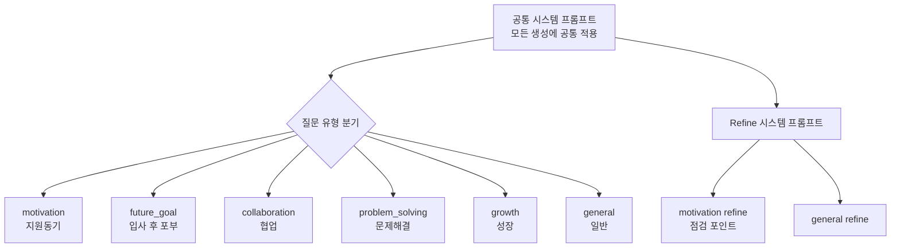

# ✍️ Job-Pocket 프롬프트 엔지니어링 전략

> **문서 목적**: 6단계 파이프라인 각 단계의 프롬프트 설계 원칙, 질문 유형별 시스템 프롬프트 분기, 품질 보장 메커니즘을 기술한다.
> **작성일**: 2026-04-22
> **버전**: v0.2.0
> **관련 파일**: `backend/services/chat_logic.py`

---

## 1. 설계 철학

### 1.1 "새로 쓰지 않는다"

프롬프트 엔지니어링의 첫 번째 원칙은 LLM이 **사용자 정보 안에서만 글을 쓰도록** 제약하는 것이다. 자소서에서 흔한 실패 모드는 LLM이 그럴듯한 경험이나 수치를 만들어내는 것이다. 이는 채용 프로세스에서 거짓 진술이 되어 치명적 문제를 일으킬 수 있다. 모든 시스템 프롬프트는 "없는 경험, 없는 수치, 없는 성과를 절대 추가하지 않는다"는 원칙을 명시한다.

### 1.2 "샘플은 참고만"

RAG로 가져온 유사 자소서 샘플은 **표현 패턴 참고용**이지 복사 대상이 아니다. LLM이 샘플 문장을 그대로 또는 부분적으로 이어 붙이면 표절이 된다. 프롬프트는 이를 명시적으로 금지하고, 대신 공통 강점·서술 구조·표현 톤을 추상화한 "스타일 규칙"을 주입한다.

### 1.3 "담백하고 설득력 있게"

한국 자소서의 전형적 오염 표현("차별화된 경쟁력 확보", "사회적 영향력 확대", "혁신을 선도" 등)을 배제한다. 프롬프트는 이런 기업 홍보성 문구를 피하고 담백하면서도 설득력 있는 톤을 요구한다. 9가지 금지어는 코드에 명시되어 생성 후 필터링에도 사용된다.

### 1.4 "문항 유형별 분기"

자소서 문항은 질문 의도에 따라 다른 서술 프레임을 요구한다. 지원동기는 회사·직무와의 연결을 드러내야 하고, 문제해결은 인식→원인→해결→결과 흐름이 명확해야 한다. 시스템 프롬프트는 6가지 문항 유형별로 분기되어 각각 최적화된 지시를 포함한다.

---

## 2. 프롬프트 아키텍처

### 2.1 계층 구조



### 2.2 단계별 프롬프트

| 단계 | 함수 | 주 LLM | 프롬프트 목적 |
|---|---|---|---|
| Parse | `llm_parse_user_request` | GPT-4o-mini / Groq | 자연어 → 구조화 JSON |
| Draft | `build_local_draft` | EXAONE 3.5 | RAG 컨텍스트 + 이력 기반 초안 생성 |
| Sample Summary | `summarize_samples` | GPT-4o-mini / Groq | 유사 샘플의 공통 패턴 추출 |
| Style Rules | `extract_sample_style_rules` | GPT-4o-mini / Groq | 패턴 → 작성 규칙 4개 |
| Revise | `revise_existing_draft` | GPT-4o-mini / Groq | 기존 초안을 요청에 맞춰 수정 |
| Refine | `refine_with_api` | GPT-4o-mini / Groq | 문체·연결 다듬기 |
| Fit | `fit_length_if_needed` | GPT-4o-mini / Groq | 글자 수 조정 |
| Evaluate | `evaluate_draft_with_api` | GPT-4o-mini / Groq | 본문 평가 + 보완 포인트 |

---

## 3. 공통 시스템 프롬프트

모든 초안 생성(`build_local_draft`, `build_draft_with_ollama`)은 공통 규칙으로 시작한다:

```
당신은 한국어 자기소개서 초안 작성 도우미다.
반드시 한국어로만 작성하라.

공통 규칙:
- 사용자 정보 안에서만 소재를 고른다.
- 없는 경험, 없는 수치, 없는 성과를 절대 추가하지 않는다.
- 샘플은 회사 정보가 아니라 표현 패턴 참고용이다.
- 샘플 문장을 복사하거나 부분적으로 이어 붙이지 말라.
- 실제 회사 정보는 사용자 입력 범위만 반영하라.
- 회사에 대한 구체 사업 내용이나 내부 프로젝트는 추측하지 말라.
- 문체는 담백하면서도 설득력 있게 유지하라.
- 자기소개서 본문만 작성하라.
- 사용자의 경험을 단순 나열하지 말고, 문항과 연결되는 이유를 분명히 드러내라.
- 너무 짧거나 메마르게 쓰지 말고, 2~3문단 정도로 자연스럽게 구성하라.
- 과장된 기업 홍보 문구처럼 쓰지 말라.
- '차별화된 경쟁력 확보', '사회적 영향력 확대', '혁신을 선도' 같은 표현은 피하라.
```

### 3.1 규칙 근거

각 규칙은 실제 관찰된 실패 모드에 대응한다:

| 규칙 | 대응하는 실패 모드 |
|---|---|
| "사용자 정보 안에서만" | 가상의 경험을 창작하는 환각 |
| "없는 수치를 추가하지 않는다" | "매출 120% 증가" 같은 구체 허위 숫자 |
| "샘플 문장을 복사하지 말라" | RAG 컨텍스트의 문장 직접 재사용 |
| "회사 내부 프로젝트를 추측하지 말라" | 실제와 다른 회사 사업 내용 서술 |
| "2~3문단 구성" | 한 문단의 장황한 서술 |
| 금지 표현 리스트 | 기업 홍보 문구 남발 |

---

## 4. 질문 유형별 프롬프트

### 4.1 Motivation (지원동기)

```
이 문항은 지원동기 문항이다.

반드시 아래 흐름을 우선하라:
1. 실제 지원 회사와 직무에 관심을 갖게 된 이유를 먼저 밝힌다.
2. 그 관심이 사용자의 경험이나 관점과 어떻게 이어지는지 구체적으로 보여준다.
3. 마지막은 입사 후 어떤 방식으로 기여하고 싶은지로 마무리한다.

중요:
- 첫 문장이 곧바로 지원 이유가 되게 써라.
- 사용자의 강점이 단순 분석이 아니라 데이터 구조화, 기준 정리, 
  활용 가능한 형태로 연결하는 관점으로 보이게 하라.
- 마지막 문단은 과장된 포부 대신 현실적인 기여 방식으로 끝내라.
```

**이 유형의 품질 검증**: 회사명이 본문에 포함되지 않으면 재생성한다. 첫 문단이 40자 미만이면 재생성한다.

### 4.2 Future Goal (입사 후 포부)

```
이 문항은 입사 후 포부 문항이다.
현재 경험을 바탕으로 입사 후 배우고 기여할 방향을 구체적으로 써라.
```

현재 역량 → 입사 후 성장 계획의 흐름을 유도한다. 추상적 포부보다 구체적 학습 방향을 강조한다.

### 4.3 Collaboration (협업)

```
이 문항은 협업 문항이다.
역할 분담보다 기준 정렬, 전달 조율, 연결을 중심으로 써라.
```

일반적으로 협업 경험은 역할 분담 서술에 그치기 쉬운데, 더 변별력 있는 "기준 정렬·전달 조율·연결"이라는 관점을 유도한다.

### 4.4 Problem Solving (문제해결)

```
이 문항은 문제 해결 문항이다.
문제 인식 → 원인 파악 → 기준 정리 → 해결 방식 → 결과 흐름으로 써라.
```

5단계 구조를 명시하여 논리적 전개를 유도한다.

### 4.5 Growth (성장)

```
이 문항은 성장/노력 문항이다.
무엇을 배우려 했고, 어떤 기준을 새로 세웠는지가 드러나게 써라.
```

결과 중심 서술보다 과정 중심 서술을 유도한다.

### 4.6 General (일반)

```
문항 의도에 맞는 흐름을 먼저 세우고 가장 관련 있는 경험 중심으로 써라.
```

특정 유형으로 분류되지 않은 문항에 대한 기본 지시다.

---

## 5. 초안 생성 프롬프트 (Human 메시지)

시스템 프롬프트 뒤에 붙는 Human 메시지는 다음 구조로 구성된다:

```
[지원자 정보]
- 성별: {gender}
- 학교: {school}
- 전공: {major}
- 직무 관련 경험: {exp}
- 수상 및 대외활동: {awards}
- 기술 스택 / 자격증: {tech}

[사용자 요청 원문]
{user_message}

[실제 지원 정보]
- 실제 지원 회사명: {company}
- 실제 지원 직무명: {job}
- 문항: {question}
- 문항 유형: {question_type}
- 글자 수 제한: {char_limit}

[유사 샘플 패턴 요약]
{sample_summary}

[샘플 기반 작성 규칙]
{style_rules}

[유사 샘플 원문 발췌]
{sample_excerpt}

요구사항:
- 샘플은 표현 패턴과 강점 서술 방식을 참고하는 용도로만 활용하라.
- 실제 회사명과 직무명은 사용자 입력 기준으로만 반영하라.
- 샘플 문장을 베끼지 말고, 사용자 이력으로 새롭게 써라.
- 사용자를 단순히 분석 툴을 쓴 사람처럼 쓰지 말고, 
  데이터를 구조화하고 기준을 정리해 활용 가능한 형태로 연결한 사람처럼 보이게 하라.
- 자기소개서 본문 초안만 써라.
```

### 5.1 5개 블록의 역할

| 블록 | 출처 | 역할 |
|---|---|---|
| 지원자 정보 | `users.resume_data` | 소재의 제약 범위 |
| 사용자 요청 원문 | `user_message` | 원본 의도 보존 |
| 실제 지원 정보 | `parse_user_request` 결과 | 회사명/직무명 정확 반영 |
| 샘플 패턴 요약 | `summarize_samples` (LLM) | 서술 스타일 가이드 |
| 샘플 기반 작성 규칙 | `extract_sample_style_rules` (LLM) | 실행 가능한 규칙 |

5번째 "유사 샘플 원문 발췌"는 LLM이 문체를 감지할 수 있는 구체적 예시를 제공하되, 샘플당 최대 700자로 제한하여 복사 위험을 줄인다.

---

## 6. Sample Summary 프롬프트

RAG로 검색된 3개 샘플에서 공통 패턴을 추출한다.

```
너는 문자열 형태의 유사 자소서 샘플들에서 패턴을 추출하는 도우미다.
반드시 한국어로만 작성하라.

중요:
- 샘플은 회사 정보가 아니라 표현 패턴 참고용이다.
- 특정 회사나 직무를 추측하지 말라.
- 샘플 문장을 그대로 베끼지 말고 패턴만 요약하라.
- 출력은 아래 형식만 따르라.

출력 형식:
공통 강점:
- ...
- ...
- ...

서술 구조:
- ...
- ...
- ...

표현 톤:
- ...
- ...
- ...

피해야 할 점:
- ...
- ...
```

### 6.1 4개 섹션의 이유

**공통 강점**: 샘플들이 공통적으로 강조하는 역량 특성을 추출. 자소서의 "무엇을" 결정.

**서술 구조**: 문장과 문단 전개 방식을 추상화. "어떻게 쓸지" 결정.

**표현 톤**: 문체와 어휘의 특징. 담백/공격적/분석적 등 톤의 결정.

**피해야 할 점**: 샘플들이 공통으로 피하는 표현. 부정적 제약을 명시화.

---

## 7. Refine 프롬프트

초안을 GPT-4o-mini/Groq로 첨삭한다. 시스템 프롬프트:

```
당신은 한국어 자기소개서 첨삭 전문가다.
역할은 새로 쓰는 것이 아니라, 이미 작성된 초안을 더 설득력 있게 다듬는 것이다.

공통 규칙:
- 반드시 한국어로만 작성
- 없는 경험, 없는 수치, 없는 성과 추가 금지
- 문체는 담백하면서도 설득력 있게 유지
- 반복 표현과 어색한 연결을 정리
- 제목, 평가, 설명문 없이 본문만 출력
- 지나치게 축약해 글의 힘이 빠지지 않게 할 것
- 과장된 표현이나 기업 홍보 문구처럼 보이는 문장은 줄일 것
- 실제 회사 정보는 사용자 입력 범위를 넘어서 추측하지 말 것
```

Motivation 유형의 추가 점검 사항:

```
지원동기 문항에서는 아래를 우선 점검하라:
- 첫 문장이 회사 지원 이유로 바로 시작하는가
- 실제 지원 회사/직무와 사용자 경험이 자연스럽게 이어지는가
- 사용자의 강점이 '분석 결과 제시'보다 '구조와 기준 정리' 쪽으로 드러나는가
- 마지막이 추상적 다짐이 아니라 실제 기여 방향으로 끝나는가
```

### 7.1 "새로 쓰지 않는다"의 의미

Refine 단계는 Draft 단계와 명확히 구분된다. Draft는 RAG 컨텍스트를 참고하여 "새 초안"을 생성하지만, Refine은 "기존 초안의 방향을 유지한 채" 문체만 다듬는다. 이 역할 분리로 두 단계가 중복 기능을 하지 않게 한다.

---

## 8. Evaluate 프롬프트

최종 평가 생성 프롬프트는 출력 형식을 엄격히 지정한다:

```
출력 형식:
평가 결과: <좋다 / 보통 / 아쉬움>
이유: <한 문장>
보완 포인트:
- <포인트 1>
- <포인트 2>

규칙:
- 2개의 보완 포인트만 작성
- 보완 포인트는 실제 수정에 바로 쓸 수 있게 구체적이고 짧게 작성
- 'AI 표절률', '유사도', '탐지율' 같은 표현은 절대 쓰지 말 것
- 실제 회사 정보는 사용자 입력 범위를 넘어서 추측하지 말 것
```

### 8.1 평가의 7가지 관점

Human 메시지는 다음 관점을 평가 기준으로 제시한다:

- 문항 적합성
- 직무 적합성
- 사용자 이력 반영도
- 첫 문장 완성도
- 마지막 문단 완성도
- 과장 표현 여부
- 수정본이면 요청 방향 반영 여부

### 8.2 포맷 제약의 이유

고정 형식(`평가 결과:`, `이유:`, `보완 포인트:`)은 Frontend의 `parse_evaluation_for_display` 함수가 파싱할 수 있도록 하기 위함이다. 평가 결과는 3단계(좋다/보통/아쉬움)로 고정하여 UI의 색상·아이콘과 매핑한다.

### 8.3 "AI 표절률" 금지의 이유

GPT 계열 모델은 종종 "AI 표절률이 낮아 보입니다", "AI 탐지율에 주의하세요" 같은 메타 코멘트를 생성하는데, 이는 자소서 평가의 본질과 무관하며 사용자에게 혼란을 준다. 프롬프트에서 명시적으로 금지한다.

---

## 9. Parse 프롬프트

자연어 요청을 JSON으로 구조화한다:

```
너는 자기소개서 요청 문장을 구조화하는 파서다.
반드시 JSON만 출력하라.
키는 아래만 사용하라:
company, job, question, char_limit, question_type

규칙:
- 없는 값은 빈 문자열 또는 null
- question_type은 아래 중 하나만:
  motivation, future_goal, collaboration, problem_solving, growth, general
- 사용자의 표현을 과도하게 바꾸지 말고 핵심만 추출
```

### 9.1 Regex Fallback

LLM 파서 전에 정규표현식 기반 파서(`parse_user_request_regex`)가 먼저 동작한다. 비용·지연 없이 명확한 패턴을 빠르게 추출한다:

| 정규식 | 추출 대상 |
|---|---|
| `(\d{3,4})\s*자\s*이내` | 글자 수 제한 |
| `(회사\|기업\|지원회사)\s*[:：]\s*(.+)` | 회사명 (명시 형) |
| `(.+?)에\s+(.+?)\s*직무로\s+지원` | 회사명 + 직무 (자연어 형) |
| `(.+?)(?:를\|을)\s*물어봤` | 문항 |

Regex가 모든 필드를 채우지 못한 경우에만 LLM 파서로 보강한다. 이 이중 전략은 명확한 입력에서는 빠르고 저렴하며, 복잡한 입력에서는 LLM의 유연성을 활용한다.

---

## 10. 프롬프트 품질 관리

### 10.1 Temperature 설정

| 단계 | Temperature | 이유 |
|---|---|---|
| EXAONE (Draft) | 0.9 | 다양한 초안 탐색 |
| GPT-4o-mini (Refine/Eval) | 0.55 | 안정적이고 일관된 출력 |
| GPT-OSS-120B (Groq) | 0.65 | 창의성과 일관성의 중간 |

Draft 단계는 높은 temperature로 후보 다양성을 확보하되, 품질 검증으로 필터링한다. 이후 단계는 낮은 temperature로 예측 가능한 결과를 낸다.

### 10.2 후처리 필터링

LLM 출력에 남기 쉬운 노이즈를 `remove_forbidden_headers` 함수가 제거한다:

- `[평가 및 코멘트]` 이후 내용 (Draft 단계에서 평가가 같이 나오는 경우)
- `[자소서 초안]`, `[N차 수정안]` 같은 라벨
- `초안:`, `본문:` 같은 메타 레이블
- `반영 사항: ...` 줄 (Draft에서 발생 시 제거)

또한 `clean_text`가 개행 정규화(`\r\n` → `\n`, 3연속 개행 → 2연속)를 수행한다.

### 10.3 재생성 조건

품질 검증(`score_local_draft`)이 5가지 기준을 확인한다. 실패 시 실패 사유를 추가 지시로 프롬프트에 주입하여 최대 3회까지 재생성한다:

```
추가 지시: 이전 초안은 '문장 반복이 많습니다' 문제가 있었어. 
실제 지원 회사명과 직무가 더 선명하게 드러나게 하고, 
사용자의 강점이 단순 분석이 아니라 데이터 구조화와 
기준 정리 쪽으로 보이게 다시 써줘. 샘플은 참고만 하고 문장은 새롭게 써줘.
```

이 재시도 메커니즘은 품질 안정화의 핵심이다.

---

## 11. Fallback 프롬프트

LLM 호출 실패 시 결정론적 응답을 반환하는 fallback이 곳곳에 마련되어 있다.

### 11.1 Sample Summary Fallback

샘플 요약 LLM이 실패하거나 샘플이 없을 때, 일반적인 "데이터 관련 직군" 프리셋을 반환한다:

```
공통 강점:
- 데이터를 활용 가능한 형태로 정리하는 관심
...
```

### 11.2 Evaluation Fallback

평가 LLM 실패 시 본문 길이 기반 결정론적 평가:

```python
result_label = "좋다" if current_len >= 300 else "보통"
```

Fallback은 UX 연속성을 보장하되 LLM 기반 응답보다 품질이 낮으므로, 관측 시스템에서 Fallback 호출률을 모니터링해야 한다.

---

## 12. 관련 문서

| 주제 | 문서 |
|---|---|
| RAG 파이프라인 | `docs/wiki/model/rag_pipeline.md` |
| 모델 선정 근거 | `docs/wiki/model/model_selection.md` |
| 임베딩 모델 | `docs/wiki/model/embedding.md` |
| 백엔드 아키텍처 | `docs/wiki/backend/architecture.md` |

---

*last updated: 2026-04-22 | 조라에몽 팀*
