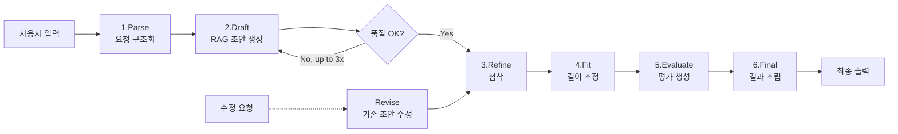
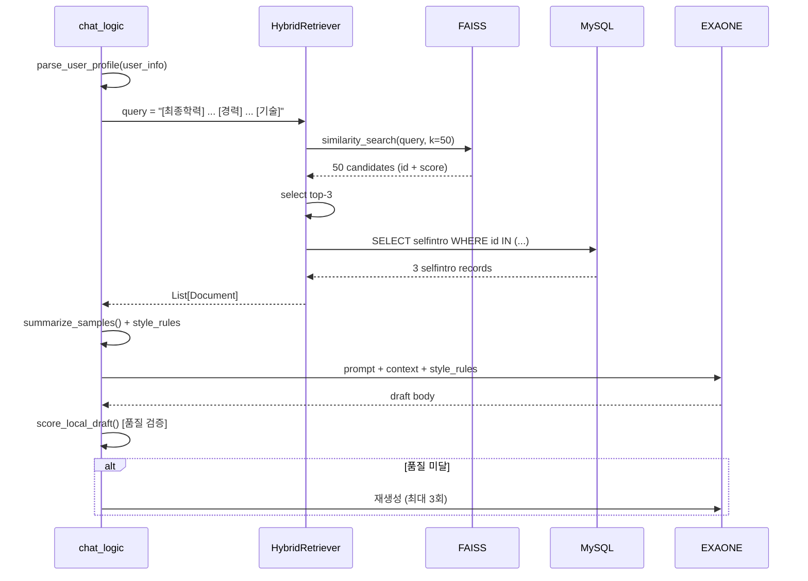

# 🔄 Job-Pocket RAG 파이프라인

> **문서 목적**: Job-Pocket이 구현한 6단계 RAG(Retrieval-Augmented Generation) 파이프라인의 동작 원리, 각 단계별 입출력, 프롬프트 전략, 품질 보장 메커니즘을 기술한다.
> **작성일**: 2026-04-22
> **버전**: v0.2.0
> **관련 파일**: `backend/services/chat_logic.py`, `backend/retriever.py`, `backend/routers/chat.py`

---

## 1. 파이프라인 개요

### 1.1 설계 원칙

전통적인 단일 단계 RAG (검색→생성) 대신, 본 서비스는 **품질 중심의 다단계 파이프라인**을 구현했다. 자기소개서는 단순 정보 요약이 아니라 "사용자 이력을 기반으로 새롭게 구성된 설득력 있는 글"이어야 하므로, 한 번의 생성으로 품질을 보장하기 어렵다. 따라서 생성 → 재생성(품질 미달 시) → 첨삭 → 길이 조정 → 평가의 다단계를 거쳐 결과물의 완성도를 단계적으로 끌어올린다.

### 1.2 파이프라인 구조



### 1.3 단계별 책임 요약

| # | 단계 | 주 엔진 | 입력 | 출력 |
|---|---|---|---|---|
| 1 | Parse | GPT-4o-mini / Groq (fallback: Regex) | 자연어 요청 | 구조화 JSON |
| 2 | Draft | EXAONE 3.5 (Ollama/RunPod) | 구조화 요청 + RAG 컨텍스트 | 자소서 초안 |
| 3 | Refine | GPT-4o-mini / Groq | 초안 + 요청 | 첨삭본 |
| 4 | Fit | GPT-4o-mini / Groq | 첨삭본 + 글자 수 제약 | 길이 조정본 |
| 5 | Evaluate | GPT-4o-mini / Groq | 최종본 | 평가 텍스트 |
| 6 | Final | — (조립만) | 본문 + 평가 | 사용자 응답 |

별도 경로: **Revise** (`revise_existing_draft`)는 기존 초안에 대한 사용자 수정 요청을 처리한다.

---

## 2. Step 1: Parse (요청 구조화)

### 2.1 목적

사용자의 자연어 요청("네이버에 백엔드 직무로 지원하는데 지원동기를 500자 내외로 써줘")을 파이프라인이 활용할 수 있는 **구조화된 JSON**으로 변환한다.

### 2.2 출력 스키마

```json
{
  "company": "네이버",
  "job": "백엔드",
  "question": "지원동기",
  "char_limit": 500,
  "question_type": "motivation"
}
```

### 2.3 이중 전략 (Regex → LLM)

1차로 정규표현식 기반 파서(`parse_user_request_regex`)가 빠르게 필드를 추출한다. 규칙적 패턴(`"회사:"`, `"N자 이내"` 등)은 Regex가 LLM보다 빠르고 비용이 없다.

2차로 Regex가 충분히 못 뽑은 경우에만 LLM 파서(`llm_parse_user_request`)가 동작한다. 판정 조건은 `company`나 `job`이 비었거나 `question_type`이 `general`인 경우다.

### 2.4 질문 유형 분류

자소서 문항을 6가지 유형으로 자동 분류한다. 각 유형은 이후 단계의 프롬프트 분기에 활용된다.

| 유형 | 키워드 예시 | 서술 프레임 |
|---|---|---|
| `motivation` | 지원 이유, 지원동기, 왜 지원 | 지원 이유 → 경험 연결 → 기여 방식 |
| `future_goal` | 입사 후 포부, 포부 | 현재 역량 → 입사 후 성장 계획 |
| `collaboration` | 협업, 팀워크, 소통 | 기준 정렬 → 전달 조율 → 연결 |
| `problem_solving` | 문제 해결, 어려움, 개선 | 인식 → 원인 → 기준 → 해결 → 결과 |
| `growth` | 성장, 노력, 배움 | 학습 동기 → 시도 → 변화 |
| `general` | (위에 해당 없음) | 문항 의도 분석 후 자유 구성 |

---

## 3. Step 2: Draft (RAG 초안 생성)

### 3.1 흐름



### 3.2 검색 쿼리 구성

사용자의 이력 정보로부터 검색 쿼리를 구성한다:

```
[최종학력] ○○대학교 컴퓨터공학
[경력 및 경험]
ABC 인턴 3개월 (데이터 파이프라인)
2024 교내 해커톤 대상
[기술 및 역량]
Python, SQL, Docker
```

이 쿼리를 Qwen3-Embedding-0.6B로 1024차원 임베딩 후 FAISS에서 유사도 검색한다.

### 3.3 프롬프트 컨텍스트 구성

초안 생성 프롬프트는 다음 요소로 구성된다:

- **[지원자 정보]**: 성별, 학교, 전공, 경험, 수상, 기술 스택
- **[사용자 요청 원문]**: 원본 자연어 요청
- **[실제 지원 정보]**: 파싱된 회사명, 직무명, 문항, 유형, 글자 수
- **[유사 샘플 패턴 요약]**: `summarize_samples()`로 추출한 공통 강점·서술 구조·표현 톤
- **[샘플 기반 작성 규칙]**: 요약에서 추출한 4개의 작성 규칙
- **[유사 샘플 원문 발췌]**: 검색된 자소서 원문 (샘플당 최대 700자)

### 3.4 시스템 프롬프트 (질문 유형별 분기)

`get_local_system_prompt(question_type)`이 공통 규칙 + 유형별 규칙을 조합해 시스템 프롬프트를 생성한다. 공통 규칙의 핵심 원칙은 다음과 같다.

원칙 1: 사용자 정보 범위 안에서만 소재를 선택하고, 없는 경험·수치·성과를 추가하지 않는다 (환각 방지).

원칙 2: 샘플은 표현 패턴 참고용이며, 문장을 복사하거나 부분적으로 이어 붙이지 않는다 (표절 방지).

원칙 3: 회사에 대한 구체적인 사업 내용이나 내부 프로젝트는 추측하지 않는다 (허위 진술 방지).

원칙 4: 과장 표현(`'차별화된 경쟁력 확보'`, `'혁신을 선도'` 등 9개 금지어)을 사용하지 않는다.

상세 프롬프트 전문은 `docs/wiki/model/prompt.md`를 참조한다.

### 3.5 품질 검증 (`score_local_draft`)

생성된 초안은 즉시 5가지 품질 기준으로 검증된다.

| 기준 | 임계값 | 실패 시 메시지 |
|---|---|---|
| 최소 길이 | 220자 이상 | "초안 길이가 너무 짧습니다" |
| 문장 반복률 | 48% 미만 | "문장 반복이 많습니다" |
| 목표 대비 길이 | 목표의 55% 이상 | "글자 수가 목표 대비 지나치게 짧습니다" |
| 회사명 반영 | 지원동기 문항 + 회사명 언급 필수 | "지원동기 문항인데 회사명이 반영되지 않았습니다" |
| 과장 표현 | 금지어 9개 중 하나 포함 시 실패 | "과장 표현이 포함되어 있습니다: {pattern}" |

검증 실패 시 `regenerate_local_draft_if_needed`가 실패 사유를 프롬프트에 추가 지시로 포함시켜 **최대 3회까지 재생성**한다.

---

## 4. Step 3: Refine (첨삭)

### 4.1 목적

EXAONE으로 생성된 초안은 한국어 자소서 문체로서는 가끔 어색하거나 반복적일 수 있다. GPT-4o-mini(또는 Groq)로 **문체·연결성·설득력**을 개선한다.

### 4.2 접근 방식

초안의 방향을 유지하되 문장을 자연스럽게 다듬는다. 새로운 내용을 추가하거나 지나치게 축약하지 않으며, 과장 표현을 줄이고 현실적인 기여 방식으로 정리한다. 지원동기 문항에 대해서는 추가 점검 사항(첫 문장이 지원 이유로 시작하는가, 마지막 문단이 추상적 다짐이 아닌 실제 기여 방향인가 등)을 반영한다.

### 4.3 LLM 선택 로직 (`choose_refine_llm`)

사용자가 선택한 모델 문자열로 LLM을 분기한다:

- `"GPT-OSS-120B"` 포함 → Groq (`llm_groq`, temperature=0.65)
- 그 외 (기본) → OpenAI GPT-4o-mini (`llm_gpt`, temperature=0.55)

---

## 5. Step 4: Fit (길이 조정)

### 5.1 목적

Refine 단계 이후의 본문이 사용자가 요청한 `char_limit`을 크게 벗어나는 경우, 의미를 유지한 채 길이를 목표치에 맞춘다.

### 5.2 동작 조건

`char_limit`이 지정된 경우에만 호출된다. 글자 수가 목표의 ±15% 이내면 조정 없이 반환한다. 초과 시 비핵심 수식어 제거·문장 병합으로 축소하며, 부족 시 사용자 정보 범위 안에서 구체화한다.

---

## 6. Step 5: Evaluate (평가)

### 6.1 출력 형식

평가는 고정된 형식으로 생성된다:

```
평가 결과: <좋다 / 보통 / 아쉬움>
이유: <한 문장>
보완 포인트:
- <포인트 1>
- <포인트 2>
```

### 6.2 평가 관점

문항 적합성, 직무 적합성, 사용자 이력 반영도, 첫 문장 완성도, 마지막 문단 완성도, 과장 표현 여부, (수정본인 경우) 요청 방향 반영 여부의 7가지 관점으로 평가한다.

### 6.3 Fallback

LLM 호출 실패 시 `fallback_evaluation_comment()`가 본문 길이에 따라 결정론적 평가("좋다" if len≥300 else "보통")를 반환하여 UX 연속성을 확보한다.

---

## 7. Step 6: Final (조립)

### 7.1 출력 구조

```
[자소서 초안]

(초안 본문)

[평가 및 코멘트]
평가 결과: 좋다
이유: 문항 의도와 사용자 경험이 자연스럽게 이어집니다.
보완 포인트:
- 첫 문장을 조금 더 구체적으로 다듬어 보세요.
- 마지막 문단의 기여 방향을 더 현실적인 표현으로 정리하면 좋습니다.
```

### 7.2 수정본 처리

`result_label`이 "수정안"으로 끝나는 경우(예: "1차 수정안"), `change_summary`가 본문 위에 "반영 사항: ..." 라인으로 삽입된다.

---

## 8. 별도 경로: Revise (기존 초안 수정)

사용자가 생성된 초안에 대해 "첫 문장을 더 구체적으로"와 같이 요청하면, 파이프라인 전체를 재실행하지 않고 `revise_existing_draft()`가 호출된다. 이 함수는 기존 초안을 유지한 채 요청 방향만 반영하여 수정본을 생성하고, 이후 Step 3~6(Refine → Fit → Evaluate → Final)을 다시 거쳐 최종 결과를 만든다.

---

## 9. Retrieval 상세 (HybridRetriever)

### 9.1 구조

`backend/retriever.py`의 `HybridRetriever`는 LangChain의 `BaseRetriever`를 상속한다. 핵심 파라미터는 다음과 같다:

| 파라미터 | 기본값 | 의미 |
|---|---|---|
| `initial_k` | 50 | FAISS에서 1차로 뽑는 후보 수 |
| `top_n` | 3 | 최종 반환 문서 수 |
| `index_folder` | `faiss_index_high` | FAISS 인덱스 저장 폴더 |

### 9.2 검색 흐름

FAISS에서 `similarity_search_with_score(query, k=50)`로 유사도 상위 50개를 뽑고, 그중 상위 3개의 ID를 MySQL에서 조회하여 실제 자소서 본문을 Document 객체로 구성한다. 각 Document에는 유사도 점수(`relevance_score`)와 자소서 평가 점수(`selfintro_score`)가 메타데이터로 부착된다.

### 9.3 향후 개선 (Peer-First 필터링)

현재 코드(주석 처리됨)는 grade별 필터링을 계획하고 있다: 상위 후보 50개에서 `grade == 'high'`를 우선 추출하고 부족 시 `'mid'`로 보충한다. 이는 유사도뿐 아니라 품질 등급까지 반영한 결과를 제공하기 위한 설계다. v0.3.0 안정화 단계에서 활성화 예정이다.

상세 Retriever 구현은 `docs/wiki/backend/rag_retriever.md`를 참조한다.

---

## 10. LLM 다중화 전략

| 역할 | 모델 | 근거 |
|---|---|---|
| 초안 생성 | EXAONE 3.5 7.8B (한국어 특화) | 한국어 자소서 톤에 강점, 자체 배포로 비용 통제 |
| 첨삭·평가 | GPT-4o-mini (기본) | 비용 대비 추론 품질 균형 |
| 첨삭·평가 (고성능) | GPT-OSS-120B via Groq | 사용자가 선택 시, 고품질·저지연 추론 |

EXAONE 로컬 환경이 불가능할 때를 대비해 `build_local_draft()`와 `build_draft_with_ollama()` 두 함수가 같은 프롬프트로 각각 LangChain Ollama와 RunPod Serverless를 호출하도록 준비되어 있다.

상세 모델 선정 배경은 `docs/wiki/model/model_selection.md`를 참조한다.

---

## 11. API 매핑

프론트엔드는 다음 엔드포인트를 **순차 호출**하여 파이프라인을 실행한다.

| Step | HTTP Endpoint | 구현 함수 |
|---|---|---|
| Parse | `POST /api/chat/step-parse` | `parse_user_request` |
| Draft | `POST /api/chat/step-draft` | `regenerate_local_draft_if_needed` |
| Revise | `POST /api/chat/step-revise` | `revise_existing_draft` |
| Refine | `POST /api/chat/step-refine` | `refine_with_api` |
| Fit | `POST /api/chat/step-fit` | `fit_length_if_needed` |
| Final | `POST /api/chat/step-final` | `build_final_response` (평가 포함) |

전체 API 명세는 `docs/wiki/backend/api_spec.md`를 참조한다.

---

## 12. 관측성 (Observability)

LangSmith가 환경변수(`LANGSMITH_TRACING=true`)로 활성화되어 있으며, 모든 LangChain 호출이 자동 추적된다. `retriever.py`에는 `@traceable(name="Vector Search")` 데코레이터가 주석 처리되어 있으며, v0.3.0 단계에서 활성화하여 검색 단계의 쿼리·결과·소요 시간을 기록할 예정이다.

---

## 13. 관련 문서

| 주제 | 문서 |
|---|---|
| 프롬프트 전략 상세 | `docs/wiki/model/prompt.md` |
| 모델 선정 근거 | `docs/wiki/model/model_selection.md` |
| 임베딩 모델 상세 | `docs/wiki/model/embedding.md` |
| Retriever 구현 상세 | `docs/wiki/backend/rag_retriever.md` |
| API 명세 | `docs/wiki/backend/api_spec.md` |
| 시스템 개요 | `docs/wiki/architecture/overview.md` |

---

*last updated: 2026-04-22 | 조라에몽 팀*
