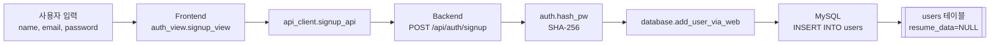
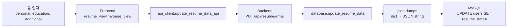
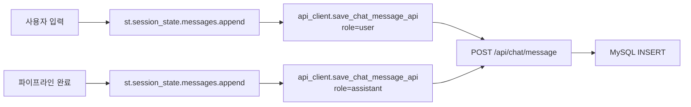
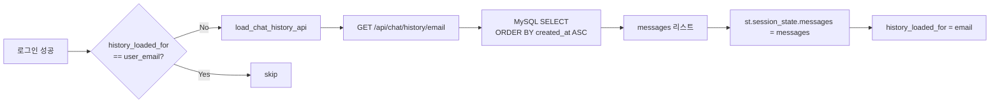
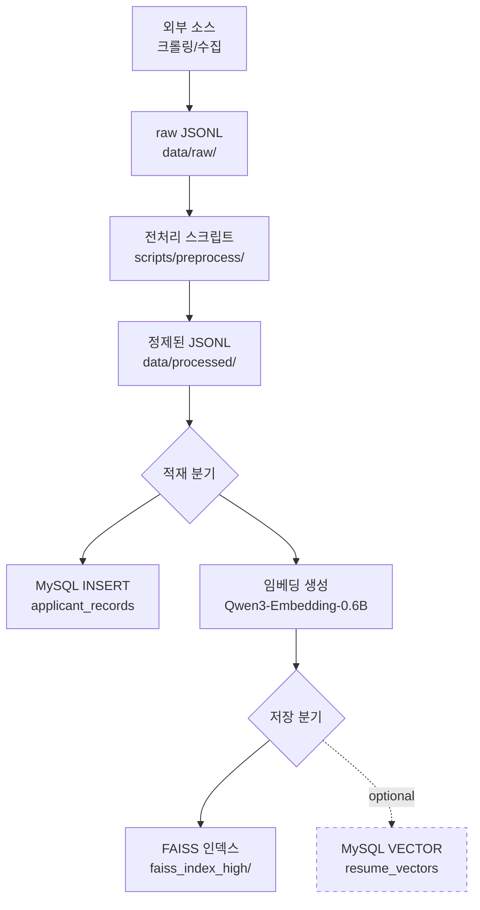
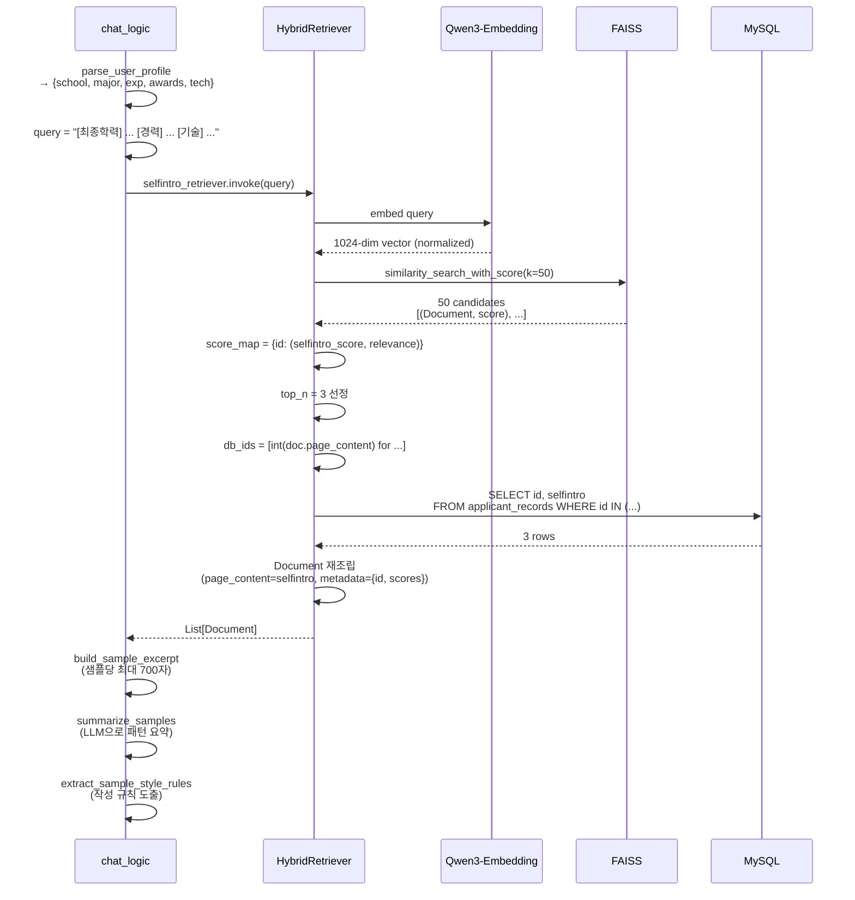
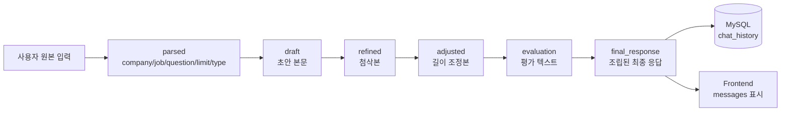
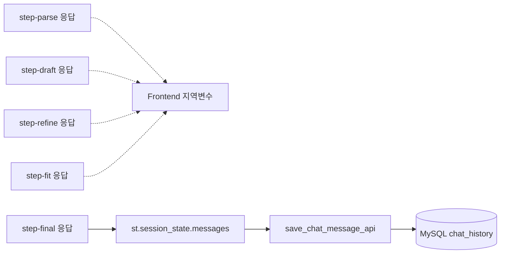
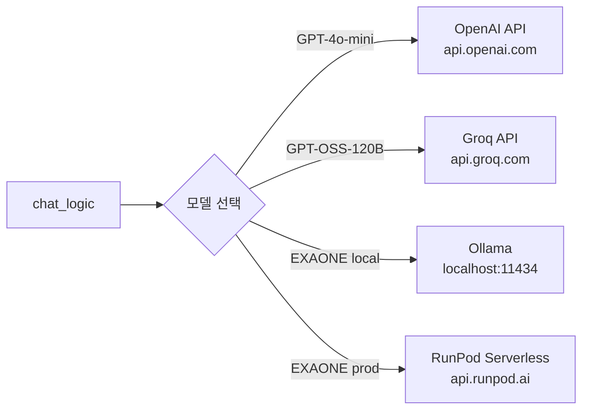

# 🔁 Job-Pocket 데이터 플로우

> **문서 목적**: 시스템 내부에서 데이터가 어떻게 생성·변환·저장·조회·소멸되는지 종단 간 흐름을 기술한다.
> **작성일**: 2026-04-22
> **버전**: v0.2.0

---

## 1. 개요

Job-Pocket의 데이터는 크게 네 가지 범주로 나뉜다. 사용자 식별 정보(인증·이력), 대화형 상호작용 데이터(채팅 이력), 참조 데이터(자소서 샘플과 그 임베딩), 그리고 파이프라인 실행 중의 일시 데이터(중간 결과물)다. 각 범주는 서로 다른 생명주기와 저장 위치를 가진다.

---

## 2. 데이터 범주

### 2.1 범주별 요약

| 범주 | 예시 | 저장소 | 생명주기 |
|---|---|---|---|
| 사용자 식별 | username, email, password hash, resume_data | `users` 테이블 | 계정 유지 기간 |
| 대화 이력 | 사용자 메시지, AI 응답 | `chat_history` 테이블 | 사용자 삭제 전까지 |
| 참조 데이터 | 자소서 본문, 평가, 점수, 임베딩 벡터 | `applicant_records` + FAISS | 영구 (수동 관리) |
| 일시 데이터 | parsed, draft, refined, adjusted | 메모리만 | 요청-응답 단일 사이클 |

### 2.2 저장소별 책임

**MySQL `job_pocket_rdb`**: 사용자 계정과 대화 이력 같은 "운영 데이터"를 담는다. 자주 읽고 쓰이며, 데이터 정합성이 중요하다.

**MySQL `job_pocket_vector`**: 자소서 샘플과 관련 메타데이터("참조 데이터")를 담는다. 주로 읽기 쿼리만 발생하며, 대량 배치로 적재된다.

**FAISS 인덱스 (`faiss_index_high/`)**: 자소서 임베딩 벡터를 담는 인덱스 파일이다. MySQL의 `applicant_records`와 ID로 1:1 대응된다. 기동 시 메모리로 로드되어 유사도 검색에 사용된다.

**Streamlit `st.session_state`**: 로그인 후 대화 세션 동안의 일시 상태를 담는다. 브라우저 새로고침 시 사라지며, 영속 데이터가 필요한 경우 API를 통해 MySQL에 저장한다.

---

## 3. 사용자 데이터 흐름

### 3.1 회원가입

이력 정보(`resume_data`)는 회원가입 시점에는 비어 있다. 사용자가 이후 "내 스펙 보관함"에서 입력해야 의미 있는 값이 들어간다.

### 3.2 이력 정보 업데이트

이력 정보는 3개 섹션으로 구조화된 dict을 JSON 문자열로 직렬화하여 단일 TEXT 컬럼에 저장한다. 이 방식은 정규화된 다중 테이블보다 단순하며, 스키마 변경이 자유롭다. 단점은 SQL 레벨에서 필드별 쿼리가 불가능하다는 것이다. 현재 쿼리 패턴(전체 레코드 로드 후 파싱)에는 문제가 없다.

### 3.3 이력 정보 조회 (파이프라인 실행 시)

`resume_data`는 자소서 생성 시점에 검색 쿼리의 주 입력으로 사용된다. 사용자가 이력 정보를 충실히 입력할수록 RAG 검색 품질이 올라간다.

---

## 4. 대화 이력 데이터 흐름

### 4.1 메시지 저장

자소서 생성 요청마다 두 번의 INSERT가 발생한다. 사용자 입력 직후 한 번(`role=user`), AI 응답 완료 직후 한 번(`role=assistant`)이다.

### 4.2 이력 로드 (로그인 시)

같은 세션에서 재진입 시 중복 로드를 방지하기 위해 `history_loaded_for`라는 플래그 변수로 한 번만 로드한다.

### 4.3 이력 삭제

이력 삭제는 사이드바의 🗑️ 버튼으로만 가능하다. 개별 메시지 삭제는 제공하지 않으며, 전체 삭제만 지원한다. 이는 부분 삭제가 대화 흐름의 일관성을 해칠 수 있기 때문이다. 삭제는 논리 삭제(soft delete)가 아닌 물리 삭제(hard delete)로 수행된다.

---

## 5. 참조 데이터 흐름 (자소서 샘플 적재)

### 5.1 전체 파이프라인

### 5.2 단계별 책임

**수집 단계**: 채용공고·자소서·평가 정보를 외부 소스에서 수집하여 `data/raw/*.jsonl`로 저장한다. (v0.2.0 시점에는 구현 미완료)

**전처리 단계**: HTML 태그 제거, 공백 정규화, 이름·연락처 등 개인정보 익명화, 중복 제거, 길이 필터링을 수행한다.

**적재 단계**: 정제된 레코드를 `applicant_records` 테이블에 INSERT한다. 동시에 Qwen3-Embedding-0.6B로 1024차원 벡터를 생성하여 FAISS 인덱스에 추가한다.

**MySQL VECTOR 저장 (옵션)**: 향후 FAISS 없이 MySQL만으로 검색하는 경로를 위해 `resume_vectors` 테이블에도 벡터를 저장할 수 있다. v0.2.0은 FAISS를 주 경로로 쓴다.

### 5.3 핵심 제약

FAISS 인덱스와 MySQL의 `applicant_records`는 **항상 동기화 상태**를 유지해야 한다. FAISS의 `page_content`가 `applicant_records.id`를 문자열화한 값이기 때문이다. 특정 레코드를 삭제하면 양쪽 모두에서 삭제해야 하며, 본문이 변경되어 임베딩이 달라지면 FAISS 인덱스를 재빌드해야 한다.

이 동기화 책임은 현재 적재 스크립트에 있다 (v0.2.0에서는 스크립트 자체가 미완성). v0.3.0에서 Alembic 스타일의 마이그레이션 도구 또는 CDC 파이프라인 도입을 검토한다.

---

## 6. 검색(Retrieval) 데이터 흐름

파이프라인의 Step 2 내부에서 발생하는 검색 흐름이다.

### 6.1 데이터 변환 추적

검색 프로세스에서 데이터는 다음과 같이 변환된다:

1. 구조화된 dict(`profile`) → 자연어 쿼리 문자열
2. 쿼리 문자열 → 1024차원 정규화 벡터
3. 벡터 → Top-50 ID 리스트
4. ID 리스트 → Top-3 ID 리스트 (간단한 top-N 잘라내기)
5. Top-3 ID → 본문·점수 포함 Document 객체
6. Document 리스트 → 샘플 발췌 + 패턴 요약 + 스타일 규칙 텍스트

---

## 7. 생성(Generation) 파이프라인의 중간 데이터 흐름

Step 1~6 동안 발생하는 일시 데이터의 생명주기다.

### 7.1 일시 데이터의 영속화 시점

`parsed`, `draft`, `refined`, `adjusted`, `evaluation` 같은 중간 결과물은 각 엔드포인트의 응답으로만 전달되며 DB에 저장되지 않는다. 오직 `final_response`만 `chat_history`에 저장된다. 이 설계는 저장 공간 절약과 사용자 관점의 단순성을 위함이다.

향후 품질 분석 목적으로 중간 결과를 저장하고 싶다면 별도의 `pipeline_runs` 테이블을 추가할 수 있으나, v0.2.0에서는 도입하지 않는다.

### 7.2 프론트엔드의 상태 이관

Backend는 stateless하므로 각 step 간 데이터는 프론트엔드가 보유하고 전달한다. Frontend 내부의 데이터 이관은 다음과 같다:

중간 응답들(`parsed`, `draft`, `refined`, `adjusted`)은 함수 내 지역변수로만 유지되며, 다음 step 호출 시 인자로 전달된 후 사라진다. `final_response`만이 `st.session_state.messages`에 추가되고 MySQL에 저장된다.

---

## 8. 세션 상태 데이터

Streamlit의 `st.session_state`는 브라우저 세션 동안 유지되는 일시 저장소다. 주요 키는 다음과 같다.

| 키 | 타입 | 의미 |
|---|---|---|
| `logged_in` | bool | 로그인 상태 |
| `user_info` | list | 로그인된 사용자 튜플 (5-tuple) |
| `messages` | list[dict] | 채팅 메시지 버퍼 |
| `page` | str | 로그인 전 페이지 (login/signup) |
| `menu` | str | 로그인 후 메뉴 (chat/resume) |
| `selected_model` | str | 선택된 LLM (GPT-4o-mini / GPT-OSS-120B (Groq)) |
| `history_loaded_for` | str | 이력 로드 완료된 이메일 |
| `show_welcome` | bool | 웰컴 화면 표시 여부 |
| `pending_prompt` | str/None | 전송 대기 중인 프롬프트 |
| `current_result_version` | int | 수정본 버전 카운터 |

### 8.1 세션 초기화 시점

로그인 성공 시 `logged_in`, `user_info`, `menu`, `history_loaded_for`가 설정된다. 로그아웃 시 `st.session_state.clear()`로 전체 초기화된다.

### 8.2 세션 상태의 한계

세션 상태는 브라우저 새로고침 시 초기화된다. 때문에 새로고침 후에도 보여야 하는 데이터(로그인, 채팅 이력)는 MySQL에 저장된다. 세션 상태에만 의존하는 데이터(현재 입력 중인 프롬프트, 웰컴 화면 표시 여부 등)는 새로고침 시 리셋된다.

---

## 9. 외부 API 호출 흐름

### 9.1 LLM 호출

LLM 호출은 모두 HTTPS over 인터넷이며, 인증은 환경변수로 주입된 API 키로 이뤄진다. 각 호출은 수 초 ~ 수십 초의 지연을 가진다.

### 9.2 관측성 데이터

LangSmith가 활성화된 경우, 모든 LangChain Runnable 호출이 `api.smith.langchain.com`으로 자동 전송된다. 이 데이터는 쿼리 원문, LLM 응답, 소요 시간, 에러 스택을 포함하므로 민감한 사용자 데이터가 외부 서비스에 남는다. v0.5.0 배포 전에 데이터 보호 정책을 재검토한다.

---

## 10. 데이터 보호 고려사항

### 10.1 민감정보 처리

사용자 이메일과 비밀번호 해시가 가장 민감한 데이터다. 비밀번호는 평문이 서버에 도달한 직후 해싱되며 원문은 저장되지 않는다. 이메일은 평문으로 저장되고 외래키로 사용된다.

자소서 본문과 이력 정보는 사용자가 직접 입력한 것이나 개인 경력·학력이 포함되므로 민감도가 높다. DB는 컨테이너 내부에만 바인드되어야 하며, 향후 암호화 at-rest 적용을 검토한다.

### 10.2 LLM 프롬프트 유출 위험

OpenAI·Groq 호출 시 사용자의 이력 정보와 자소서 본문이 프롬프트에 포함되어 외부 서버로 전송된다. 각 제공자의 데이터 이용 정책을 확인하고, 민감 필드는 마스킹하는 방안을 v0.4.0에서 도입한다.

### 10.3 로그 기록

현재 로깅은 `print()` 기반이며 민감 데이터를 필터링하지 않는다. 구조화 로깅 도입 시 PII 마스킹 필터를 함께 적용한다.

---

## 11. 데이터 수명 관리

### 11.1 보존 기간

| 데이터 | 현재 정책 | 이상적 정책 |
|---|---|---|
| 사용자 계정 | 무제한 | 2년 미접속 시 알림 후 삭제 |
| 채팅 이력 | 사용자 삭제 전까지 무제한 | 90일 이후 아카이브 |
| 자소서 샘플 | 수동 관리 | 연 1회 품질 재평가 |
| FAISS 인덱스 | 수동 빌드 | 샘플 변경 시 자동 재빌드 |

v0.2.0은 모두 수동 관리 상태다. v0.4.0 최적화 단계에서 보존 정책과 자동화를 도입한다.

---

## 12. 관련 문서

| 주제 | 문서 |
|---|---|
| 시스템 개요 | `docs/wiki/architecture/overview.md` |
| 시퀀스 다이어그램 | `docs/wiki/architecture/sequence_diagram.md` |
| DB 스키마 | `docs/wiki/backend/database.md` |
| RAG 파이프라인 | `docs/wiki/model/rag_pipeline.md` |
| Retriever 상세 | `docs/wiki/backend/rag_retriever.md` |

---

*last updated: 2026-04-22 | 조라에몽 팀*
