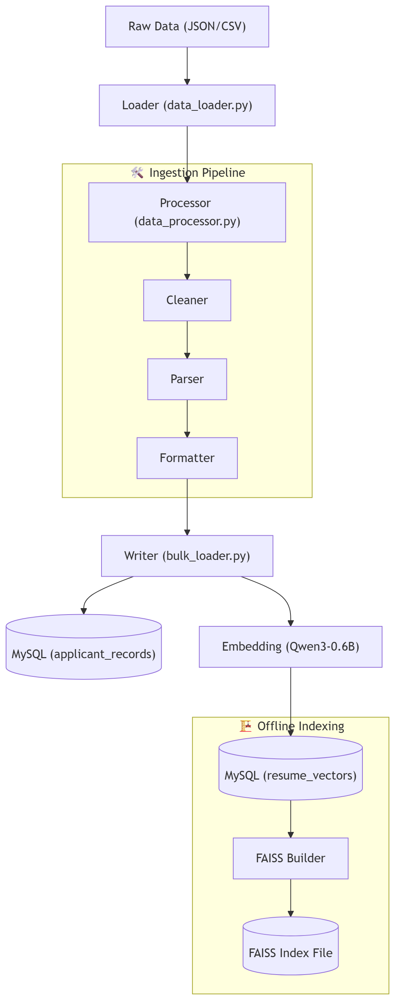
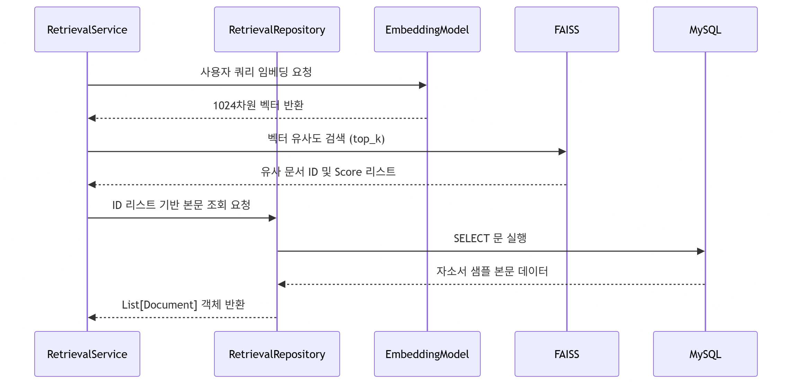

# 🔁 Job-Pocket 데이터 플로우

> **문서 목적**: 시스템 내부에서 데이터가 어떻게 생성·변환·저장·조회·소멸되는지 종단 간 흐름을 기술한다.  
> **최종 수정일**: 2026-04-26  
> **버전**: v0.3.0 (Ingestion Pipeline 및 Repository 패턴 반영)

---

## 1. 개요

Job-Pocket의 데이터는 크게 **운영 데이터**(사용자 정보, 채팅 이력), **참조 데이터**(자소서 샘플, 벡터 인덱스), 그리고 **일시 데이터**(생성 파이프라인 중간 결과)로 나뉩니다. 현재는 SQLAlchemy Engine을 기반으로 **Raw SQL** 및 **DB API(PyMySQL)**를 활용하여 관계형 데이터와 벡터 데이터를 통합 관리합니다.

---

## 2. 데이터 저장소 및 책임

| 저장소 | 위치 | 담당 데이터 | 관리 방식 |
|---|---|---|---|
| **MySQL 9.3 (RDB)** | `job_pocket_rdb` | 사용자, 채팅 이력, 프로필 | SQLAlchemy (Repository) |
| **MySQL 9.3 (Vector)** | `job_pocket_vector` | 자소서 샘플 원문, 메타데이터 | SQLAlchemy / PyMySQL |
| **FAISS Index** | `backend/data/` | 1024차원 임베딩 벡터 | `RetrievalService` (In-memory) |
| **Session State** | `st.session_state` | 로그인 세션, UI 상태 | Streamlit (Client-side) |

---

## 3. 참조 데이터 구축 흐름 (Ingestion & Indexing)

외부 자소서 샘플은 1차적으로 MySQL에 영구 저장되며, 이후 검색 성능을 위해 오프라인에서 FAISS 인덱스로 변환됩니다.

- **MySQL 저장**: `bulk_loader`를 통해 원문과 생성된 임베딩 벡터를 각각의 테이블에 영구 저장합니다.
- **오프라인 인덱싱**: DB에 적재된 벡터 데이터를 로드하여 고속 검색용 FAISS 인덱스(`index.faiss`)를 별도로 빌드합니다. 백엔드 서비스는 이 빌드된 파일을 메모리에 로드하여 검색을 수행합니다.

---

## 4. 사용자 데이터 및 이력 흐름

Service-Repository 패턴을 통한 데이터 처리 흐름입니다.

### 4.1 회원가입 및 프로필 저장
1. **Frontend**: 사용자 입력을 JSON으로 전송.
2. **AuthRouter**: 요청 수신 및 `AuthService` 호출.
3. **UserRepository**: SQLAlchemy를 통해 `users` 테이블에 INSERT.
4. **Data**: `resume_data`는 복잡한 스펙 정보를 담기 위해 JSON 타입으로 저장.

### 4.2 채팅 이력 로드 및 기록
- **저장**: 생성 파이프라인이 완료되면 `ChatRepository`를 통해 `chat_history` 테이블에 즉시 기록.
- **조회**: 로그인 시 `history_loaded_for` 플래그를 확인하여 해당 유저의 전체 이력을 1회 로드 후 세션에 캐싱.

---

## 5. 검색(Retrieval) 데이터 흐름

---

## 6. 생성(Generation) 파이프라인 데이터 변환

사용자 입력이 최종 응답으로 변환되는 과정에서 중간 데이터는 **오케스트레이터(`chat_logic`)** 내에서만 유통됩니다.

1. **Raw Prompt**: 사용자의 자연어 입력.
2. **ParsedData**: LLM 파서에 의해 구조화된 회사, 직무, 문항 정보 (`ParsedUserRequest`).
3. **Draft**: EXAONE 모델이 생성한 1차 초안 본문.
4. **Refined/Adjusted**: 문장 다듬기 및 글자 수 조정이 완료된 텍스트.
5. **Final Response**: 본문 + 평가 코멘트가 결합된 최종 마크다운 문자열.

---

## 7. 보안 및 보호 정책

- **Password**: `security.py`를 통해 SHA-256 해싱 후 저장.
- **API Keys**: `.env` 및 `config.py`를 통해 관리하며 소스코드 내 노출 엄금.
- **Session**: 브라우저 종료 시 초기화되나, 중요 데이터는 DB 영속화를 통해 새로고침 대응.

---

*last updated: 2026-04-26 | 조라에몽 팀*
