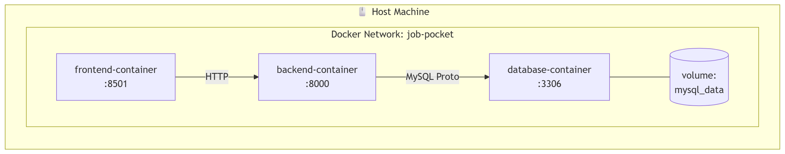

# 📐 Job-Pocket 시스템 아키텍처 개요

> **문서 목적**: Job-Pocket 서비스의 전체 시스템 구조와 구성 요소 간 상호작용을 기술한다. 하위 모든 아키텍처 문서의 기준점이 된다.  
> **최종 수정일**: 2026-04-26  
> **버전**: v0.3.0 (Modularized Architecture 반영)

---

## 1. 프로젝트 개요

### 1.1 서비스 목표
Job-Pocket은 **RAG(Retrieval-Augmented Generation) 기반 한국어 자기소개서 피드백 서비스**입니다. 사용자의 이력 정보와 자소서 문항을 입력받으면, 유사한 우수 자소서 샘플을 벡터 검색으로 추출하고 이를 참고 컨텍스트로 활용해 개인화된 자소서 초안을 생성합니다. 생성된 결과물은 다단계 첨삭 및 품질 평가 파이프라인을 거쳐 사용자에게 전달됩니다.

### 1.2 핵심 가치 제안
- **검증된 서술 방식 반영**: 합격자 자소서 패턴을 RAG로 참조하여 논리적 서술 방식을 학습합니다.
- **도메인 특화 생성**: 문항 유형(지원동기, 협업 등)을 자동 분류하여 최적화된 프롬프트와 평가 기준을 적용합니다.
- **실시간 대화형 수정**: 생성된 초안에 대해 자연어로 추가 수정을 요청할 수 있는 인터랙티브 환경을 제공합니다.

---

## 2. 전체 시스템 구성도

### 2.1 논리 아키텍처 (Layered Architecture)

### 2.2 물리 아키텍처 (Docker Compose)

---

## 3. 주요 컴포넌트

### 3.1 컴포넌트 책임 매트릭스

| 레이어 | 컴포넌트 | 구현 위치 | 주요 책임 |
|:--- |:--- |:--- |:--- |
| **Presentation** | Frontend | `frontend/` | UI 렌더링, 세션 상태 관리, 파이프라인 오케스트레이션 |
| **Application** | Routers | `backend/routers/` | HTTP 엔드포인트 제공, 요청/응답 스키마 검증 |
| | Chat Logic | `backend/services/chat_logic.py` | 각 단계별(Parse, Draft 등) 서비스 조율 (Orchestrator) |
| | Chat Modules | `backend/services/chat/` | 실제 LLM 프롬프트 생성, 파싱, 생성 및 품질 평가 로직 |
| | Retrieval Svc | `backend/services/retrieval_service.py` | 하이브리드 검색(FAISS + MySQL) 비즈니스 로직 |
| **Repository** | DB Access | `backend/repository/` | 데이터 영속 계층 접근 (SQLAlchemy/PyMySQL 사용) |
| **AI / Model** | LLM | RunPod / OpenAI / Groq | 초안 생성(EXAONE), 첨삭 및 평가(GPT/Llama) |
| | Embedding | HuggingFace (Local) | 쿼리 및 문서의 1024차원 벡터화 |
| **Data** | Database | MySQL 9 | 사용자 데이터, 채팅 이력, 벡터 및 자소서 샘플 저장 |

---

## 4. 기술 스택 및 선정 근거

### 4.1 스택 요약

| 영역 | 기술 | 상세 |
|---|---|---|
| **Backend** | FastAPI / SQLAlchemy | 비동기 처리 및 ORM 기반의 효율적인 데이터 관리 |
| **Frontend** | Streamlit | 빠른 프로토타이핑과 AI 인터랙션 최적화 |
| **Database** | MySQL 9.x | RDB와 Vector 검색(`VECTOR_DISTANCE`)의 통합 운영 |
| **Vector Index** | FAISS (CPU) | 대규모 임베딩 데이터의 고속 Similarity Search |
| **LLM Engine** | EXAONE 3.5 / GPT-4o-mini | 한국어 특화 생성과 글로벌 모델의 논리적 첨삭 결합 |
| **Observability** | LangSmith | LLM 호출 체인 트레이싱 및 디버깅 |

### 4.2 주요 선정 근거
- **Service-Repository 패턴**: 비즈니스 로직과 DB 접근 로직을 분리하여 코드의 재사용성과 테스트 용이성을 확보했습니다.
- **MySQL 9 단일 DB**: 벡터 전용 DB를 별도로 두지 않고 MySQL 9의 벡터 타입을 활용하여 시스템 복잡도를 낮추고 데이터 일관성을 높였습니다.
- **Modular Chat Services**: `chat_logic`에 집중되어 있던 로직을 `parser`, `generator`, `evaluator`로 분산하여 유지보수성을 극대화했습니다.

---

## 5. 데이터 플로우 개요

### 5.1 자소서 생성 요청 시퀀스 (Summary)

사용자의 요청은 프론트엔드에 의해 **4~5개의 주요 단계**로 나뉘어 백엔드에 전달됩니다.

1. **Step 1 (Parse)**: 사용자 메시지를 분석하여 회사명, 직무, 문항 유형을 구조화합니다.
2. **Step 2 (Draft)**: 사용자의 스펙을 바탕으로 RAG 검색을 수행하고 EXAONE 모델로 초안을 생성합니다.
3. **Step 3 (Refine/Fit)**: 생성된 초안을 정교하게 다듬고 요청된 글자 수에 맞게 조정합니다.
4. **Step 4 (Final)**: 최종 결과물에 대한 AI 평가를 생성하고 응답을 조립합니다.

상세 시퀀스는 `docs/wiki/architecture/sequence_diagram.md`를 참조하세요.

---

*last updated: 2026-04-26 | 조라에몽 팀*
