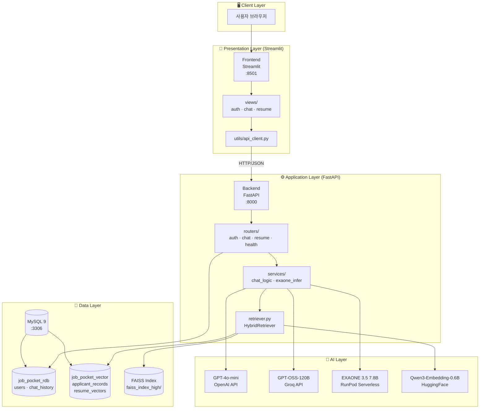
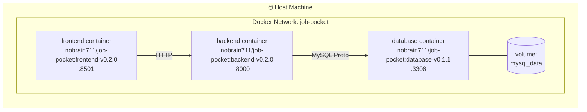
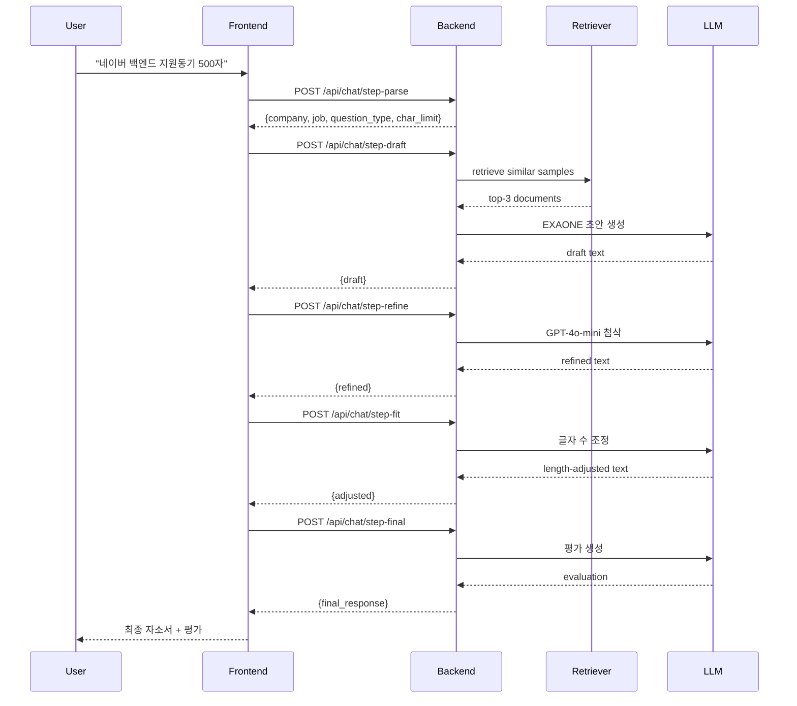

# 📐 Job-Pocket 시스템 아키텍처 개요

> **문서 목적**: Job-Pocket 서비스의 전체 시스템 구조와 구성 요소 간 상호작용을 기술한다. 하위 모든 아키텍처 문서의 기준점이 된다.
> **작성일**: 2026-04-22
> **버전**: v0.2.0
> **팀**: 조라에몽 (이창우, 장한재, 전종혁, 조동휘, 최수아, 홍완기)

---

## 1. 프로젝트 개요

### 1.1 서비스 목표

Job-Pocket은 **RAG(Retrieval-Augmented Generation) 기반 한국어 자기소개서 피드백 서비스**다. 사용자의 이력 정보와 자소서 문항을 입력받으면, 유사한 우수 자소서 샘플을 벡터 검색으로 추출하고 이를 참고 컨텍스트로 활용해 개인화된 자소서 초안을 생성한다. 생성된 초안은 다단계 첨삭·평가 파이프라인을 거쳐 사용자에게 최종 결과물로 제공된다.

### 1.2 핵심 가치 제안

기존 자소서 작성 도구가 단순 생성(generation)에 머무는 반면, Job-Pocket은 실제 서류 합격자의 자소서 패턴을 RAG로 참조하여 **검증된 서술 방식**을 반영한다. 또한 문항 유형(지원동기·입사후포부·협업·문제해결·성장 등)을 자동 분류하여 유형별 최적화된 프롬프트와 평가 기준을 적용한다.

### 1.3 사용자 시나리오

사용자는 로그인 후 "내 스펙 보관함"에서 학력·경력·기술 스택 등의 정형 정보를 저장한다. 채팅 인터페이스에서 "네이버에 백엔드 직무로 지원하는데 지원동기를 500자 내외로 써줘"와 같이 자연어로 요청하면, 시스템은 요청을 구조화 파싱하고 관련 샘플을 검색하여 초안을 생성한다. 생성된 초안은 자동으로 첨삭·평가가 이뤄지며, 사용자는 대화로 수정 요청을 이어갈 수 있다.

---

## 2. 전체 시스템 구성도

### 2.1 논리 아키텍처

### 2.2 물리 아키텍처 (Docker Compose)

---

## 3. 주요 컴포넌트

### 3.1 컴포넌트 책임 매트릭스

| 컴포넌트 | 구현 위치 | 주요 책임 |
|---|---|---|
| Frontend | `frontend/app.py`, `frontend/views/` | 사용자 UI, 세션 상태 관리, API 호출 오케스트레이션 |
| Backend API | `backend/routers/` | HTTP 엔드포인트 제공, 요청 검증, 서비스 호출 |
| Chat Logic | `backend/services/chat_logic.py` | 6단계 RAG 파이프라인 구현, 프롬프트 관리 |
| Retriever | `backend/retriever.py` | FAISS 벡터 검색 + MySQL 본문 조회의 하이브리드 검색 |
| Embedding | Qwen3-Embedding-0.6B (HuggingFace) | 쿼리와 문서의 1024차원 임베딩 생성 |
| LLM Serving | OpenAI / Groq / RunPod | 3종 LLM 엔진, 사용자 선택 및 자동 폴백 |
| RDB | `job_pocket_rdb` | 사용자, 채팅 이력 저장 |
| Vector DB | `job_pocket_vector` + FAISS | 자소서 샘플 원문과 벡터 인덱스 저장 |

### 3.2 외부 의존성

서비스는 세 종류의 외부 LLM 제공자에 의존한다. OpenAI는 `gpt-4o-mini` 모델을 기본 첨삭·평가용으로 사용하며, Groq는 `openai/gpt-oss-120b` 고성능 모델을 선택 사용한다. RunPod Serverless는 자체 배포한 EXAONE 3.5 7.8B 모델을 호스팅하여 초안 생성에 활용한다. 임베딩은 Qwen3-Embedding-0.6B를 HuggingFace에서 로드하여 컨테이너 내부에서 직접 추론한다. LangSmith는 선택적 관측(observability) 도구로 연동된다.

---

## 4. 기술 스택 및 선정 근거

### 4.1 스택 요약

| 영역 | 기술 | 버전 |
|---|---|---|
| Language | Python | 3.12 |
| Backend Framework | FastAPI | 0.115+ |
| Frontend Framework | Streamlit | 1.56 |
| RDBMS + Vector DB | MySQL | 9.3 |
| Vector Index | FAISS (CPU) | 1.12+ |
| LLM Orchestration | LangChain | 1.2.2+ |
| LLM (Generation) | EXAONE 3.5 7.8B | via RunPod |
| LLM (Refine/Eval) | GPT-4o-mini / GPT-OSS-120B | via OpenAI / Groq |
| Embedding Model | Qwen3-Embedding-0.6B | HuggingFace |
| Container | Docker / Docker Compose | 최신 |

### 4.2 주요 선정 근거

**MySQL 9 단일 DB 채택**: 일반적인 RAG 시스템은 Qdrant/Pinecone 같은 전용 벡터 DB를 별도로 구성하지만, MySQL 9의 VECTOR 타입과 `VECTOR_DISTANCE()` 함수로 RDB와 벡터 검색을 **하나의 DB**에서 처리하도록 설계했다. 운영 복잡도 감소, 트랜잭션 일관성, 학습 비용 절감이 주된 이유다.

**EXAONE 3.5 선정**: 한국어 자소서 생성이라는 도메인 특성상, 한국어 학습 비중이 높은 국산 LLM이 결과 품질 면에서 유리하다고 판단했다. LG AI Research의 EXAONE 3.5 7.8B는 상업 사용이 허가된 라이선스와 한국어 성능의 균형이 우수하다.

**Hybrid Retrieval (FAISS + MySQL) 구조**: FAISS는 in-memory 고속 벡터 검색에 강점이 있고, MySQL은 관계형 데이터의 정합성과 대용량 본문 저장에 유리하다. 두 장점을 결합하여, 벡터 유사도 계산은 FAISS로 상위 K개 후보를 빠르게 뽑고, 실제 자소서 본문은 MySQL에서 조회하는 2단계 구조를 설계했다.

**Streamlit 채택**: 프로토타이핑 속도가 빠르고 Python 생태계와 통합이 자연스럽다. UI는 복잡한 상태 관리보다 폼 기반 입출력이 중심이라 Streamlit의 선언적 스타일이 적합하다.

---

## 5. 데이터 플로우 개요

### 5.1 자소서 생성 요청의 종단 간 흐름

사용자가 채팅창에 요청을 입력하면, Streamlit Frontend는 `api_client.py`를 통해 FastAPI Backend의 `/api/chat/step-*` 엔드포인트를 **순차적으로 6번** 호출한다. 각 스텝은 다음과 같은 책임을 가진다.

상세 파이프라인은 `docs/wiki/model/rag_pipeline.md`를 참조한다.

### 5.2 검색(Retrieval) 플로우

검색 단계에서는 사용자의 학력·경력·기술 정보를 쿼리로 구성하여 Qwen3-Embedding-0.6B로 1024차원 벡터화한다. 이 벡터로 FAISS에서 상위 50개 후보를 추출한 뒤, 상위 3건의 ID로 MySQL의 `applicant_records` 테이블에서 실제 자소서 본문을 조회한다. 이 2단계 방식은 FAISS의 속도와 MySQL의 정합성을 동시에 확보한다.

---

## 6. 보안 및 운영 고려사항

### 6.1 인증

사용자 비밀번호는 `backend/auth.py`의 SHA-256 해싱을 거쳐 저장된다. 세션 관리는 Streamlit의 `st.session_state`로 클라이언트 측에서 유지되며, 현재 단계에서는 JWT 등 토큰 기반 인증은 도입하지 않는다. v0.5.0 배포 단계에서 OAuth 또는 JWT 도입을 검토한다.

### 6.2 비밀정보 관리

API 키(OpenAI, Groq, RunPod, LangSmith)와 DB 자격증명은 모두 `.env` 파일에 저장하며, `.env.example`로 템플릿만 버전 관리한다. `.gitignore`에 `.env` 및 `*.crt`가 포함되어 있으며, 컨테이너 실행 시 `env_file` 옵션으로 주입된다.

### 6.3 네트워크

컨테이너 간 통신은 Docker 내부 네트워크를 사용한다. Frontend는 `http://backend:8000`으로 Backend를 호출하고, Backend는 `database:3306`으로 DB에 연결한다. 외부로는 Frontend의 8501 포트만 노출되는 구조를 권장하나, 현재 개발 단계에서는 Backend의 8000 포트도 함께 호스트에 바인딩된다.

---

## 7. 배포 전략

### 7.1 버전 관리

프로젝트는 마일스톤 기반 버전 관리 전략을 따른다. v0.1.0(인프라 완료) → v0.2.0(통합) → v0.3.0(안정화) → v0.4.0(최적화) → v0.5.0(배포) 순서로 진행하며, 각 버전은 `release/v{버전}` 브랜치를 거쳐 `main`에 머지된다.

### 7.2 이미지 태깅

Docker Hub에 다음 세 이미지를 게시한다: `nobrain711/job-pocket:backend-v0.2.0`, `nobrain711/job-pocket:frontend-v0.2.0`, `nobrain711/job-pocket:database-v0.1.1`. 데이터베이스 이미지는 MySQL 설정이 변경되지 않아 v0.1.1을 유지한다.

---

## 8. 관련 문서

| 주제 | 문서 |
|---|---|
| 데이터 플로우 상세 | `docs/wiki/architecture/data_flow.md` |
| 시퀀스 다이어그램 | `docs/wiki/architecture/sequence_diagram.md` |
| 인프라 상세 | `docs/wiki/architecture/infra_diagram.md` |
| 백엔드 아키텍처 | `docs/wiki/backend/architecture.md` |
| DB 설계 / ERD | `docs/wiki/backend/database.md` |
| API 명세 | `docs/wiki/backend/api_spec.md` |
| RAG 파이프라인 | `docs/wiki/model/rag_pipeline.md` |
| 프롬프트 전략 | `docs/wiki/model/prompt.md` |
| 모델 선정 | `docs/wiki/model/model_selection.md` |
| 임베딩 모델 | `docs/wiki/model/embedding.md` |
| 프론트엔드 구조 | `docs/wiki/frontend/architecture.md` |

---

*last updated: 2026-04-22 | 조라에몽 팀*
