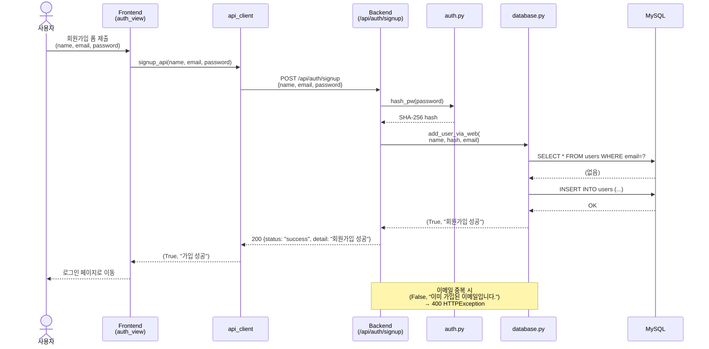
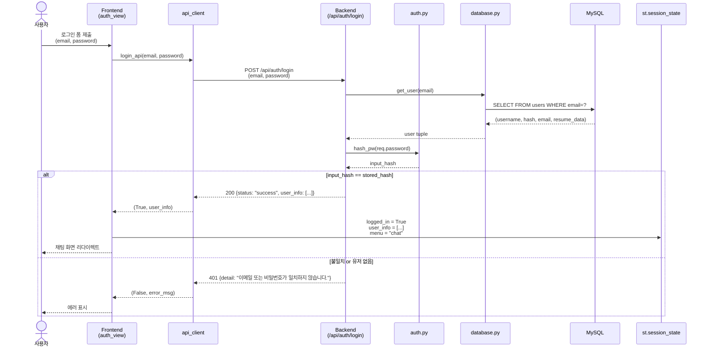
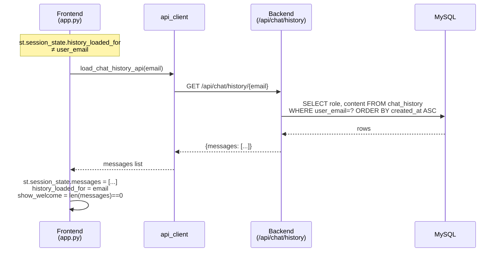
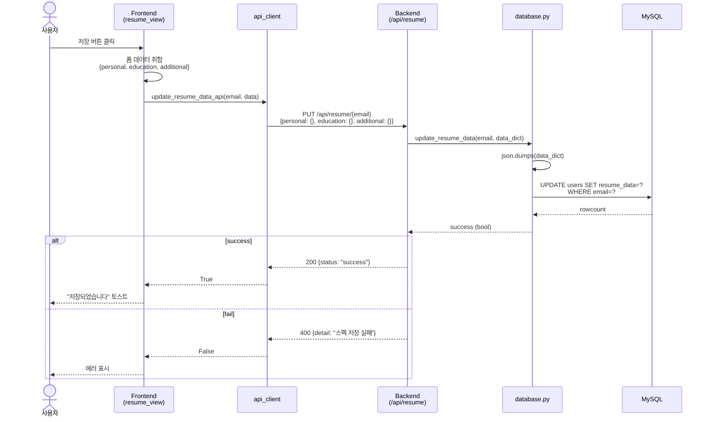
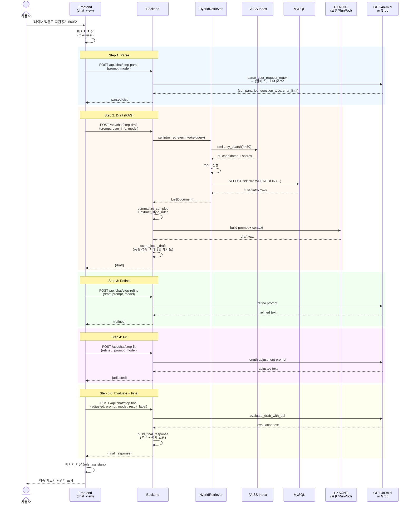
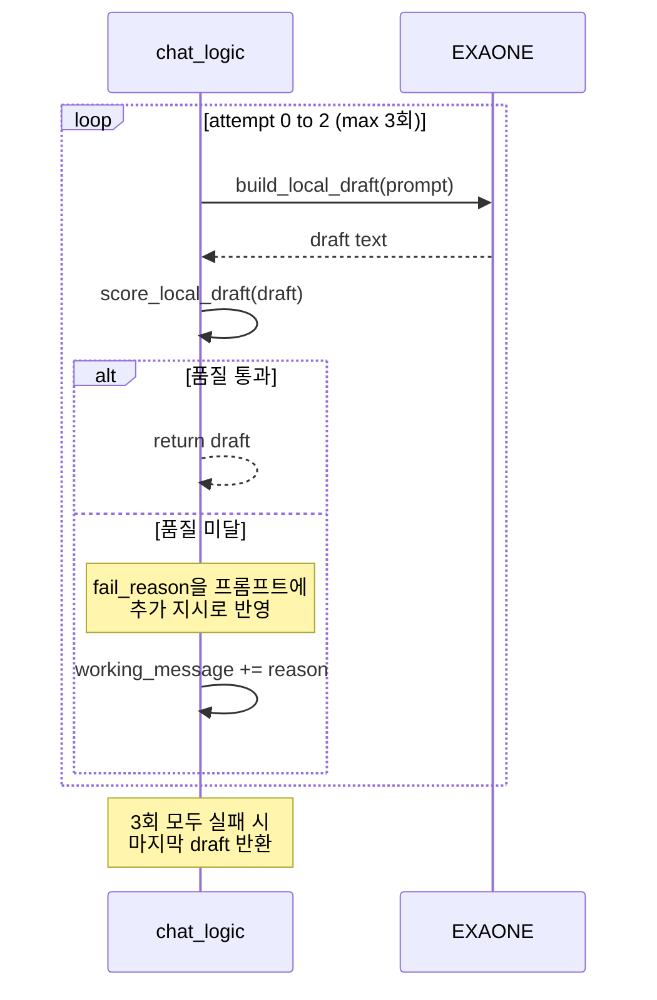
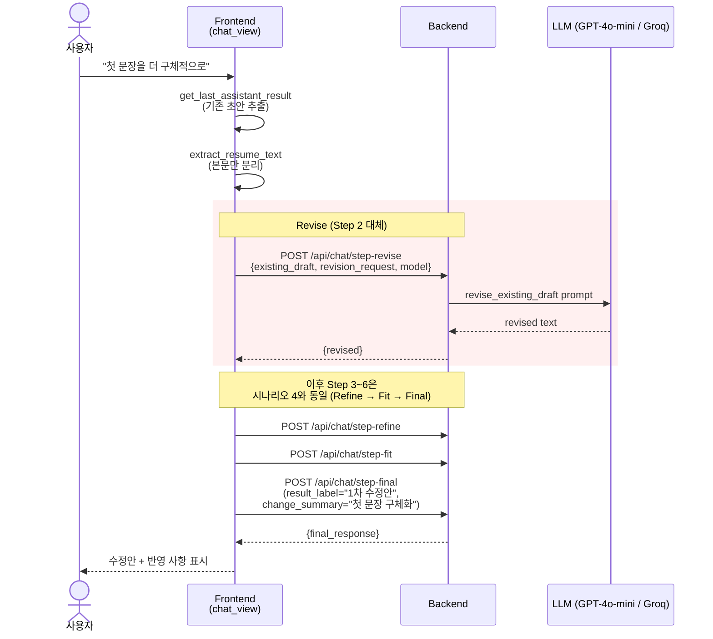
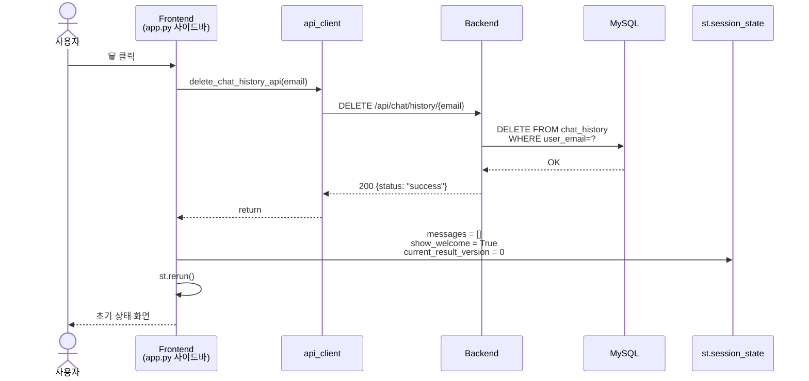

# 🔄 Job-Pocket 시퀀스 다이어그램

> **문서 목적**: Job-Pocket 서비스의 주요 사용자 시나리오를 시퀀스 다이어그램으로 기술하여 컴포넌트 간 상호작용과 API 호출 순서를 명확히 한다.
> **작성일**: 2026-04-22
> **버전**: v0.2.0

---

## 1. 시나리오 목록

| # | 시나리오 | 빈도 | 핵심 컴포넌트 |
|---|---|---|---|
| 1 | 회원가입 | 1회성 | Frontend, Backend, MySQL |
| 2 | 로그인 | 높음 | Frontend, Backend, MySQL |
| 3 | 이력 정보 저장 | 중간 | Frontend, Backend, MySQL |
| 4 | 자소서 생성 (6단계 파이프라인) | 높음 | 전체 컴포넌트 |
| 5 | 기존 자소서 수정 | 중간 | Frontend, Backend, LLM |
| 6 | 채팅 이력 조회 | 로그인 시 | Frontend, Backend, MySQL |
| 7 | 채팅 이력 삭제 | 낮음 | Frontend, Backend, MySQL |

---

## 2. 시나리오 1 — 회원가입



---

## 3. 시나리오 2 — 로그인



### 3.1 세션 초기화 (로그인 직후)

로그인 성공 시 Frontend는 해당 사용자의 채팅 이력을 서버에서 로드한다:



---

## 4. 시나리오 3 — 이력 정보 저장 (내 스펙 보관함)



---

## 5. 시나리오 4 — 자소서 생성 (6단계 파이프라인)

가장 복잡한 핵심 시나리오로, 프론트엔드가 6개 API를 순차 호출한다.

### 5.1 전체 흐름



### 5.2 Step 2의 품질 검증 재시도



### 5.3 품질 검증 항목

검증은 `score_local_draft` 함수가 수행하며, 다음 5가지를 순차 체크한다:

1. 최소 길이 220자
2. 문장 반복률 48% 미만
3. `char_limit` 대비 최소 55% 이상
4. 지원동기 문항인 경우 회사명 포함 및 첫 문단 40자 이상
5. 과장 표현 9종(`'차별화된 경쟁력 확보'`, `'혁신을 선도'` 등) 미포함

---

## 6. 시나리오 5 — 기존 자소서 수정

사용자가 생성된 초안에 대해 "첫 문장을 더 구체적으로"와 같이 수정 요청을 하는 경우다.



### 6.1 수정본 라벨링

`result_label`은 수정 횟수에 따라 증가한다. Frontend는 `st.session_state.current_result_version`을 기준으로 `"1차 수정안"`, `"2차 수정안"`을 순차 생성한다. `change_summary` 필드는 수정 사항 요약을 담아 최종 응답의 "반영 사항:" 라인으로 표시된다.

---

## 7. 시나리오 6 — 채팅 이력 조회

로그인 직후 또는 페이지 새로고침 시 호출된다. 시나리오 2의 "로그인 직후 세션 초기화"와 동일하다. 주요 쿼리는 다음과 같다:

```sql
SELECT role, content 
FROM chat_history 
WHERE user_email = ? 
ORDER BY created_at ASC;
```

이력은 생성 시간순으로 정렬되어 가장 오래된 메시지부터 최신 메시지 순서로 반환된다. Frontend는 이를 `st.session_state.messages`에 그대로 할당하여 채팅 화면을 재구성한다.

---

## 8. 시나리오 7 — 채팅 이력 삭제

사용자가 사이드바의 🗑️ 버튼을 클릭하면 실행된다.



---

## 9. 메시지 저장 패턴

자소서 생성과 수정 과정에서 Frontend는 두 시점에 `/api/chat/message`를 호출하여 DB에 저장한다:

1. 사용자 입력 직후: `role="user"`, `content=사용자 원본 입력`
2. AI 응답 완료 직후: `role="assistant"`, `content=final_response 전체 문자열`

이 단순한 저장 구조는 대화를 재구성할 때 파싱이 용이하게 하는 대신, 저장 공간은 다소 낭비된다. v0.3.0에서 결과물을 본문(`body`)과 평가(`evaluation`)로 분리 저장하는 방안을 검토한다.

---

## 10. 에러 복구 전략

각 시퀀스의 에러 상황에서 Frontend가 처리하는 방식이다.

| 단계 | 실패 상황 | 복구 전략 |
|---|---|---|
| Parse 실패 | LLM 응답 JSON 파싱 불가 | Regex 결과로만 진행 (fallback) |
| Draft 품질 미달 | 3회 재시도 모두 실패 | 마지막 초안 그대로 반환 |
| Refine 실패 | LLM 호출 예외 | 원본 draft를 refined로 사용 (passthrough) |
| Fit 실패 | 글자 수 조정 실패 | refined를 adjusted로 사용 (passthrough) |
| Evaluate 실패 | LLM 호출 예외 | `fallback_evaluation_comment` 결정론적 평가 사용 |
| DB 저장 실패 | `/message` API 실패 | 사용자에게 표시하되 세션은 유지 |

대부분의 실패는 사용자 경험을 끊지 않도록 passthrough 또는 fallback으로 처리된다.

---

## 11. 관련 문서

| 주제 | 문서 |
|---|---|
| 시스템 개요 | `docs/wiki/architecture/overview.md` |
| RAG 파이프라인 | `docs/wiki/model/rag_pipeline.md` |
| API 명세 | `docs/wiki/backend/api_spec.md` |
| 백엔드 아키텍처 | `docs/wiki/backend/architecture.md` |
| 프론트엔드 구조 | `docs/wiki/frontend/architecture.md` |

---

*last updated: 2026-04-22 | 조라에몽 팀*
