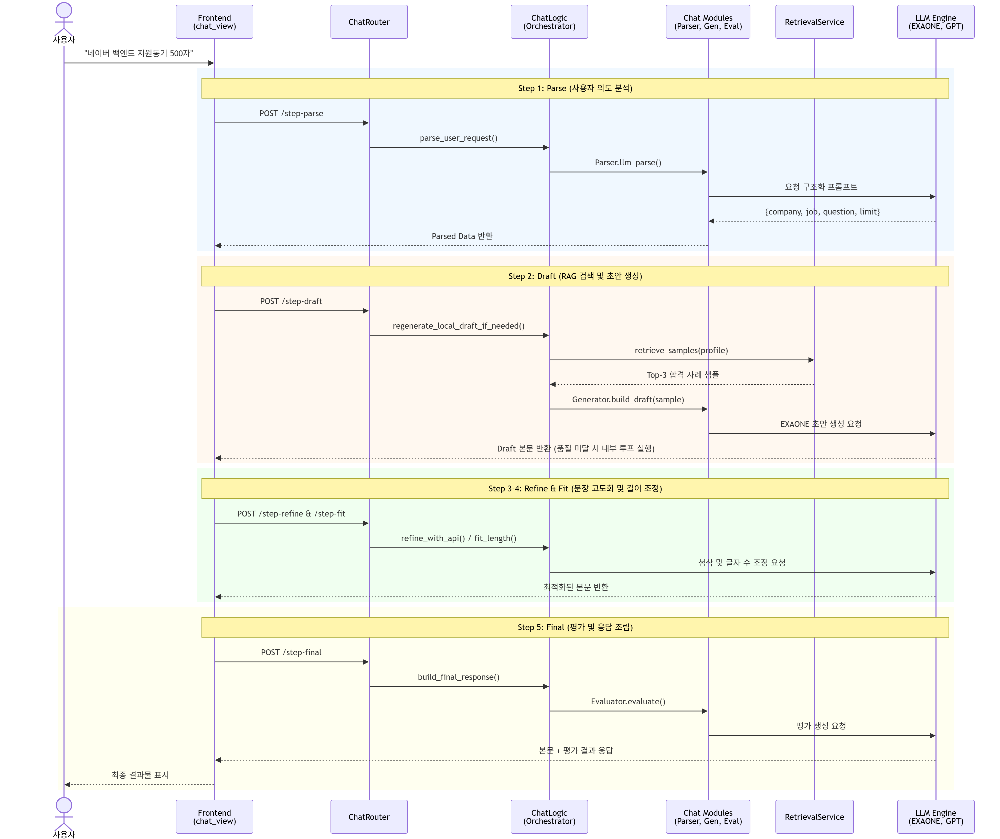
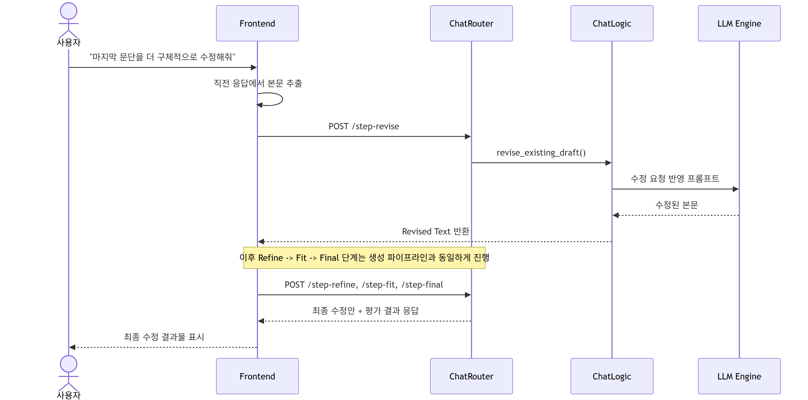
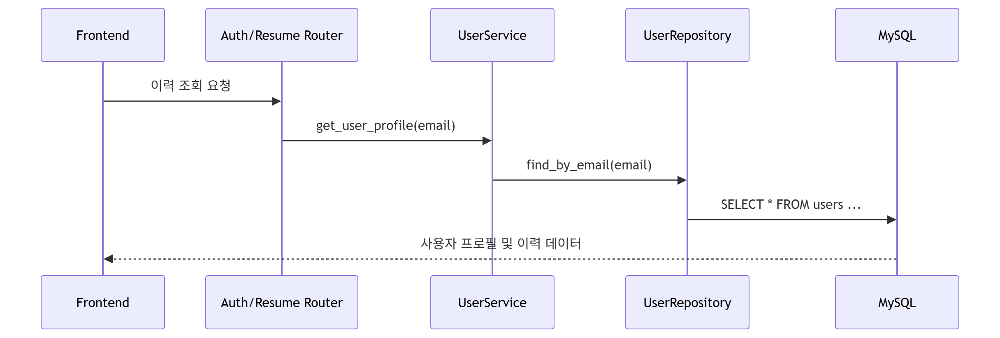
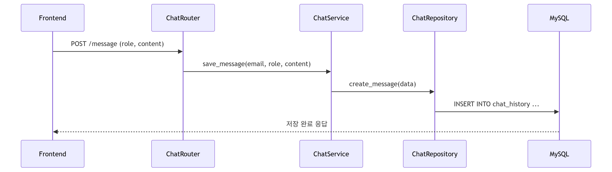
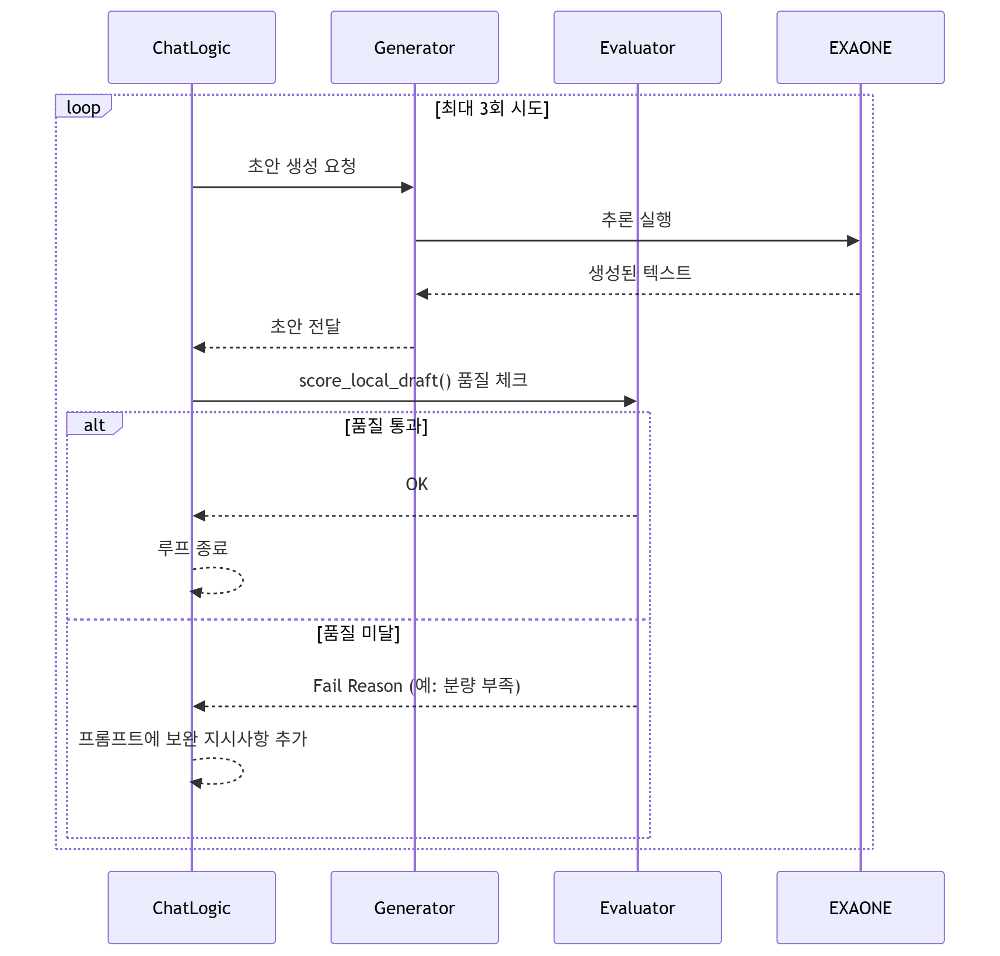

# 🔄 Job-Pocket 시퀀스 다이어그램

> **문서 목적**: 주요 사용자 시나리오별 컴포넌트 간 상호작용과 API 호출 순서를 기술한다.  
> **최종 수정일**: 2026-04-26  
> **버전**: v0.3.0 (Service-Repository 패턴 반영)

---

## 1. 자소서 생성 파이프라인 (Step-by-Step)

사용자가 채팅창에 요청을 입력했을 때 발생하는 전체 흐름입니다. 프론트엔드는 사용자에게 진행 상황을 알리기 위해 단계별로 API를 호출합니다.

### 💡 핵심 설계 포인트
- **Stateless 통신**: 백엔드는 별도의 세션을 유지하지 않으며, 각 단계에서 필요한 `ParsedData`를 프론트엔드가 보관했다가 다음 요청 시 전달합니다.
- **사용자 경험(UX) 최적화**: 긴 생성 시간을 단일 로딩으로 처리하지 않고, '분석-생성-정제-평가'의 단계를 시각적으로 노출하여 체감 대기 시간을 줄였습니다.

---

## 2. 기존 자소서 수정 시나리오

사용자가 "조금 더 담백하게 고쳐줘"와 같이 수정 요청을 보낼 때의 흐름입니다. `is_revision_request` 분기를 탑니다.

### 💡 핵심 설계 포인트
- **수정 의도 판별**: `is_revision_request()` 로직을 통해 사용자가 새로운 자소서를 쓰려는 것인지, 기존 결과물을 고치려는 것인지 자동 판별합니다.
- **점진적 고도화**: 수정된 결과물 또한 '정제(Refine)'와 '길이 조정(Fit)' 단계를 동일하게 거쳐 최종 품질을 보장합니다.

---

## 3. 데이터 조회 및 저장 (Repository 계층 활용)

### 3.1 이력 정보 조회 및 로드

### 3.2 채팅 메시지 영속화

### 💡 핵심 설계 포인트
- **Repository 패턴**: 서비스 로직(`AuthService`, `ChatService`)은 DB 엔진이 무엇인지 알 필요가 없습니다. 모든 데이터 접근은 `Repository`를 통해 추상화됩니다.
- **Lazy Loading**: 채팅 이력은 로그인 직후 1회만 로드하여 세션에 캐싱함으로써 API 호출을 최소화합니다.

---

## 4. 품질 검증 재시도 루프 (Internal Service Flow)

`generator.py`와 `evaluator.py` 사이에서 일어나는 내부 품질 보증 과정입니다.

### 💡 핵심 설계 포인트
- **피드백 기반 생성**: 단순히 다시 쓰는 것이 아니라, `Evaluator`가 지적한 '실패 사유(예: 회사명 누락)'를 다음 프롬프트에 직접 주입하여 문제점을 해결하도록 유도합니다.
- **Fail-safe**: 최대 3회 재시도 후에도 품질 기준을 충족하지 못할 경우, 가장 점수가 높았던 결과물을 반환하여 파이프라인 중단을 방지합니다.

---
*last updated: 2026-04-26 | 조라에몽 팀*
