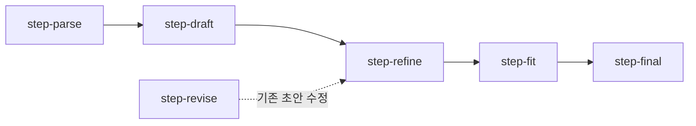

# 📡 Job-Pocket API 명세

> **문서 목적**: Job-Pocket 백엔드 FastAPI가 제공하는 모든 HTTP 엔드포인트의 Request/Response 스펙과 에러 응답을 기술한다.
> **작성일**: 2026-04-22
> **버전**: v0.2.0
> **Base URL**: `http://localhost:8000` (개발) / `http://backend:8000` (컨테이너 내부)
> **OpenAPI Docs**: `http://localhost:8000/docs` (Swagger UI)

---

## 1. 개요

### 1.1 엔드포인트 요약

| 그룹 | Prefix | 엔드포인트 수 |
|---|---|---|
| Health | `/health` | 1 |
| Authentication | `/api/auth` | 3 |
| Resume | `/api/resume` | 2 |
| Chat — History | `/api/chat` | 3 |
| Chat — Pipeline | `/api/chat` | 6 |
| **총합** | | **15** |

### 1.2 공통 규약

모든 Request/Response는 JSON이며, `Content-Type: application/json`을 사용한다. 인증은 현재 세션 기반이 아니며, 로그인 엔드포인트가 사용자 정보를 프론트엔드에 반환하면 프론트엔드가 이를 세션에 저장하고 후속 요청의 식별자(email)로 활용한다. v0.5.0 배포 단계에서 JWT 또는 OAuth로 전환 예정이다.

### 1.3 에러 응답 형식

FastAPI 기본 형식을 따른다:

```json
{
  "detail": "이메일 또는 비밀번호가 일치하지 않습니다."
}
```

Pydantic 검증 실패 시 422 상태코드와 함께 상세 필드 에러가 반환된다:

```json
{
  "detail": [
    {
      "type": "missing",
      "loc": ["body", "email"],
      "msg": "Field required"
    }
  ]
}
```

---

## 2. Health

### 2.1 `GET /health/z`

컨테이너 생존 확인용 헬스체크 엔드포인트.

**Response 200**
```json
{
  "status": "healthy API",
  "service": "job-pocket",
  "version": "0.1.0",
  "message": "서버가 정상적으로 동작 중 입니다."
}
```

---

## 3. Authentication

### 3.1 `POST /api/auth/signup`

신규 사용자 등록. 비밀번호는 서버에서 SHA-256 해싱 후 저장한다.

**Request Body**
```json
{
  "name": "홍길동",
  "email": "hong@example.com",
  "password": "plain_password_123"
}
```

**Response 200**
```json
{
  "status": "success",
  "detail": "회원가입 성공"
}
```

**Response 400** — 이미 가입된 이메일
```json
{
  "detail": "이미 가입된 이메일입니다."
}
```

### 3.2 `POST /api/auth/login`

이메일과 비밀번호로 로그인. 성공 시 사용자 정보를 튜플 형태로 반환한다.

**Request Body**
```json
{
  "email": "hong@example.com",
  "password": "plain_password_123"
}
```

**Response 200**
```json
{
  "status": "success",
  "user_info": [
    "홍길동",
    "SHA256_HASH_STRING",
    "hong@example.com",
    null,
    "{\"personal\": {}, \"education\": {}, \"additional\": {}}"
  ]
}
```

`user_info` 배열의 인덱스 의미는 다음과 같다: `[0]` username, `[1]` password hash, `[2]` email, `[3]` (예약), `[4]` resume_data (JSON 문자열).

**Response 401**
```json
{
  "detail": "이메일 또는 비밀번호가 일치하지 않습니다."
}
```

---

## 4. Resume

### 4.1 `GET /api/resume/{email}`

특정 사용자의 이력 정보를 JSON 문자열로 반환한다.

**Path Parameter**: `email` (string)

**Response 200**
```json
{
  "resume_data": "{\"personal\": {\"gender\": \"남성\"}, \"education\": {\"school\": \"○○대\", \"major\": \"컴퓨터공학\"}, \"additional\": {\"internship\": \"ABC 인턴 3개월\", \"awards\": \"2024 해커톤 대상\", \"tech_stack\": \"Python, SQL, Docker\"}}"
}
```

`resume_data`는 DB에 저장된 JSON 문자열을 그대로 반환한다. 프론트엔드에서 `json.loads()`로 파싱하여 사용한다.

**Response 404**
```json
{
  "detail": "유저를 찾을 수 없습니다."
}
```

### 4.2 `PUT /api/resume/{email}`

사용자의 이력 정보를 교체 저장한다 (부분 갱신이 아닌 전체 덮어쓰기).

**Request Body**
```json
{
  "personal": {
    "eng_name": "Hong Gil-Dong",
    "gender": "남성"
  },
  "education": {
    "school": "○○대학교",
    "major": "컴퓨터공학"
  },
  "additional": {
    "internship": "ABC 인턴 3개월",
    "awards": "2024 해커톤 대상",
    "tech_stack": "Python, SQL, Docker"
  }
}
```

**Response 200**
```json
{
  "status": "success"
}
```

**Response 400** — 업데이트 실패 (유저 부재 등)
```json
{
  "detail": "스펙 저장 실패"
}
```

---

## 5. Chat — 이력 관리

### 5.1 `GET /api/chat/history/{email}`

특정 사용자의 전체 채팅 이력을 시간순으로 반환한다.

**Path Parameter**: `email` (string)

**Response 200**
```json
{
  "messages": [
    {"role": "user", "content": "네이버 백엔드 지원동기 500자로 써줘"},
    {"role": "assistant", "content": "[자소서 초안]\n\n...본문...\n\n[평가 및 코멘트]\n평가 결과: 좋다\n..."}
  ]
}
```

### 5.2 `POST /api/chat/message`

사용자 또는 AI의 메시지 한 건을 DB에 저장한다. 프론트엔드가 생성·응답 후 각각 호출한다.

**Request Body**
```json
{
  "email": "hong@example.com",
  "role": "user",
  "content": "네이버 백엔드 지원동기 500자로 써줘"
}
```

**Response 200**
```json
{
  "status": "success"
}
```

### 5.3 `DELETE /api/chat/history/{email}`

특정 사용자의 전체 채팅 이력을 삭제한다. 사용자가 사이드바의 🗑️ 버튼을 누를 때 호출된다.

**Response 200**
```json
{
  "status": "success"
}
```

---

## 6. Chat — RAG 파이프라인

### 6.1 파이프라인 개요

프론트엔드는 아래 6개 엔드포인트를 순차 호출하여 자소서 생성·첨삭을 수행한다. 서버는 각 스텝을 stateless하게 처리하며, 상태 전달은 프론트엔드의 책임이다. 상세 로직은 `docs/wiki/model/rag_pipeline.md`를 참조한다.



### 6.2 `POST /api/chat/step-parse`

사용자의 자연어 요청을 구조화된 JSON으로 파싱한다.

**Request Body**
```json
{
  "prompt": "네이버에 백엔드 직무로 지원하는데 지원동기를 500자 내외로 써줘",
  "model": "GPT-4o-mini"
}
```

`model`은 `"GPT-4o-mini"` 또는 `"GPT-OSS-120B (Groq)"` 중 하나다.

**Response 200**
```json
{
  "raw": "네이버에 백엔드 직무로 지원하는데 지원동기를 500자 내외로 써줘",
  "company": "네이버",
  "job": "백엔드",
  "question": "지원동기",
  "char_limit": 500,
  "question_type": "motivation"
}
```

`question_type`은 `motivation`, `future_goal`, `collaboration`, `problem_solving`, `growth`, `general` 중 하나다.

### 6.3 `POST /api/chat/step-draft`

RAG 검색 + LLM으로 자소서 초안을 생성한다. 내부적으로 품질 검증을 수행하며, 미달 시 최대 3회까지 재생성한다. 응답에 소요되는 시간이 가장 긴 엔드포인트다 (수십 초).

**Request Body**
```json
{
  "prompt": "네이버에 백엔드 직무로 지원하는데 지원동기를 500자 내외로 써줘",
  "user_info": [
    "홍길동",
    "SHA256_HASH",
    "hong@example.com",
    null,
    "{\"personal\":{\"gender\":\"남성\"},\"education\":{\"school\":\"○○대\",\"major\":\"컴퓨터공학\"},\"additional\":{\"internship\":\"ABC 인턴\",\"awards\":\"\",\"tech_stack\":\"Python, SQL\"}}"
  ],
  "model": "GPT-4o-mini"
}
```

`user_info`는 로그인 응답의 `user_info` 배열을 그대로 전달한다.

**Response 200**
```json
{
  "draft": "저는 데이터를 단순히 수집하는 것보다 활용 가능한 형태로 정리하는 과정에 관심이 많습니다. (중략) 네이버 백엔드 조직에서 안정적이고 신뢰할 수 있는 데이터 기반을 만드는 데 기여하고 싶습니다."
}
```

### 6.4 `POST /api/chat/step-revise`

기존 초안에 대한 사용자 수정 요청을 반영한다.

**Request Body**
```json
{
  "existing_draft": "(이전 초안 본문)",
  "revision_request": "첫 문장을 더 구체적으로 다듬어줘",
  "model": "GPT-4o-mini"
}
```

**Response 200**
```json
{
  "revised": "(수정된 초안 본문)"
}
```

### 6.5 `POST /api/chat/step-refine`

초안의 문체와 연결성을 다듬는다. LLM 호출 실패 시 원본을 그대로 반환한다.

**Request Body**
```json
{
  "draft": "(초안 본문)",
  "prompt": "(원본 사용자 요청)",
  "model": "GPT-4o-mini"
}
```

**Response 200**
```json
{
  "refined": "(첨삭된 본문)"
}
```

### 6.6 `POST /api/chat/step-fit`

`char_limit`이 지정된 경우 글자 수를 목표에 맞게 조정한다. 조정 불필요 시 입력을 그대로 반환한다.

**Request Body**
```json
{
  "refined": "(첨삭된 본문)",
  "prompt": "(원본 사용자 요청, char_limit 파싱용)",
  "model": "GPT-4o-mini"
}
```

**Response 200**
```json
{
  "adjusted": "(길이 조정된 본문)"
}
```

### 6.7 `POST /api/chat/step-final`

최종 평가를 생성하고 결과를 `[자소서 초안]`-`[평가 및 코멘트]` 포맷으로 조립한다.

**Request Body**
```json
{
  "adjusted": "(길이 조정된 본문)",
  "prompt": "(원본 사용자 요청)",
  "model": "GPT-4o-mini",
  "result_label": "자소서 초안",
  "change_summary": null
}
```

- `result_label`: `"자소서 초안"` (기본) 또는 `"1차 수정안"`, `"2차 수정안"` 등
- `change_summary`: 수정본일 때 반영 사항 요약 (선택)

**Response 200**
```json
{
  "final_response": "[자소서 초안]\n\n저는 데이터를 단순히 수집하는 것보다... (중략)\n\n[평가 및 코멘트]\n평가 결과: 좋다\n이유: 문항 의도와 사용자 경험이 자연스럽게 이어집니다.\n보완 포인트:\n- 첫 문장을 조금 더 구체적으로 다듬어 보세요.\n- 마지막 문단의 기여 방향을 더 현실적인 표현으로 정리하면 좋습니다."
}
```

---

## 7. 상태 코드 매트릭스

| 엔드포인트 | 200 | 400 | 401 | 404 | 422 | 5xx |
|---|---|---|---|---|---|---|
| POST /auth/signup | ✓ | ✓ (중복 이메일) | — | — | ✓ | ✓ |
| POST /auth/login | ✓ | — | ✓ | — | ✓ | ✓ |
| GET /resume/{email} | ✓ | — | — | ✓ | — | ✓ |
| PUT /resume/{email} | ✓ | ✓ | — | — | ✓ | ✓ |
| GET /chat/history/{email} | ✓ | — | — | — | — | ✓ |
| POST /chat/message | ✓ | — | — | — | ✓ | ✓ |
| DELETE /chat/history/{email} | ✓ | — | — | — | — | ✓ |
| POST /chat/step-* | ✓ | — | — | — | ✓ | ✓ |

---

## 8. 클라이언트 호출 예시 (Python)

```python
import requests

BASE = "http://localhost:8000/api"

# 로그인
res = requests.post(f"{BASE}/auth/login", json={
    "email": "hong@example.com",
    "password": "secret"
})
user_info = res.json()["user_info"]

# 파이프라인 실행
prompt = "네이버 백엔드 지원동기 500자로 써줘"
model = "GPT-4o-mini"

# Step 1
parsed = requests.post(f"{BASE}/chat/step-parse",
    json={"prompt": prompt, "model": model}).json()

# Step 2
draft = requests.post(f"{BASE}/chat/step-draft",
    json={"prompt": prompt, "user_info": user_info, "model": model}
    ).json()["draft"]

# Step 3
refined = requests.post(f"{BASE}/chat/step-refine",
    json={"draft": draft, "prompt": prompt, "model": model}
    ).json()["refined"]

# Step 4
adjusted = requests.post(f"{BASE}/chat/step-fit",
    json={"refined": refined, "prompt": prompt, "model": model}
    ).json()["adjusted"]

# Step 5
final = requests.post(f"{BASE}/chat/step-final",
    json={
        "adjusted": adjusted,
        "prompt": prompt,
        "model": model,
        "result_label": "자소서 초안"
    }).json()["final_response"]

print(final)
```

---

## 9. 관련 문서

| 주제 | 문서 |
|---|---|
| 백엔드 아키텍처 | `docs/wiki/backend/architecture.md` |
| RAG 파이프라인 상세 | `docs/wiki/model/rag_pipeline.md` |
| 프롬프트 전략 | `docs/wiki/model/prompt.md` |
| DB 스키마 | `docs/wiki/backend/database.md` |

---

*last updated: 2026-04-22 | 조라에몽 팀*
