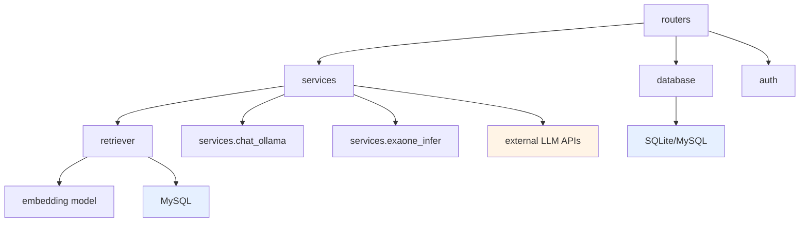
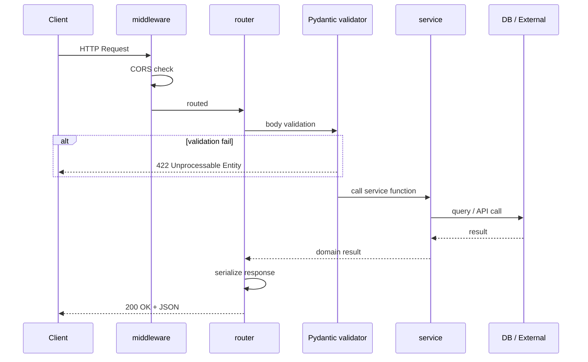

# 🏗️ Job-Pocket 백엔드 아키텍처

> **문서 목적**: FastAPI 기반 백엔드의 계층 구조, 의존성 흐름, 설계 패턴, 주요 관심사 분리 전략을 기술한다.
> **작성일**: 2026-04-22
> **버전**: v0.2.0
> **관련 파일**: `backend/**/*.py`, `docker/backend/`

---

## 1. 설계 원칙

### 1.1 계층 분리

백엔드는 HTTP 요청 처리, 비즈니스 로직, 외부 서비스 호출, 데이터 영속성을 명확히 분리한다. 각 계층은 상위 계층에만 의존하며, 하위 계층은 상위 계층의 존재를 알지 않는다. 이는 단위 테스트 용이성과 교체 비용 최소화를 목표로 한다.

### 1.2 Stateless Backend

FastAPI 프로세스 자체는 상태를 유지하지 않는다. 세션 상태는 Streamlit Frontend의 `st.session_state`에서 관리하며, 영속 상태는 MySQL에만 저장한다. 예외로 LLM 클라이언트(`llm_gpt`, `llm_groq`, `local_llm`)와 임베딩 모델은 프로세스 시작 시 1회 초기화 후 싱글톤처럼 재사용된다.

### 1.3 의존성 방향



상위에서 하위로만 의존이 흐른다. routers는 schemas·services·database에 의존하며, services는 retriever·외부 LLM·내부 유틸에 의존한다. 역방향 의존(예: retriever가 router 호출)은 허용되지 않는다.

---

## 2. 디렉토리 구조

```
backend/
├── main.py                    # FastAPI 앱 엔트리포인트
├── auth.py                    # 비밀번호 해싱, 토큰 생성
├── database.py                # DB 커넥션 및 CRUD
├── retriever.py               # HybridRetriever (FAISS + MySQL)
├── isrgrootx1.crt             # TLS 루트 인증서 (TiDB 연결 옵션용)
├── routers/                   # HTTP 엔드포인트
│   ├── auth.py                # /api/auth/*
│   ├── chat.py                # /api/chat/*
│   ├── resume.py              # /api/resume/*
│   └── health.py              # /health/z
├── schemas/                   # Pydantic 응답 모델
│   └── health.py
└── services/                  # 비즈니스 로직
    ├── chat_logic.py          # 6단계 RAG 파이프라인
    ├── chat_ollama.py         # RunPod Ollama 호출 래퍼
    ├── exaone_infer.py        # RunPod Serverless + EXAONE
    ├── health_service.py      # 헬스체크 로직
    └── essay_samples.json     # 샘플 자소서 시드 데이터
```

### 2.1 각 폴더의 역할

`routers/`는 HTTP 요청을 받아 요청 바디를 검증하고 적절한 service 함수를 호출한 뒤 응답을 반환한다. 비즈니스 로직을 포함하지 않는다는 원칙이다.

`services/`는 도메인 로직의 핵심이다. 단일 router에 묶이지 않고 여러 router가 공유할 수 있다. `chat_logic.py`가 대표적인 예로, chat router의 6개 엔드포인트가 모두 이 모듈의 함수를 호출한다.

`schemas/`는 Pydantic 기반 응답 모델을 담는다. v0.2.0에서는 `health.py`만 분리되어 있고 나머지 Request/Response 모델은 router 파일 내부에 동거한다. v0.3.0에서 전면 분리 예정이다.

`database.py`와 `auth.py`는 현재 루트에 위치하나, v0.3.0에서 `db/`와 `core/` 서브패키지로 이동할 계획이다.

---

## 3. Application 초기화

### 3.1 FastAPI 인스턴스 구성

```python
app = FastAPI(
    title="JobPocket API",
    description="AI Cover Letter Assistant Backend"
)

app.add_middleware(
    CORSMiddleware,
    allow_origins=["*"],        # 배포 시 제한 필요
    allow_credentials=True,
    allow_methods=["*"],
    allow_headers=["*"],
)

@app.on_event("startup")
def startup_event():
    db.init_db()

app.include_router(auth.router, prefix="/api/auth", tags=["Authentication"])
app.include_router(resume.router, prefix="/api/resume", tags=["Resume"])
app.include_router(chat.router, prefix="/api/chat", tags=["AI Chat Logic"])
app.include_router(health_check)
```

### 3.2 CORS 정책

개발 환경에서는 `allow_origins=["*"]`로 모든 오리진을 허용한다. v0.5.0 배포 단계에서는 `["http://localhost:8501"]` 또는 실제 도메인으로 제한할 예정이다.

### 3.3 기동 시 초기화

`startup` 이벤트에서 `db.init_db()`가 호출되어 테이블 스키마가 없을 경우 자동 생성된다. 이는 개발 편의를 위한 것이며, 운영 환경에서는 `database/init/*.sql`이 MySQL 컨테이너 초기화 시 한 번만 적용된다.

### 3.4 프로세스 시작 시 1회 로드

`services/chat_logic.py` 모듈 로드 시점에 다음이 초기화된다:

- LLM 클라이언트 3종 (`local_llm`, `llm_gpt`, `llm_groq`)
- HuggingFace 임베딩 모델 (`hf_embeddings`)
- HybridRetriever 인스턴스 (`selfintro_retriever`)

이 초기화는 컨테이너 기동 시 임베딩 모델 다운로드와 FAISS 인덱스 로드를 동반하므로 시간이 걸린다. 기동 후 첫 요청까지 보통 15~30초의 웜업이 필요하다.

---

## 4. 요청 생명주기

### 4.1 일반 요청 흐름



### 4.2 에러 처리

현재는 각 router에서 `HTTPException`을 직접 raise한다. 전역 예외 핸들러(`@app.exception_handler`)는 정의되어 있지 않다. v0.3.0에서 `backend/core/exceptions.py`를 추가하여 도메인 예외를 HTTP 상태 코드로 매핑하는 핸들러를 도입할 예정이다.

---

## 5. Router 계층 상세

### 5.1 Auth Router (`routers/auth.py`)

두 개의 엔드포인트를 제공한다: 회원가입(`/signup`), 로그인(`/login`). 모든 엔드포인트는 `auth.hash_pw()`로 비밀번호를 SHA-256 해싱한다. 로그인 성공 시 사용자 튜플 `(username, password_hash, email, resume_data)`을 그대로 반환하여, 프론트엔드가 `st.session_state.user_info`에 저장한다.

### 5.2 Resume Router (`routers/resume.py`)

사용자의 이력 정보(`resume_data`)를 조회·갱신한다. JSON 문자열 형태로 `users` 테이블의 `resume_data` 컬럼에 저장되며, 스키마는 `{personal, education, additional}` 3키로 구성된다.

### 5.3 Chat Router (`routers/chat.py`)

가장 복잡한 router다. 크게 두 가지 그룹의 엔드포인트를 제공한다:

- **이력 관리** (3개): `GET /history/{email}`, `POST /message`, `DELETE /history/{email}`
- **RAG 파이프라인** (6개): `POST /step-parse`, `step-draft`, `step-revise`, `step-refine`, `step-fit`, `step-final`

파이프라인 엔드포인트는 서로 독립된 상태를 가지지 않으며, 프론트엔드가 이전 스텝의 결과를 다음 스텝의 입력으로 전달하는 책임을 진다. 이는 대화 상태를 서버에 두지 않는 설계 결정의 결과다.

상세 명세는 `docs/wiki/backend/api_spec.md`를 참조한다.

### 5.4 Health Router (`routers/health.py`)

컨테이너 헬스체크 용도의 `GET /health/z` 엔드포인트 하나를 제공한다. Docker Compose의 healthcheck 설정이나 외부 모니터링 도구에서 사용한다.

---

## 6. Service 계층 상세

### 6.1 `chat_logic.py` 구조

1066줄의 가장 큰 모듈이며, 기능별로 7개 섹션으로 구성되어 있다:

1. **DB 연결 설정** — `DB_CONFIG` dict (환경변수 기반)
2. **모델 설정** — 3개 LLM 클라이언트 + 1개 임베딩 + HybridRetriever
3. **공통 유틸** — 파싱, 정규화, 반복률 계산 등
4. **프롬프트** — 로컬 초안용, 첨삭용 시스템 프롬프트 생성
5. **생성 단계** — `build_local_draft`, `refine_with_api`, `fit_length_if_needed`
6. **평가 단계** — `evaluate_draft_with_api`, `fallback_evaluation_comment`
7. **최종 조립** — `build_final_response`

### 6.2 `exaone_infer.py`

RunPod Serverless 환경에서 EXAONE 3.5 7.8B 모델을 로드하고 추론하는 함수다. 모델과 토크나이저를 전역 변수에 캐싱하여 콜드 스타트 이후 재호출 시 지연을 줄인다. HuggingFace `AutoModelForCausalLM`으로 FP16 + CUDA에서 실행한다. 주석 처리된 `@Endpoint` 데코레이터를 활성화하면 `runpod-flash`가 해당 함수를 Serverless 엔드포인트로 배포한다.

### 6.3 `chat_ollama.py`

`exaone_infer`를 async 호출 가능하도록 래핑한다. LangChain의 `BaseMessage` 리스트를 입력으로 받아, RunPod 응답을 문자열로 반환한다. 호출 실패 시 에러 메시지를 포함한 문자열을 반환하여 파이프라인이 끊기지 않게 설계됐다.

---

## 7. 데이터 계층

### 7.1 현재 구현 (`database.py`)

`database.py`는 SQLite(`user_data.db`)에 연결하여 `users`와 `chat_history` 테이블을 관리한다. 이는 초기 개발 단계의 잔재이며, Docker Compose로 띄운 MySQL 9와 연결되지 않은 상태다.

### 7.2 개선 계획 (v0.3.0)

v0.3.0 안정화 단계에서 SQLite를 제거하고 모든 영속 저장을 MySQL 9로 통합한다. `database.py`는 SQLAlchemy 또는 pymysql 기반으로 재작성되며, 기존 `database/init/03_rdb_tables.sql`의 스키마를 그대로 사용한다. Retriever가 이미 pymysql로 MySQL에 접속하고 있으므로 동일한 커넥션 설정을 재사용할 수 있다.

---

## 8. 외부 서비스 통합

### 8.1 LLM 제공자

세 종류의 LLM 제공자와 통합되어 있다. 각각은 LangChain의 표준 인터페이스(`BaseChatModel`)를 구현한 클래스로 추상화되어 있어, 애플리케이션 코드 입장에서는 제공자 차이를 신경쓰지 않는다.

| 제공자 | 클래스 | 모델 | 인증 환경변수 |
|---|---|---|---|
| OpenAI | `ChatOpenAI` | `gpt-4o-mini` | `OPENAI_API_KEY` |
| Groq | `ChatGroq` | `openai/gpt-oss-120b` | `GROQ_API_KEY` |
| Ollama (Local) | `ChatOllama` | `exaone3.5:7.8b` | (localhost:11434) |
| RunPod | custom async | EXAONE 3.5 7.8B | `RUNPOD_API_KEY` |

### 8.2 임베딩 모델

`HuggingFaceEmbeddings`를 통해 `Qwen/Qwen3-Embedding-0.6B` 모델을 CPU에서 실행한다. 첫 호출 시 HuggingFace Hub에서 모델 가중치를 다운로드하여 `~/.cache/huggingface/` 하위에 캐싱한다. 컨테이너 재시작 시 매번 다운받지 않으려면 볼륨 마운트가 필요하다 (v0.3.0에서 반영 예정).

### 8.3 관측 (LangSmith)

환경변수 `LANGSMITH_TRACING=true`가 설정되면 모든 LangChain Runnable 호출이 자동 추적된다. 프로젝트명은 `LANGSMITH_PROJECT=Job-pocket`로 지정되어 있다.

---

## 9. 환경변수

| 변수명 | 용도 | 필수 |
|---|---|---|
| `OPENAI_API_KEY` | OpenAI GPT-4o-mini 호출 | ✓ |
| `GROQ_API_KEY` | Groq GPT-OSS-120B 호출 | 선택 |
| `RUNPOD_API_KEY` | RunPod Serverless 호출 | 선택 |
| `RDB_URL` | RDB 접속 URL | ✓ (v0.3+) |
| `MYSQL_RDB_USER`, `MYSQL_RDB_PASSWORD` | RDB 계정 | ✓ (v0.3+) |
| `VECTOR_DB_URL` | Vector DB 접속 URL | ✓ |
| `MYSQL_VECTOR_USER`, `MYSQL_VECTOR_PASSWORD` | Vector DB 계정 | ✓ |
| `LANGSMITH_*` | 관측 도구 | 선택 |
| `TZ` | 타임존 | 권장 (`Asia/Seoul`) |

주의: `chat_logic.py`의 `DB_CONFIG`는 현재 `HOST/PORT/USER/PASSWORD/DB` 단일 이름 규약을 사용하여 `.env.example`과 불일치한다. v0.3.0에서 환경변수명을 통일할 예정이다.

---

## 10. Dockerization

### 10.1 Dockerfile 요약

Python 3.12-slim 이미지를 베이스로 하며, `gcc`, `pkg-config`만 시스템 패키지로 설치한다. `PYTHONPATH=/app`을 설정하여 `from routers.x import ...` 같은 루트 기반 import가 작동하게 한다.

### 10.2 실행 명령

```dockerfile
CMD ["uvicorn", "main:app", "--host", "0.0.0.0", "--port", "8000", "--reload"]
```

`--reload` 플래그는 개발 편의용이며, v0.5.0 배포 이미지에서는 제거하고 `--workers N`으로 멀티 프로세스 구성으로 전환한다.

### 10.3 의존성 관리

`docker/backend/requirements.txt`에 FastAPI, LangChain, Torch(CPU), FAISS, Transformers, 3종 LLM 클라이언트, pytest 등이 고정되어 있다. 이미지 빌드 캐시 효율을 위해 requirements 먼저 COPY하고 이어서 소스 COPY한다.

---

## 11. 현재 제약사항 및 개선 로드맵

### 11.1 알려진 제약

`backend/main.py`의 상당 부분이 삼중따옴표 주석 안에 갇혀 있어, 실행 시 `/health/z` 외 라우터가 등록되지 않는다. v0.2.1 핫픽스로 해결 예정이다.

`database.py`가 SQLite를 사용하여 Docker Compose의 MySQL과 분리되어 있다. 위에서 언급한 v0.3.0 통합 작업에 포함된다.

`retriever.py`가 로드하는 `faiss_index_high/` 폴더는 현재 저장소에 포함되지 않는다. 인덱스 빌드 스크립트(`scripts/embed/build_faiss_index.py`)가 별도로 필요하다.

### 11.2 개선 로드맵

| 버전 | 계획 |
|---|---|
| v0.2.1 | `main.py` 라우터 등록 복구 |
| v0.3.0 | SQLite → MySQL 9 통합 / 환경변수 네이밍 정리 / schemas 분리 |
| v0.4.0 | 구조화 로깅 / 전역 예외 핸들러 / Observability 강화 |
| v0.5.0 | bcrypt 전환 / JWT 인증 / CORS 제한 / multi-worker uvicorn |

---

## 12. 관련 문서

| 주제 | 문서 |
|---|---|
| API 명세 | `docs/wiki/backend/api_spec.md` |
| DB 설계 | `docs/wiki/backend/database.md` |
| Retriever 상세 | `docs/wiki/backend/rag_retriever.md` |
| RAG 파이프라인 | `docs/wiki/model/rag_pipeline.md` |
| 시스템 개요 | `docs/wiki/architecture/overview.md` |

---

*last updated: 2026-04-22 | 조라에몽 팀*
