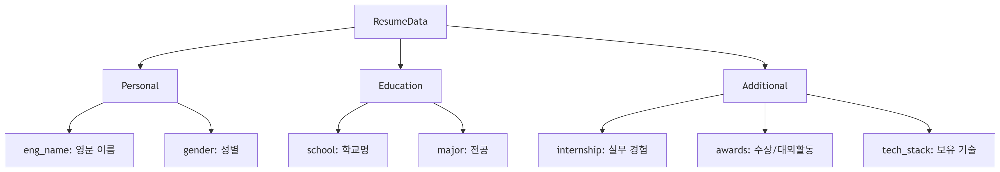

# 📖 데이터 사전 및 스키마 상세

> **문서 목적**: 시스템 내에서 사용되는 복잡한 데이터 구조(JSON)와 백엔드 모듈 간 통신에 사용되는 Pydantic 스키마 명세를 기술한다.  
> **최종 수정일**: 2026-04-26  
> **작성자**: 조라에몽 팀

---

## 1. 사용자 이력 데이터 계층 구조 (`ResumeData`)

사용자의 스펙 정보는 프론트엔드 폼과 백엔드 파이프라인 간의 호환성을 위해 계층형 Pydantic 모델로 정의되어 관리됩니다.

### 1.1 계층 구조도

---

## 2. API 단계별 요청 모델 (Contract Models)

RAG 파이프라인의 각 단계는 **상태 보존(Stateless)** 원칙에 따라 이전 단계의 결과물인 `parsed_data`를 인자로 전달받아 실행됩니다.

| 모델명 | 주요 필드 | 용도 |
|:--- |:--- |:--- |
| **StepParseRequest** | `prompt`, `model` | Step 1: 자연어 의도 분석 요청 |
| **StepDraftRequest** | `parsed_data`, `user_info` | Step 2: RAG 기반 초안 생성 요청 |
| **StepReviseRequest** | `existing_draft`, `revision_request` | Step 2 (Alt): 기존 결과 수정 요청 |
| **StepRefineRequest** | `draft`, `parsed_data` | Step 3: 문장 표현 정제 요청 |
| **StepFitRequest** | `refined`, `parsed_data` | Step 4: 글자 수 조정 요청 |
| **StepFinalRequest** | `adjusted`, `parsed_data`, `result_label` | Step 5: 최종 평가 및 조립 요청 |

---

## 3. 핵심 도메인 모델 (Internal Core)

시스템 내부 로직에서 의사결정의 기준이 되는 마스터 객체들입니다.

### 3.1 `ParsedUserRequest` (파이프라인 마스터 객체)
사용자의 복잡한 자연어 요청을 분석하여 구조화한 결과물입니다.
- **`company`**: 지원 기업 (예: 네이버).
- **`job`**: 지원 직무 (예: 백엔드).
- **`question_type`**: 문항 성격 (motivation, collaboration 등).
- **`char_limit`**: 목표 글자 수.

### 3.2 `LLMEvaluationResult` (구조화된 평가 데이터)
`Evaluator` 모듈이 생성하는 정형화된 품질 리포트입니다.
- **`label`**: 품질 등급 ('좋다', '보통', '아쉬움').
- **`reason`**: 등급 부여 사유.
- **`points`**: UI와 연동되어 자동 수정을 유도하는 보완점 리스트.

---

## 4. 기타 유틸리티 모델

- **ChatMessageRequest**: 사용자/AI의 메시지를 DB에 영속화할 때 사용 (`email`, `role`, `content`).
- **RetrievalResult**: FAISS 검색 결과 및 DB 원문을 조합한 객체 (`id`, `content`, `relevance_score`).

---

## 5. 데이터 매핑 및 인제스션 참고

데이터 적재 시 적용되는 표준화 규칙(회사명 정제, 직무 분류 등)은 아래 문서를 참조하십시오.

- **[Data Ingestion 상세 가이드](./data_ingestion.md)**: ETL 파이프라인 매핑 룰 명세.

---
*Copyright (c) 2026 Team Joraemon*
