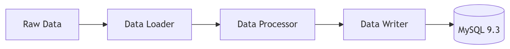

# 🧪 데이터 인제스션 및 전처리 파이프라인

> **문서 목적**: 원천 데이터(Raw Data)가 시스템에 적재되기까지의 정제, 구조화, 임베딩 과정을 기술한다.  
> **최종 수정일**: 2026-04-26  
> **작성자**: 조라에몽 팀

---

## 1. 파이프라인 개요

Job-Pocket의 RAG 성능은 고품질의 합격자 데이터에 의존합니다. 이를 위해 `database/ingestion` 모듈은 비정형 데이터를 정밀하게 정제하여 MySQL 9의 관계형 테이블과 벡터 테이블에 동시 적재하는 **3단계 ETL 프로세스**를 수행합니다.




---

## 2. 상세 전처리 프로세스 (Transform)

`DataProcessor` 클래스는 다양한 서브 모듈을 조율하여 데이터를 표준화합니다.

### 2.1 회사명 정제 (`CompanyNameCleaner`)
가장 복잡한 로직이 포함된 단계로, 텍스트 노이즈를 제거하고 유사한 기업명을 하나로 통합합니다.
- **기초 정규화**: 괄호(`()`, `[]`) 및 내부 내용 제거, 영문 사명 한글화(예: Naver -> 네이버).
- **접미사 표준화**: '솔루션', '네트워크' 등의 다양한 표기를 '솔루션즈', '네트웍스' 등으로 통일.
- **유사도 분석 (Edit Distance)**: 
    - 두 회사명의 편집 거리(Edit Distance)가 1인 경우, 데이터셋 내 빈도수가 더 높은 이름으로 통합합니다.
    - 예: `삼성전자` (100건) vs `삼성전가` (1건) → 모두 `삼성전자`로 통합.
- **충돌 방지**: 동일 그룹 내에 보호 키워드가 있는 경우 무분별한 통합을 방지합니다.

### 2.2 데이터 표준화 및 매핑
- **직무(Job Title)**: 비정형 직무명을 `frontend`, `backend`, `ai` 등 시스템이 정의한 카테고리로 매핑합니다.
- **경력(Career)**: `신입`, `경력`, `인턴` 등의 키워드를 분석하여 표준화된 등급을 부여합니다.
- **평가 및 점수 파이프**: `<eval_selfintro>`와 같은 커스텀 태그 내에서 실제 평가 텍스트와 수치화된 점수를 정규표현식으로 추출합니다.

### 2.3 이력서 및 자기소개서 정제
- 개인 식별 정보(이름, 연락처, 상세 주소 등)를 제거하거나 마스킹하여 보안을 강화합니다.
- 텍스트 내의 불필요한 줄바꿈, 특수문자, HTML 태그를 정규화합니다.

---

## 3. 효율적인 데이터 적재 (Load)

`JobPocketPipeline`은 대량의 데이터를 안정적으로 DB에 밀어넣기 위해 다음과 같은 전략을 사용합니다.

### 3.1 청크 단위 임베딩 (Chunk-based Embedding)
수만 건의 데이터를 한 번에 임베딩하면 메모리 부족(OOM)이 발생합니다. 파이프라인은 설정된 `chunk_size`(기본 3000) 단위로 데이터를 나누어 실시간으로 임베딩을 생성하고 적재합니다.

### 3.2 체크포인트 시스템 (`CheckpointManager`)
- 적재 중 네트워크 오류나 서버 중단이 발생하더라도, `checkpoint.json` 파일을 통해 마지막으로 성공한 인덱스를 기록합니다.
- 재실행 시 중복 적재 없이 중단된 지점부터 자동으로 재개합니다.

### 3.3 관계 중심 적재 (Phase-based Loading)
데이터 무결성을 위해 3단계로 나누어 적재합니다.
1. **Phase 1**: 회사(`companies`) 정보 적재.
2. **Phase 2**: 채용공고(`job_posts`) 정보 적재.
3. **Phase 3**: 지원자 기록(`applicant_records`) 및 벡터(`resume_vectors`) 적재.

---

## 4. 실행 방법

인제스션 파이프라인은 CLI 환경에서 실행할 수 있습니다.

```bash
# 기본 실행 (3000개 단위 청크)
python database/ingestion/pipeline.py

# 샘플링 실행 (100개만 테스트 적재)
python database/ingestion/pipeline.py --limit 100 --chunk_size 50
```

---

## 5. 관련 파일 위치

- **메인 파이프라인**: `database/ingestion/pipeline.py`
- **전처리 로직**: `database/ingestion/processors/data_processor.py`
- **회사명 정제**: `database/ingestion/processors/cleaners/company_cleaner.py`
- **DB 포맷터**: `database/ingestion/processors/formatters/db_formatter.py`
- **벌크 로더**: `database/ingestion/writers/bulk_loader.py`

---

*last updated: 2026-04-26 | 조라에몽 팀*
