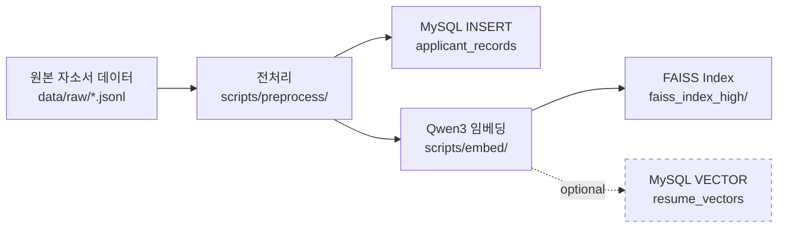

# 🗄️ Job-Pocket 데이터베이스 설계

> **문서 목적**: Job-Pocket 서비스가 사용하는 MySQL 9 데이터베이스의 스키마 설계, 테이블 구조, 관계, 인덱스 전략을 기술한다.
> **작성일**: 2026-04-22
> **버전**: v0.2.0
> **관련 파일**: `database/init/01~04_*.sql`, `database/my.cnf`

---

## 1. 설계 개요

### 1.1 DB 선정: MySQL 9 단일 인스턴스

일반적인 RAG 시스템은 관계형 데이터와 벡터 데이터를 분리하여 각각 PostgreSQL/MySQL과 Qdrant/Pinecone으로 구성한다. 본 프로젝트는 MySQL 9의 `VECTOR` 타입과 `VECTOR_DISTANCE()` 내장 함수를 활용하여 **단일 MySQL 인스턴스 안에서 RDB와 Vector DB를 논리적으로 분리 운영**하는 접근을 택했다. 이는 운영 복잡도 감소, 트랜잭션 일관성 확보, 학습 비용 절감을 목표로 한다.

물리적으로 하나의 MySQL 컨테이너에서 두 개의 데이터베이스를 생성한다:

| 데이터베이스 | 용도 | 접속 유저 |
|---|---|---|
| `job_pocket_rdb` | 사용자·채팅 이력 등 관계형 데이터 | `rdb_user` |
| `job_pocket_vector` | 자소서 샘플·회사·공고·벡터 | `vector_user` |

각 DB에 대해 독립된 유저를 생성하여 권한을 분리한다. Backend 애플리케이션은 두 DB에 별도의 커넥션 풀로 접속한다.

### 1.2 Character Set

모든 테이블은 `utf8mb4` + `utf8mb4_unicode_ci` (또는 `utf8mb4_0900_ai_ci`) 조합을 사용한다. 한국어·이모지·4바이트 UTF-8 문자를 완전히 지원하기 위함이다.

---

## 2. 전체 ERD

```mermaid
erDiagram
    USERS ||--o{ CHAT_HISTORY : "has"
    COMPANIES ||--o{ JOB_POSTS : "offers"
    JOB_POSTS ||--o{ APPLICANT_RECORDS : "receives"
    APPLICANT_RECORDS ||--|| RESUME_VECTORS : "embedded_as"

    USERS {
        int idx PK "AUTO_INCREMENT"
        varchar(50) username
        varchar(255) password "SHA-256 hash"
        varchar(100) email UK "UNIQUE"
        text resume_data "JSON string"
        timestamp created_at
    }

    CHAT_HISTORY {
        int id PK "AUTO_INCREMENT"
        varchar(100) user_email FK
        varchar(20) role "user / assistant"
        text content
        timestamp created_at
    }

    COMPANIES {
        int id PK "AUTO_INCREMENT"
        varchar(100) name UK "UNIQUE"
        timestamp updated_at
    }

    JOB_POSTS {
        int id PK "AUTO_INCREMENT"
        int company_id FK
        text description
        enum position_type "frontend/backend/ai engineer"
        enum career_type "junior/senior"
        text responsibilities
        text qualifications
        text preferred
        timestamp updated_at
    }

    APPLICANT_RECORDS {
        bigint id PK "AUTO_INCREMENT"
        int jobpost_id FK
        text resume_cleaned
        text selfintro
        text selfintro_evaluation
        int selfintro_score
        enum grade "high/mid/low"
        timestamp created_at
    }

    RESUME_VECTORS {
        bigint record_id PK_FK
        vector_1024 embedding "Qwen3 1024-dim"
    }
```

### 2.1 핵심 관계 요약

한 회사(`COMPANIES`)는 여러 채용공고(`JOB_POSTS`)를 가질 수 있다. 각 채용공고에는 여러 지원자 기록(`APPLICANT_RECORDS`)이 쌓이며, 각 기록은 정확히 한 건의 임베딩 벡터(`RESUME_VECTORS`)와 1:1로 대응된다. 사용자(`USERS`)와 그 사용자의 채팅 이력(`CHAT_HISTORY`)은 이메일을 외래키로 연결된다.

---

## 3. 테이블 상세

### 3.1 `job_pocket_rdb` 데이터베이스

#### 3.1.1 `users` — 사용자 정보

서비스 가입자의 인증 정보와 개인 이력을 저장한다. `resume_data`는 학력·경력·기술 스택 등 구조화된 이력 정보를 JSON 문자열로 직렬화하여 보관한다. 이 방식은 스키마 유연성(필드 추가/삭제에 테이블 변경 불필요)과 단순성을 동시에 얻기 위한 선택이다.

```sql
CREATE TABLE users (
    idx         INT NOT NULL AUTO_INCREMENT PRIMARY KEY,
    username    VARCHAR(50),
    password    VARCHAR(255) NOT NULL,    -- SHA-256 hash (64 chars)
    email       VARCHAR(100) NOT NULL UNIQUE,
    resume_data TEXT,                      -- JSON: {personal, education, additional}
    created_at  TIMESTAMP DEFAULT CURRENT_TIMESTAMP
) ENGINE = InnoDB DEFAULT CHARSET = utf8mb4;
```

**`resume_data` JSON 구조 예시**:

```json
{
  "personal": {"eng_name": "Hong Gil-Dong", "gender": "남성"},
  "education": {"school": "○○대학교", "major": "컴퓨터공학"},
  "additional": {
    "internship": "ABC 인턴 3개월 (데이터 파이프라인)",
    "awards": "2024 교내 해커톤 대상",
    "tech_stack": "Python, SQL, Docker"
  }
}
```

#### 3.1.2 `chat_history` — 채팅 이력

AI 자소서 첨삭 대화를 저장한다. 한 유저의 모든 대화를 시간순으로 조회할 수 있도록 `user_email`에 외래키를 걸었으며, 유저 삭제 시 `ON DELETE CASCADE`로 함께 정리된다.

```sql
CREATE TABLE chat_history (
    id         INT NOT NULL AUTO_INCREMENT PRIMARY KEY,
    user_email VARCHAR(100) NOT NULL,
    role       VARCHAR(20)  NOT NULL,    -- 'user' | 'assistant'
    content    TEXT         NOT NULL,
    created_at TIMESTAMP    DEFAULT CURRENT_TIMESTAMP,
    CONSTRAINT fk_user_email
        FOREIGN KEY (user_email) REFERENCES users (email)
        ON DELETE CASCADE ON UPDATE CASCADE
) ENGINE = InnoDB DEFAULT CHARSET = utf8mb4;
```

**예상 조회 패턴**: 특정 유저의 이력을 시간순으로 전체 로드 (`WHERE user_email = ? ORDER BY created_at ASC`). 향후 `(user_email, created_at)` 복합 인덱스 추가를 검토한다.

---

### 3.2 `job_pocket_vector` 데이터베이스

#### 3.2.1 `companies` — 회사 정보

채용공고의 모회사 정보를 정규화하여 저장한다. 이름으로 UNIQUE 제약을 걸어 동일 회사 중복 등록을 방지한다.

```sql
CREATE TABLE companies (
    id         INT AUTO_INCREMENT PRIMARY KEY,
    name       VARCHAR(100) UNIQUE NOT NULL,
    updated_at TIMESTAMP DEFAULT CURRENT_TIMESTAMP ON UPDATE CURRENT_TIMESTAMP
);
```

#### 3.2.2 `job_posts` — 채용공고

회사별 채용공고 정보를 저장한다. 직무(`position_type`)와 경력 구분(`career_type`)을 ENUM으로 제약하여 데이터 품질을 보장한다.

```sql
CREATE TABLE job_posts (
    id               INT AUTO_INCREMENT PRIMARY KEY,
    company_id       INT NOT NULL,
    description      TEXT,
    position_type    ENUM('frontend engineer',
                         'backend engineer',
                         'ai engineer') NOT NULL,
    career_type      ENUM('junior', 'senior') NOT NULL,
    responsibilities TEXT NOT NULL,
    qualifications   TEXT NOT NULL,
    preferred        TEXT,
    updated_at       TIMESTAMP DEFAULT CURRENT_TIMESTAMP,
    CONSTRAINT fk_company_id
        FOREIGN KEY (company_id) REFERENCES companies (id)
        ON DELETE CASCADE
);
```

**ENUM 값의 의도**: v0.2.0에서는 개발자 3개 직군(frontend/backend/ai engineer)만 지원한다. 향후 범위 확장 시 ENUM을 FOREIGN KEY 기반의 `positions` 테이블로 리팩토링할 수 있다.

#### 3.2.3 `applicant_records` — 지원자 기록 (RAG 샘플 원천)

서비스의 핵심 데이터로, 실제 서류 합격자의 자소서와 평가 정보를 저장한다. RAG 파이프라인의 검색 결과가 이 테이블에서 조회된다. `grade` 필드는 품질 등급(high/mid/low)으로, retriever의 Peer-First 필터링에 사용된다.

```sql
CREATE TABLE applicant_records (
    id                   BIGINT AUTO_INCREMENT PRIMARY KEY,
    jobpost_id           INT    NOT NULL,
    resume_cleaned       TEXT   NOT NULL,     -- 전처리 완료 이력 요약
    selfintro            TEXT   NOT NULL,     -- 자소서 본문 (검색 결과)
    selfintro_evaluation TEXT   NOT NULL,     -- 자소서 평가 의견
    selfintro_score      INT    NOT NULL,     -- 자소서 점수 (0~60)
    grade                ENUM('high','mid','low') NOT NULL,
    created_at           TIMESTAMP DEFAULT CURRENT_TIMESTAMP,
    INDEX idx_grade (grade),
    CONSTRAINT fk_record_id
        FOREIGN KEY (jobpost_id) REFERENCES job_posts (id)
        ON DELETE CASCADE
);
```

**인덱스 설계**: `grade` 단일 인덱스를 설정하여 등급별 필터링 성능을 확보했다. 현재는 '상' 등급만 적재되지만, 향후 '중' 등급 샘플 추가 시 `WHERE grade IN ('high','mid')` 쿼리가 빈번할 것으로 예상된다.

#### 3.2.4 `resume_vectors` — 임베딩 벡터

`applicant_records`의 자소서 본문을 Qwen3-Embedding-0.6B로 임베딩한 1024차원 벡터를 저장한다. MySQL 9의 `VECTOR` 타입을 활용한다.

```sql
CREATE TABLE resume_vectors (
    record_id BIGINT PRIMARY KEY,
    embedding VECTOR(1024) NOT NULL,
    CONSTRAINT fk_resume_id
        FOREIGN KEY (record_id) REFERENCES applicant_records (id)
        ON DELETE CASCADE
);
```

**1024 차원 선정 근거**: Qwen3-Embedding-0.6B 모델의 기본 출력 차원이 1024다. 모델 교체 시 이 값을 조정해야 하며, 동시에 기존 벡터를 재임베딩해야 한다.

**현재 구현 상태**: 운영 단계에서는 `resume_vectors` 테이블에 실제 벡터를 적재하지 않고, FAISS 로컬 인덱스(`faiss_index_high/`)를 사용한다. 이는 개발 편의성과 검색 속도 최적화를 위한 선택이며, v0.3.0 안정화 단계에서 MySQL VECTOR 기반으로 통합 전환을 검토한다. 두 저장소의 장단점은 `docs/wiki/model/rag_pipeline.md`에서 비교한다.

---

## 4. 데이터 적재 플로우



원본 자소서 데이터는 전처리를 거쳐 `applicant_records` 테이블에 INSERT되고, 동시에 Qwen3-Embedding-0.6B로 임베딩되어 FAISS 인덱스로 저장된다. MySQL VECTOR 컬럼(`resume_vectors`)은 옵션으로 준비되어 있으며, 현 단계에서는 FAISS가 주 저장소 역할을 한다.

---

## 5. 쿼리 패턴

### 5.1 RAG Retrieval 쿼리 (핵심)

HybridRetriever가 FAISS에서 top-N 후보의 ID를 얻은 뒤, 실제 본문을 가져오는 쿼리다.

```sql
SELECT id, selfintro
FROM applicant_records
WHERE id IN (%s, %s, %s);   -- FAISS에서 나온 top-3 ID
```

### 5.2 사용자 인증

```sql
SELECT username, password, email, resume_data
FROM users
WHERE email = %s;
```

### 5.3 채팅 이력 로드

```sql
SELECT role, content
FROM chat_history
WHERE user_email = %s
ORDER BY created_at ASC;
```

---

## 6. MySQL 튜닝 설정

`database/my.cnf`에서 벡터 연산과 안정성을 고려한 주요 설정을 적용했다.

| 파라미터 | 값 | 이유 |
|---|---|---|
| `character-set-server` | `utf8mb4` | 한국어·이모지 대응 |
| `collation-server` | `utf8mb4_0900_ai_ci` | MySQL 9 기본 한국어 정렬 |
| `innodb_buffer_pool_size` | `2G` | 벡터 연산 메모리 확보 |
| `innodb_buffer_pool_instances` | `2` | 동시성 개선 |
| `read_rnd_buffer_size` | `32M` | 벡터 후보 조회 랜덤 read 최적화 |
| `sort_buffer_size` | `16M` | ORDER BY 성능 |
| `innodb_flush_log_at_trx_commit` | `1` | crash-safe (ACID) |
| `sync_binlog` | `1` | 복제 안정성 |
| `max_connections` | `100` | 개발 환경 기본 |

---

## 7. 마이그레이션 전략

현재는 `database/init/*.sql` 파일을 MySQL 컨테이너의 `/docker-entrypoint-initdb.d/`에 마운트하여 초기 실행 시점에만 스키마를 생성한다. 향후 스키마 변경이 필요할 때는 다음 순서로 진행한다:

1. `database/init/` 아래에 새 번호(예: `05_alter_*.sql`)의 마이그레이션 파일을 추가한다.
2. 운영 DB에 해당 SQL을 수동 적용한다.
3. v0.4.0 최적화 단계에서 Alembic 등 마이그레이션 도구 도입을 검토한다.

---

## 8. 보안 고려사항

비밀번호는 애플리케이션 레벨(`backend/auth.py`)에서 SHA-256 해싱 후 저장한다. SHA-256은 속도가 빨라 brute-force 공격에 취약할 수 있으므로, 프로덕션 배포(v0.5.0) 전에 bcrypt 또는 Argon2로 전환할 예정이다.

DB 접근 유저는 `rdb_user`/`vector_user`로 분리되어 있으며, 각자 자신의 DB에만 `ALL PRIVILEGES`를 갖고 다른 DB에는 접근할 수 없다. root 계정은 컨테이너 초기화 용도 외에는 사용하지 않는다.

---

## 9. 관련 문서

| 주제 | 문서 |
|---|---|
| 아키텍처 개요 | `docs/wiki/architecture/overview.md` |
| RAG 파이프라인 | `docs/wiki/model/rag_pipeline.md` |
| Retriever 상세 | `docs/wiki/backend/rag_retriever.md` |
| 백엔드 구조 | `docs/wiki/backend/architecture.md` |
| 데이터 전처리 | `docs/wiki/data/preprocessing.md` |

---

*last updated: 2026-04-22 | 조라에몽 팀*
