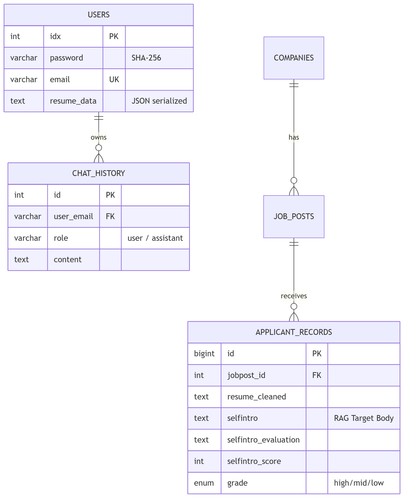

# 🗄️ Job-Pocket 데이터베이스 설계

> **문서 목적**: SQLAlchemy를 통해 관리되는 MySQL 9 기반의 스키마와 인프라 구성을 기술한다.  
> **최종 수정일**: 2026-04-26  
> **버전**: v0.3.0 (SQLAlchemy 및 Ingestion 연동 반영)

---

## 1. 설계 개요

Job-Pocket은 벡터 데이터베이스를 별도로 구축하지 않고, **MySQL 9의 VECTOR 타입**과 내장 `VECTOR_DISTANCE()` 함수를 수용하기 위한 설계를 지향합니다. 다만 현재 RAG 검색 속도의 최적화를 위해 **FAISS In-memory 인덱스**를 주력으로 사용하며, MySQL은 원문 데이터 저장소의 역할을 담당합니다.

DB 연결과 ORM 처리는 `SQLAlchemy` 및 `PyMySQL` 드라이버를 통해 수행됩니다. (`backend/common/db.py`)

---

## 2. 데이터베이스 분리 (Logical Separation)

하나의 MySQL 컨테이너 내에서 권한과 용도에 따라 두 개의 논리적 DB를 운용합니다.

### 2.1 `job_pocket_rdb`
- **목적**: 시스템 운영 및 사용자 데이터 관리.
- **테이블**:
  - `users`: 로그인 정보 및 `resume_data`(JSON 형태의 이력 스펙).
  - `chat_history`: AI 첨삭 대화 기록.

### 2.2 `job_pocket_vector`
- **목적**: RAG 모델의 참조(Reference) 데이터베이스. 데이터 인제스션 파이프라인에 의해 일괄 관리됨.
- **테이블**:
  - `companies`, `job_posts`: 정규화된 채용공고 정보.
  - `applicant_records`: **가장 중요한 테이블**. 전처리된 합격 자소서 원문, 평가, 점수, 품질 등급(`grade`)을 보관.
  - `resume_vectors`: MySQL VECTOR 연산 실험을 위한 임베딩 저장 테이블 (선택적 사용).

---

## 3. 엔티티 관계 및 주요 컬럼

### 3.1 `users.resume_data`
- 프론트엔드의 "내 스펙 보관함"에서 전달되는 `{personal, education, additional}` 딕셔너리를 단일 문자열로 저장합니다. 
- 스키마가 자주 변동되는 사용자 스펙 정보에 유연하게 대응하기 위함입니다.

### 3.2 `applicant_records.selfintro`
- RAG 파이프라인에서 추출하는 최종 문맥(Context) 원문입니다.
- 이 컬럼의 텍스트가 임베딩되어 FAISS 인덱스와 매핑됩니다 (FAISS ID = `applicant_records.id`).

---

## 4. 데이터 초기화 및 마이그레이션

- 로컬/개발 환경 구축 시 `database/init/01~04_*.sql` 스크립트가 Docker 진입점(`docker-entrypoint-initdb.d`)을 통해 실행되어 테이블을 생성합니다.
- 대량의 합격자 자소서 데이터는 `database/ingestion/pipeline.py` ETL 파이프라인을 통해 정제된 후 `job_pocket_vector`에 적재됩니다. (상세 내용은 `Data Ingestion` 문서 참조)

---

*last updated: 2026-04-26 | 조라에몽 팀*
