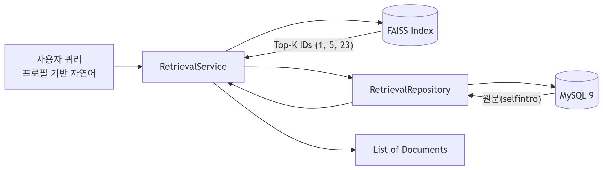

# 🔍 Job-Pocket RAG Retriever 상세

> **문서 목적**: 로컬 FAISS 인덱스와 MySQL 기반의 하이브리드 리트리버 시스템 구조를 기술한다.  
> **최종 수정일**: 2026-04-26  
> **버전**: v0.3.0 (RetrievalService / RetrievalRepository 분리)

---

## 1. 아키텍처 개요

과거 하나의 클래스(`HybridRetriever`)가 담당하던 벡터 검색과 데이터베이스 조회를 **Service-Repository 패턴**에 맞춰 분리했습니다. 이를 통해 로직의 결합도를 낮추고 데이터 접근 방식을 투명하게 관리합니다.




---

## 2. 구성 요소 상세

### 2.1 `RetrievalService` (`backend/services/retrieval_service.py`)
- **역할**: 비즈니스 로직 및 FAISS 벡터 인덱스 접근 관리.
- **검색 전략**: 임베딩 생성 시 적용된 정규화(Normalization)와 FAISS의 **내적(Inner Product) 연산 전략**을 결합하여, 수학적으로 완벽한 **코사인 유사도** 기반의 검색 결과를 도출합니다.
- **초기화**: FastAPI 기동 시 `Qwen3-Embedding-0.6B` 임베딩 모델과 로컬 파일시스템의 `faiss_index_high/` 폴더를 읽어들여 메모리에 유지합니다.
- **검색 흐름**:
  1. 임베딩 모델을 이용해 쿼리를 벡터화.
  2. `similarity_search_with_score`를 호출하여 최적의 유사도를 가진 Document(본문에는 MySQL ID 보관) 추출.
  3. `RetrievalRepository`에 추출된 ID 리스트를 넘겨 원문 데이터 요청.
  4. LangChain `Document` 객체 또는 내부 `RetrievalResult` Pydantic 스키마로 포맷팅하여 반환.

### 2.2 `RetrievalRepository` (`backend/repository/retrieval_repository.py`)
- **역할**: 영속성 계층(DB)과의 직접적인 통신 담당.
- **구현**: SQLAlchemy Engine(`vector_engine`)에서 `PyMySQL` Raw Connection을 획득하여 `applicant_records` 테이블에 대해 빠르고 가벼운 IN 절 쿼리를 수행합니다.

```python
# 예시 쿼리
SELECT id, selfintro FROM applicant_records WHERE id IN (1, 5, 23);
```

---

## 3. FAISS 인덱스와 MySQL의 동기화

FAISS 인덱스는 검색 성능을 위해 DB의 벡터 데이터를 기반으로 사전 빌드되어 관리됩니다.
- **인덱스 구성**: DB의 `resume_vectors` 테이블에 저장된 1024차원 임베딩을 추출하여 고속 검색용 바이너리(`index.faiss`)로 변환한 결과물입니다.
- **FAISS Document 구성**:
  - `page_content`: 문자열화된 MySQL의 Record ID (`"123"`)
  - `metadata`: `selfintro_score` (합격 자소서 품질 점수)
- **이점**: 자소서 본문에 오타 수정 등의 단순 업데이트가 발생하더라도, 벡터의 의미가 크게 바뀌지 않는 한 FAISS 인덱스를 다시 빌드할 필요 없이 DB 값만 갱신하여 즉시 반영할 수 있습니다.

*인덱스 구축 및 업데이트는 `database/ingestion` 파이프라인을 통해 자동화되어 관리됩니다.*

---

*last updated: 2026-04-26 | 조라에몽 팀*
