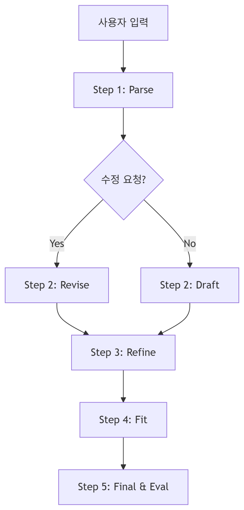

# 🎨 Job-Pocket 프론트엔드 아키텍처

> **문서 목적**: Streamlit 기반 프론트엔드의 페이지 라우팅, 세션 상태 관리, API 호출 패턴을 기술한다.  
> **최종 수정일**: 2026-04-26  
> **버전**: v0.3.0 (최적화된 파이프라인 반영)

---

## 1. 설계 원칙

### 1.1 Streamlit 기반 UI
Python 중심의 선언적 UI 프레임워크인 Streamlit을 사용하여 빠른 프로토타이핑을 구현했습니다. AI 서비스 특성상 입력 폼과 채팅 인터페이스가 주를 이루므로, Streamlit의 재실행(Rerun) 모델이 적합합니다.

### 1.2 비즈니스 로직 위임
프론트엔드는 **화면 렌더링**과 **API 호출 오케스트레이션**에 집중하며, 실제 데이터 처리 및 LLM 생성 로직은 백엔드에 전적으로 위임합니다. 특히 자소서 생성의 여러 단계를 프론트엔드가 순차적으로 호출하여 사용자에게 실시간 진행 상황을 공유합니다.

---

## 2. 디렉토리 구조

```text
frontend/
├── app.py                     # 진입점, 라우팅 및 사이드바 구성
├── public/                    # 로고 및 정적 자산
├── .streamlit/                # 테마 및 서버 설정 (config.toml)
├── utils/
│   ├── api_client.py          # Backend API 통신 래퍼 (환경변수 기반)
│   └── ui_components.py       # 커스텀 CSS 및 공통 UI 요소
└── views/
    ├── auth_view.py           # 인증 관련 화면 (로그인/회원가입)
    ├── chat_view.py           # 메인 AI 채팅 및 파이프라인 제어
    └── resume_view.py         # 사용자 스펙 관리 (Tabs 기반 폼)
```

---

## 3. 페이지 라우팅 및 세션 관리

### 3.1 상태 기반 라우팅
별도의 라우팅 라이브러리 없이 `st.session_state`의 변수값에 따라 조건부 렌더링을 수행합니다.
- `logged_in`: 로그인 여부.
- `page`: 로그인 전 페이지 (login / signup / find_password).
- `menu`: 로그인 후 메뉴 (chat / resume).

### 3.2 핵심 세션 변수
| 변수명 | 역할 |
|---|---|
| `messages` | 현재 세션의 채팅 이력 버퍼 |
| `user_info` | 로그인된 사용자의 프로필 데이터 (Parsed JSON) |
| `pending_prompt` | 보완 포인트 '적용' 버튼 클릭 시 자동 전송될 프롬프트 |
| `current_result_version` | 수정본 차수 카운터 |

---

## 4. API 통신 전략

### 4.1 환경변수 기반 설정
`utils/api_client.py`는 `os.getenv("API_BASE_URL")`를 통해 백엔드 주소를 동적으로 결정합니다. Docker 환경에서는 `http://backend:8000`으로 통신합니다.

### 4.2 최적화된 파이프라인 호출
기존의 고정된 6단계 호출 방식에서, 사용자 의도에 따른 **분기형 파이프라인**으로 최적화되었습니다.




- **데이터 재사용**: Step 1에서 얻은 `parsed_data`를 이후 모든 단계의 인자로 전달하여 백엔드의 중복 파싱을 방지합니다.

---

## 5. UI/UX 요소

### 5.1 진행 단계 가시화 (Progress Card)
사용자가 LLM의 긴 응답 대기 시간 동안 지루함을 느끼지 않도록, `render_progress_card`를 통해 현재 수행 중인 단계(1/4 ~ 4/4)를 시각적으로 노출합니다.

### 5.2 퀵 액션 (Quick Action)
AI가 제시한 보완 포인트를 클릭 한 번으로 반영할 수 있도록 '적용' 버튼을 제공합니다. 이는 `pending_prompt` 세션을 거쳐 다음 대화로 자동 이어집니다.

---

*last updated: 2026-04-26 | 조라에몽 팀*
