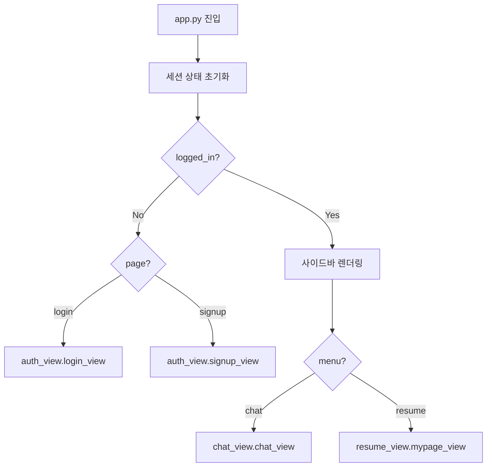

# 🎨 Job-Pocket 프론트엔드 아키텍처

> **문서 목적**: Streamlit 기반 프론트엔드의 페이지 라우팅, 세션 상태 관리, 컴포넌트 구성, API 호출 패턴을 기술한다.
> **작성일**: 2026-04-22
> **버전**: v0.2.0
> **관련 파일**: `frontend/app.py`, `frontend/views/*.py`, `frontend/utils/*.py`

---

## 1. 설계 원칙

### 1.1 Streamlit 선정 이유

Streamlit은 Python 단일 파일 기반의 선언적 UI 프레임워크다. React/Vue 같은 SPA 프레임워크 대비 러닝커브가 낮고, 데이터 사이언스/AI 프로젝트의 프로토타이핑에 최적화되어 있다. Job-Pocket의 UI는 입력 폼 중심이고 복잡한 상태 전이가 없어, Streamlit의 재실행 기반 모델이 잘 맞는다.

### 1.2 Backend와의 경계

프론트엔드는 **화면 렌더링과 상호작용 중심**이며, 비즈니스 로직은 전적으로 Backend에 위임한다. 프론트엔드의 주 책임은 다음과 같다:

- 사용자 입력 수집 (폼, 채팅 입력)
- 세션 상태 관리 (`st.session_state`)
- Backend API 호출 오케스트레이션 (특히 6단계 파이프라인 순차 호출)
- 응답 데이터 포맷팅 및 표시

자소서 품질 검증, 프롬프트 구성, RAG 검색 같은 로직은 프론트엔드에 두지 않는다.

---

## 2. 디렉토리 구조

```
frontend/
├── app.py                     # 진입점, 사이드바, 라우팅
├── public/
│   └── logo_light.png         # 브랜드 로고
├── .streamlit/
│   └── config.toml            # Streamlit 설정
├── utils/
│   ├── api_client.py          # Backend API 호출 래퍼
│   └── ui_components.py       # 공통 UI (CSS, 헤더 등)
└── views/
    ├── auth_view.py           # 로그인/회원가입
    ├── chat_view.py           # AI 자소서 첨삭 채팅
    └── resume_view.py         # 내 스펙 보관함
```

### 2.1 역할별 구분

`app.py`는 애플리케이션의 진입점이다. 페이지 설정, 세션 초기화, 사이드바 렌더링, 페이지 라우팅을 담당한다.

`views/`는 화면 단위 모듈이다. 각 뷰는 하나의 사용자 의도(로그인, 채팅, 이력 관리)를 처리한다.

`utils/`는 재사용 가능한 유틸리티다. `api_client.py`는 Backend HTTP 통신을, `ui_components.py`는 공통 UI 요소(커스텀 CSS, 헤더 등)를 제공한다.

---

## 3. 페이지 라우팅

### 3.1 라우팅 전략

React Router 같은 전용 라우터는 사용하지 않는다. 대신 `st.session_state.page`와 `st.session_state.menu` 두 변수를 **조건 분기**로 읽어 해당 뷰 함수를 호출한다.



### 3.2 라우팅 변수

| 변수 | 값 | 의미 |
|---|---|---|
| `logged_in` | bool | 로그인 여부 결정 |
| `page` | login / signup | 로그인 전 화면 |
| `menu` | chat / resume | 로그인 후 화면 |

### 3.3 화면 전환 메커니즘

사용자가 "회원가입" 버튼을 누르면 다음 흐름이 발생한다:

1. 버튼 클릭 이벤트로 `st.session_state.page = "signup"` 실행
2. `st.rerun()` 호출로 스크립트 전체 재실행
3. 재실행된 `app.py`가 `page == "signup"` 분기를 타고 `signup_view()` 호출

이는 Streamlit의 "매 상호작용마다 스크립트 전체 재실행" 모델에 따른 자연스러운 전환 방식이다.

---

## 4. 세션 상태 관리

### 4.1 초기화

`app.py`의 `DEFAULT_SESSION_VALUES` dict에 14개의 세션 변수 기본값이 정의되어 있다. 애플리케이션 시작 시 세션에 없는 키를 기본값으로 채운다:

```python
DEFAULT_SESSION_VALUES = {
    "logged_in": False,
    "user_info": None,
    "messages": [],
    "page": "login",
    "menu": "chat",
    "selected_model": "GPT-4o-mini",
    "history_loaded_for": None,
    "show_welcome": True,
    "pending_prompt": None,
    "current_result_version": 0,
}
for key, value in DEFAULT_SESSION_VALUES.items():
    if key not in st.session_state:
        st.session_state[key] = value
```

### 4.2 상태 변수 상세

| 변수 | 용도 | 변경 시점 |
|---|---|---|
| `logged_in` | 로그인 여부 | login/logout |
| `user_info` | 사용자 5-tuple | login 직후 |
| `messages` | 채팅 메시지 버퍼 | 로그인 시 로드, 메시지 발생 시 append |
| `page` | 로그인 전 페이지 | 버튼 클릭 |
| `menu` | 로그인 후 메뉴 | 사이드바 버튼 |
| `selected_model` | 선택된 LLM | 사이드바 selectbox |
| `history_loaded_for` | 이력 로드 완료 이메일 | 최초 로드 시 |
| `show_welcome` | 웰컴 화면 표시 | 이력 0건일 때 |
| `pending_prompt` | 전송 대기 프롬프트 | 추천 프롬프트 클릭 시 |
| `current_result_version` | 수정본 버전 카운터 | 수정 요청마다 +1 |

### 4.3 로그아웃 시 초기화

```python
if st.button("로그아웃", ...):
    st.session_state.clear()
    st.rerun()
```

`st.session_state.clear()`로 전체 초기화 후 재실행하면 초기 페이지(로그인)로 돌아간다. 이 방식은 단순하고 누수 없이 안전하다.

---

## 5. 사이드바 (로그인 후)

사이드바는 로그인된 사용자의 모든 메뉴와 상태를 통합 제공한다. `app.py`의 `with st.sidebar:` 블록에서 렌더링된다.

### 5.1 구성 요소

사이드바는 위에서 아래로 다음 요소를 배치한다:

- 로고 이미지 (base64 인코딩하여 inline 표시, border-radius 적용)
- 사용자 정보 popover (👤 이름 클릭 시 "내 스펙 보관함" 버튼 노출)
- 새 채팅 버튼 (`menu = "chat"`으로 전환)
- AI 모델 선택 selectbox (GPT-4o-mini / GPT-OSS-120B (Groq))
- 대화 기록 리스트 (최근 사용자 질문 15자 미리보기, 최신이 위)
- 대화 전체 삭제 버튼 (🗑️)
- 로그아웃 버튼 (하단 고정)

### 5.2 이력 자동 로드

로그인 직후 사이드바 렌더링 직전에 이력 로드가 발생한다:

```python
if st.session_state.history_loaded_for != user_email:
    st.session_state.messages = api_client.load_chat_history_api(user_email)
    st.session_state.history_loaded_for = user_email
    st.session_state.show_welcome = not bool(st.session_state.messages)
```

`history_loaded_for` 플래그를 사용하여 같은 세션에서 반복 로드를 방지한다. 다른 사용자로 전환하면 (`user_email`이 변경되면) 재로드된다.

### 5.3 대화 전체 삭제 플로우

🗑️ 버튼 클릭 시:

1. `api_client.delete_chat_history_api(user_email)`로 Backend DELETE 호출
2. `st.session_state.messages = []`로 로컬 버퍼 비움
3. `show_welcome = True`, `current_result_version = 0`으로 초기 상태 복원
4. `st.rerun()`으로 화면 재구성

---

## 6. 뷰 레이어

### 6.1 뷰 함수 시그니처

모든 뷰 함수는 인자를 받지 않고 전역 세션 상태만 참조한다:

```python
def login_view(): ...
def signup_view(): ...
def chat_view(): ...
def mypage_view(): ...
```

이는 Streamlit의 재실행 모델과 어울리는 단순한 패턴이다. 뷰 내부에서 상태를 변경하려면 `st.session_state`를 직접 수정한다.

### 6.2 뷰별 책임 요약

| 뷰 | 파일 | 주요 기능 |
|---|---|---|
| Auth | `views/auth_view.py` | 로그인, 회원가입 |
| Chat | `views/chat_view.py` | 메시지 표시, 프롬프트 입력, 6단계 파이프라인 호출, 수정 버튼 |
| Resume | `views/resume_view.py` | 이력 정보 입력 폼 (인적사항/학력/경력) |

상세 뷰 구현은 `docs/wiki/frontend/views.md`를 참조한다.

---

## 7. API Client

### 7.1 구조

`frontend/utils/api_client.py`는 Backend의 모든 엔드포인트에 대응하는 함수를 제공한다. 각 함수는 다음 네 가지 책임을 가진다:

1. 적절한 HTTP 메서드와 엔드포인트 호출
2. Request body 직렬화 (dict → JSON)
3. 응답 상태 코드 확인
4. 성공/실패 결과를 Python 친화적 형태로 변환

### 7.2 함수 목록

| 함수 | 엔드포인트 | 반환값 |
|---|---|---|
| `login_api` | POST /api/auth/login | (success, user_info or error) |
| `signup_api` | POST /api/auth/signup | (success, message) |
| `get_user_resume_api` | GET /api/resume/{email} | JSON string |
| `update_resume_data_api` | PUT /api/resume/{email} | bool |
| `load_chat_history_api` | GET /api/chat/history/{email} | list |
| `save_chat_message_api` | POST /api/chat/message | (없음) |
| `delete_chat_history_api` | DELETE /api/chat/history/{email} | (없음) |
| `parse_request_api` | POST /api/chat/step-parse | dict |
| `generate_local_draft_api` | POST /api/chat/step-draft | str / None |
| `revise_existing_draft_api` | POST /api/chat/step-revise | str |
| `refine_with_api_api` | POST /api/chat/step-refine | str |
| `fit_length_api` | POST /api/chat/step-fit | str |
| `build_final_response_api` | POST /api/chat/step-final | str |

### 7.3 BASE_URL 설정

```python
BASE_URL = "http://localhost:8000/api"
```

현재 하드코딩되어 있으나, Docker 내부 통신에서는 `http://backend:8000/api`로 전환해야 한다. v0.3.0에서 환경변수(`API_BASE_URL`)로 분리할 예정이다.

### 7.4 에러 처리 철학

Backend가 실패 응답을 보내면 API client는 대체로 안전한 기본값을 반환한다. 예를 들어 refine 실패 시 원본 draft를 반환하고, 이력 로드 실패 시 빈 리스트를 반환한다. 이 방식은 사용자 경험을 끊지 않기 위한 choice이며, 에러 자체는 `st.error()` 또는 콘솔 로그로만 표시된다.

---

## 8. UI 컴포넌트

### 8.1 `utils/ui_components.py`

공통 UI 요소를 제공한다. 주요 함수는 다음과 같다:

| 함수 | 역할 |
|---|---|
| `apply_custom_css()` | 커스텀 CSS를 `st.markdown`으로 주입하여 기본 테마 확장 |
| `display_header(title)` | 공통 헤더 (로고 + 제목) 렌더링 |

커스텀 CSS는 사이드바 하단 고정, 버튼 스타일, 채팅 말풍선 등 Streamlit 기본 스타일로는 구현이 까다로운 부분을 담는다.

### 8.2 아바타

```python
AI_AVATAR = "public/logo_light.png"
USER_AVATAR = "👤"
```

`st.chat_message(role, avatar=...)` 호출 시 `role`에 따라 AI는 로고 이미지, 사용자는 이모지를 표시한다.

---

## 9. Streamlit 설정

`.streamlit/config.toml`은 Streamlit 런타임 설정을 담는다. 주로 테마 색상, 서버 옵션, 탭 이름 등이 지정된다. 운영 환경에서는 `runOnSave=false`, `developmentMode=false`로 전환한다.

---

## 10. 페이지 설정

```python
st.set_page_config(
    page_title="JobPocket",
    page_icon="public/logo_light.png",
    layout="wide"
)
```

`layout="wide"`는 전체 화면 너비를 사용하도록 하여, 자소서 본문과 평가가 나란히 표시될 공간을 확보한다.

---

## 11. 현재 제약 및 개선 계획

### 11.1 제약

**API_BASE_URL 하드코딩**: 환경변수로 분리되지 않아 Docker 배포 시 수정이 필요하다.

**에러 UX**: Backend 에러가 발생해도 사용자에게 명확히 알리지 않는 경우가 있다. 파이프라인 중 실패를 단계별로 보여주는 UI 개선이 필요하다.

**파이프라인 진행 표시**: 6단계 진행을 단일 로딩 스피너로 보여주어, 어느 단계인지 알기 어렵다. 단계별 진행 표시가 필요하다.

### 11.2 v0.3.0 개선

| 항목 | 내용 |
|---|---|
| 환경변수 | `API_BASE_URL` 분리 |
| 에러 UX | 단계별 상태 표시 + 재시도 버튼 |
| 파이프라인 표시 | Step 1~6 체크리스트 형태 표시 |
| 반응형 | 모바일 화면 최적화 |

---

## 12. 관련 문서

| 주제 | 문서 |
|---|---|
| 뷰 상세 | `docs/wiki/frontend/views.md` |
| API 명세 | `docs/wiki/backend/api_spec.md` |
| 시퀀스 다이어그램 | `docs/wiki/architecture/sequence_diagram.md` |
| 데이터 플로우 | `docs/wiki/architecture/data_flow.md` |

---

*last updated: 2026-04-22 | 조라에몽 팀*
