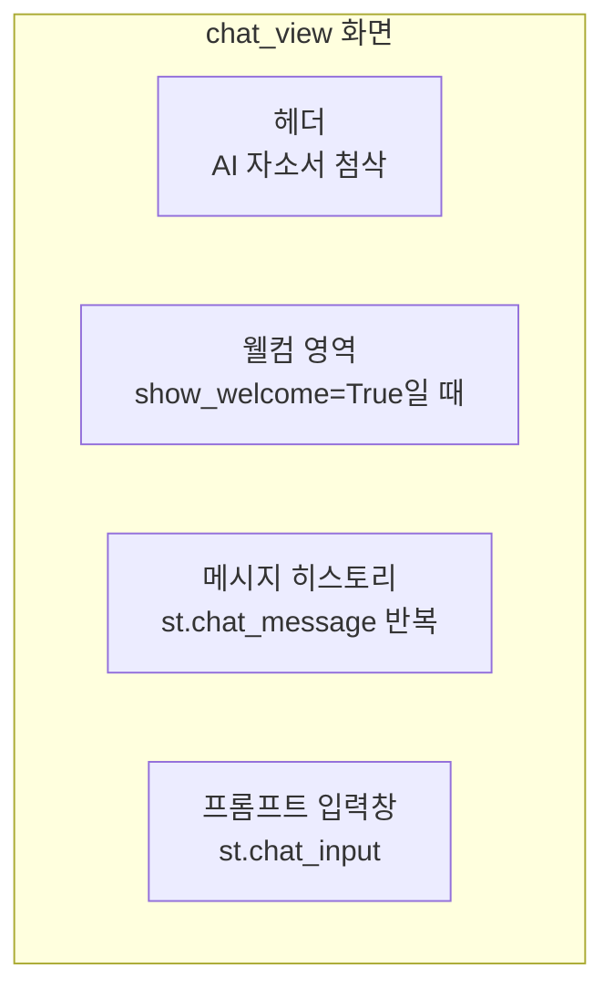
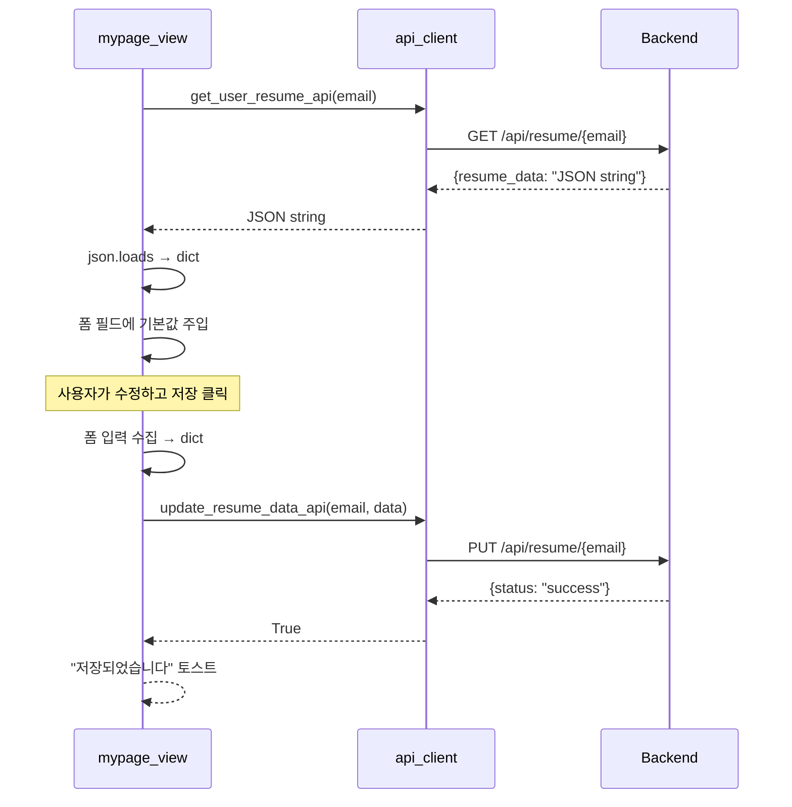

# 🖥️ Job-Pocket 뷰(Views) 상세

> **문서 목적**: 프론트엔드 3개 뷰(Auth, Chat, Resume)의 내부 구조, 상호작용 로직, 핵심 헬퍼 함수를 기술한다.
> **작성일**: 2026-04-22
> **버전**: v0.2.0
> **관련 파일**: `frontend/views/*.py`

---

## 1. 뷰 개요

| 뷰 | 파일 | 라인 수 | 주 기능 | 필요 인증 |
|---|---|---|---|---|
| Auth | `auth_view.py` | 59 | 로그인·회원가입 | 불필요 |
| Chat | `chat_view.py` | 391 | AI 자소서 첨삭 채팅 | 필요 |
| Resume | `resume_view.py` | 50 | 이력 정보 관리 | 필요 |

Chat 뷰가 전체 분량의 76%를 차지하며, 시스템의 핵심 기능을 담고 있다.

---

## 2. Auth View (`auth_view.py`)

### 2.1 함수 구성

| 함수 | 화면 | 호출 API |
|---|---|---|
| `login_view()` | 로그인 폼 | `login_api` |
| `signup_view()` | 회원가입 폼 | `signup_api` |

### 2.2 login_view 흐름

```python
def login_view():
    display_header("로그인")
    _, col_main, _ = st.columns([1, 2, 1])
    
    with col_main:
        with st.form("login_form"):
            email = st.text_input("이메일 주소")
            password = st.text_input("비밀번호", type="password")
            
            if st.form_submit_button("로그인", use_container_width=True):
                success, user_data_or_error = api_client.login_api(email, password)
                if success:
                    st.session_state.logged_in = True
                    st.session_state.user_info = user_data_or_error
                    st.session_state.menu = "chat"
                    st.session_state.history_loaded_for = None
                    st.rerun()
                else:
                    st.error("이메일 또는 비밀번호가 올바르지 않습니다.")
        
        if st.button("회원가입", use_container_width=True):
            st.session_state.page = "signup"
            st.rerun()
```

**주요 설계 포인트**:

`st.form`으로 감싸는 이유는 "Enter 키로 제출"과 "폼 필드 동시 검증"을 가능하게 하기 위함이다. 폼 내부의 `st.form_submit_button`만이 폼 제출 트리거가 된다.

3컬럼 레이아웃(`[1, 2, 1]`)으로 중앙 정렬한다. `layout="wide"` 설정과 결합하여 데스크톱에서 폼이 과하게 늘어지는 것을 방지한다.

로그인 성공 시 `history_loaded_for = None`을 설정하여, 사이드바 렌더링 시 해당 사용자의 이력을 새로 로드하도록 유도한다.

---

## 3. Chat View (`chat_view.py`)

### 3.1 주요 함수

| 함수 | 역할 |
|---|---|
| `chat_view()` | 메인 화면 렌더링 |
| `get_result_label(content)` | 메시지에서 `[자소서 초안]` 등의 라벨 추출 |
| `get_last_assistant_result()` | 메시지 중 최신 자소서 본문 추출 |
| `extract_resume_text(content)` | 조립된 응답에서 본문만 분리 |
| `extract_evaluation_text(content)` | 응답에서 `[평가 및 코멘트]` 블록 추출 |
| `parse_evaluation_for_display(text)` | 평가 텍스트를 dict(rating, reason, points)로 파싱 |
| `point_to_revision_prompt(point)` | 평가의 보완 포인트를 수정 요청 프롬프트로 변환 |

### 3.2 화면 구성

Chat 뷰는 크게 세 영역으로 나뉜다:



첫 방문자(대화 이력 0건)에게는 추천 프롬프트 카드가 표시되어 어떻게 시작할지 가이드를 제공한다.

### 3.3 파이프라인 실행 흐름

사용자가 프롬프트를 입력하면 chat_view는 다음 흐름으로 6단계 API를 순차 호출한다:

```python
# 의사 코드
user_prompt = st.chat_input(...) or st.session_state.pending_prompt

# 1. 사용자 메시지 저장
st.session_state.messages.append({"role": "user", "content": user_prompt})
api_client.save_chat_message_api(email, "user", user_prompt)

# 2. 수정 요청 여부 판정
last_result = get_last_assistant_result()
is_revision = bool(last_result) and "수정" in user_prompt

if is_revision:
    existing_body = extract_resume_text(last_result)
    revised = api_client.revise_existing_draft_api(
        existing_body, user_prompt, selected_model
    )
    draft = revised
else:
    # 3. Parse → Draft
    parsed = api_client.parse_request_api(user_prompt, selected_model)
    draft = api_client.generate_local_draft_api(
        user_prompt, user_info, selected_model
    )

# 4. Refine → Fit → Final
refined = api_client.refine_with_api_api(draft, user_prompt, selected_model)
adjusted = api_client.fit_length_api(refined, user_prompt, selected_model)
final = api_client.build_final_response_api(
    adjusted, user_prompt, selected_model,
    result_label="1차 수정안" if is_revision else "자소서 초안"
)

# 5. 응답 저장
st.session_state.messages.append({"role": "assistant", "content": final})
api_client.save_chat_message_api(email, "assistant", final)
st.rerun()
```

### 3.4 결과 텍스트 파싱

Backend가 반환하는 `final_response`는 다음 고정 형식을 따른다:

```
[자소서 초안]

(또는 "반영 사항: ..." 한 줄)

(본문)

[평가 및 코멘트]
평가 결과: 좋다
이유: ...
보완 포인트:
- 포인트 1
- 포인트 2
```

Frontend는 이 조립된 텍스트를 다시 **분리**하여 UI에 표시한다. 분리 작업은 `extract_resume_text`와 `extract_evaluation_text`가 담당한다.

**`extract_resume_text` 로직**:

1. 첫 줄의 `[라벨]` 태그를 제거
2. `반영 사항:` 줄이 있으면 제거
3. `[평가 및 코멘트]`를 기준으로 split하여 본문만 남김

**`parse_evaluation_for_display` 로직**:

평가 텍스트를 줄 단위로 순회하며 `평가 결과:`, `이유:`, `보완 포인트` 헤더를 감지한다. `보완 포인트` 섹션 이후의 `-` 또는 `•` 시작 줄은 `points` 리스트에 추가한다.

### 3.5 수정 제안 버튼

각 평가의 "보완 포인트"는 버튼으로 렌더링되어, 클릭 시 해당 포인트를 수정 요청 프롬프트로 변환하여 자동 전송한다.

**`point_to_revision_prompt` 매핑 예시**:

| 보완 포인트 키워드 | 변환된 프롬프트 |
|---|---|
| "첫 문장" 포함 | "이 결과의 첫 문장이 더 선명하고 구체적으로 드러나도록 수정해줘." |
| "마지막 문단" 포함 | "이 결과의 마지막 문단이 더 자연스럽고 현실적인 마무리가 되도록 수정해줘." |
| (그 외) | 원문 그대로 수정 요청 |

버튼 클릭 시 `st.session_state.pending_prompt`에 변환된 프롬프트가 저장되고 `st.rerun()`이 호출되어, 다음 사이클에서 자동으로 파이프라인이 재실행된다.

### 3.6 수정본 버전 카운터

`current_result_version`은 수정 요청이 발생할 때마다 +1 증가하며, "1차 수정안", "2차 수정안" 같은 `result_label`을 생성하는 데 사용된다. 대화 전체 삭제 시 0으로 리셋된다.

### 3.7 로딩 상태 표시

파이프라인 실행 동안 `st.spinner("자소서를 작성하고 있어요...")`로 로딩 인디케이터를 표시한다. 6단계 전체 소요 시간은 LLM 응답 시간에 따라 15초~60초 수준이다.

---

## 4. Resume View (`resume_view.py`)

### 4.1 구조

`mypage_view()` 함수 하나로 구성되어 있다. 내부적으로 `st.tabs`로 3개 탭(👤 인적사항 / 🎓 학력 / 🏆 경력·스펙)을 만들고, 각 탭에 폼 필드를 배치한다.

### 4.2 데이터 로드·저장 흐름



### 4.3 이력 데이터 스키마

3개 섹션으로 구조화된다:

| 섹션 | 필드 |
|---|---|
| `personal` | `eng_name`, `gender` |
| `education` | `school`, `major` |
| `additional` | `internship`, `awards`, `tech_stack` |

스키마 변경이 자유로우며, Backend는 JSON 문자열을 그대로 저장하므로 필드 추가/삭제에 테이블 변경이 필요 없다.

### 4.4 프론트엔드 폼 설계

모든 필드는 `st.form` 안에 배치되어 "저장" 버튼 한 번으로 전체 필드를 한꺼번에 전송한다. 성별(`gender`)은 3-option selectbox, 나머지는 모두 자유 텍스트 입력이다.

---

## 5. 뷰 간 전환

### 5.1 로그인 전

`st.session_state.page`를 변경하고 `st.rerun()`을 호출하면 `app.py`의 페이지 라우팅이 해당 뷰를 호출한다. 전환 흐름:

```
login_view → (회원가입 버튼) → signup_view
```

### 5.2 로그인 후

`st.session_state.menu`를 변경하여 사이드바에서 Chat ↔ Resume 뷰 간 전환한다. 전환 시 세션 데이터(user_info, messages 등)는 유지된다.

---

## 6. 공통 UI 패턴

### 6.1 폼 제출 후 `st.rerun()`

대부분의 변경 작업 후 `st.rerun()`을 호출하여 화면을 재구성한다. 이는 Streamlit의 재실행 모델과 조화를 이루기 위한 관례다. 재실행 없이 `st.session_state`만 변경하면 현재 사이클에서는 반영되지 않는다.

### 6.2 토스트 알림

성공/실패 메시지는 `st.success()`, `st.error()`, `st.warning()`으로 인라인 표시하거나, 짧은 메시지는 `st.toast()`로 토스트 알림을 사용한다. 토스트는 시각적 부담이 적어 저장·삭제 같은 빈번한 액션에 적합하다.

### 6.3 `time.sleep` + `st.rerun`

일부 성공 메시지는 표시 후 `time.sleep(1.5)` + `st.rerun()` 조합으로 자동 페이지 전환을 구현한다. 예: 회원가입 성공 → "가입되었습니다" 표시 → 1.5초 후 로그인 페이지로.

---

## 7. 테스트 전략 (향후)

v0.3.0에서 도입할 프론트엔드 테스트 전략:

| 대상 | 도구 | 범위 |
|---|---|---|
| 파서 함수 | pytest | `extract_resume_text`, `parse_evaluation_for_display`, `point_to_revision_prompt` 등 순수 함수 |
| API client | pytest + requests-mock | Backend 응답 모킹하여 각 `*_api` 함수 검증 |
| 뷰 인터랙션 | Streamlit Testing | 폼 제출, 버튼 클릭 시 상태 변경 |

프론트엔드 파서 함수는 순수 함수이므로 단위 테스트가 용이하다. 특히 `parse_evaluation_for_display`는 Backend 응답 포맷이 변경되면 즉시 깨지므로 회귀 테스트 우선순위가 높다.

---

## 8. 현재 제약 및 개선 계획

### 8.1 제약

**파이프라인 진행률 불투명**: 사용자가 15초 이상 기다리는 동안 어느 단계인지 알 수 없다.

**편집 중 이탈 방지 부재**: 이력 편집 중 다른 메뉴로 이동하면 변경 사항이 사라진다.

**수정 제안 매핑 단순화**: `point_to_revision_prompt`가 키워드 기반이라 다양한 표현에 대응이 부족하다.

### 8.2 v0.3.0 개선

| 항목 | 내용 |
|---|---|
| 진행률 표시 | Step 1~6 단계 체크리스트 |
| 편집 보호 | 브라우저 unload 이벤트로 경고 |
| 수정 제안 | LLM으로 프롬프트 변환 |
| 국제화 | 영어 UI 대응 준비 |

---

## 9. 관련 문서

| 주제 | 문서 |
|---|---|
| 프론트엔드 아키텍처 | `docs/wiki/frontend/architecture.md` |
| API 명세 | `docs/wiki/backend/api_spec.md` |
| 시퀀스 다이어그램 | `docs/wiki/architecture/sequence_diagram.md` |

---

*last updated: 2026-04-22 | 조라에몽 팀*
