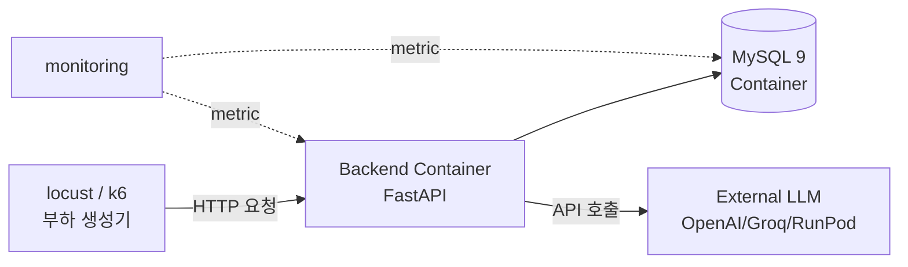

# ⚡ Job-Pocket 성능 테스트 보고서

> **문서 목적**: 서비스의 응답 시간, 동시성, 리소스 사용량에 대한 성능 테스트 계획과 결과를 기록한다. v0.4.0 최적화 단계에서 정식 수행 예정이며, 본 문서는 계획과 베이스라인 관찰을 포함한다.
> **작성일**: 2026-04-22
> **버전**: v0.2.0 (베이스라인 관찰)
> **관련 문서**: `docs/wiki/test/test_plan.md`, `docs/wiki/architecture/infra_diagram.md`

---

## 1. 개요

### 1.1 목적

성능 테스트의 목적은 서비스가 정상적인 사용 부하 하에서 사용자 경험을 해치지 않는 범위의 응답 시간과 안정성을 유지하는지 정량 검증하는 것이다. Job-Pocket은 LLM 호출이 응답 시간의 대부분을 차지하는 특성상, 단순한 처리량(throughput)보다 **단일 요청의 end-to-end 지연**과 **다중 사용자 환경에서의 안정성**이 핵심 관심사다.

### 1.2 현재 상태

v0.2.0 시점에서는 정식 성능 테스트가 **수행되지 않았다**. 이는 다음 이유 때문이다.

- 치명 결함(D-001)으로 API 대부분이 동작하지 않음
- FAISS 인덱스 부재로 RAG 파이프라인 실행 불가
- 성능 테스트의 의미 있는 수행은 기능이 정상 동작하는 v0.3.0 이후

본 문서는 v0.4.0 최적화 단계에서 수행할 **성능 테스트 계획서**이자, v0.2.0 시점에 관찰된 **베이스라인 데이터**를 기록한다.

### 1.3 수행 일정

| 단계 | 시점 | 수행 내용 |
|---|---|---|
| 준비 | v0.3.0 말 | 시나리오 스크립트 작성, 기준값 설정 |
| 베이스라인 측정 | v0.4.0 초 | 현재 시스템의 기본 성능 확보 |
| 1차 부하 테스트 | v0.4.0 중 | 동시 사용자 시나리오 실행 |
| 최적화 작업 | v0.4.0 중 | 병목 식별 후 개선 적용 |
| 2차 검증 | v0.4.0 말 | 최적화 효과 측정 |

---

## 2. 성능 목표

### 2.1 응답 시간 목표 (from test_plan.md)

| 엔드포인트 | p50 | p95 | p99 |
|---|---|---|---|
| GET /health/z | < 50ms | < 100ms | < 200ms |
| POST /api/auth/login | < 300ms | < 800ms | < 1.5s |
| POST /api/auth/signup | < 500ms | < 1.2s | < 2s |
| GET /api/chat/history | < 300ms | < 800ms | < 1.5s |
| POST /api/chat/step-parse | < 1.5s | < 3s | < 5s |
| POST /api/chat/step-draft | < 25s | < 45s | < 60s |
| POST /api/chat/step-refine | < 10s | < 20s | < 30s |
| POST /api/chat/step-final | < 10s | < 20s | < 30s |
| **전체 파이프라인 (6단계)** | **< 60s** | **< 90s** | **< 120s** |

### 2.2 동시성 목표

| 지표 | 목표 | 최소 허용 |
|---|---|---|
| 동시 처리 가능 사용자 수 | 50 | 20 |
| API 요청 처리량 | 10 req/s | 5 req/s |
| 파이프라인 동시 실행 | 5 | 3 |
| 에러율 (동시 부하 하) | < 1% | < 3% |

### 2.3 리소스 사용 목표

| 리소스 | 목표 (정상 부하) | 최대 허용 |
|---|---|---|
| Backend 메모리 | < 2 GB | 3 GB |
| Backend CPU | < 60% 평균 | 85% 피크 |
| MySQL 메모리 | < 1.5 GB | 2 GB |
| 디스크 I/O | — | 포화 없음 |

### 2.4 통과 기준

v0.4.0 성능 테스트의 통과 기준은 위의 p95 응답 시간과 에러율 < 1%를 **모두 만족**하는 것이다. 하나라도 미달 시 최적화 작업 후 재측정한다.

---

## 3. 테스트 범위

### 3.1 In-Scope

**단일 사용자 응답 시간**: 각 API 엔드포인트의 단일 호출 기준 p50/p95/p99 측정.

**다중 사용자 동시성**: 가상 사용자 수를 5 → 10 → 20 → 50으로 점진 증가하며 에러율과 응답 시간 변화 관찰.

**지속 부하 (Endurance)**: 10명 동시 사용자로 30분 지속 실행 시 메모리 누수나 성능 저하가 있는지 확인.

**리소스 사용**: Backend·MySQL 컨테이너의 메모리·CPU 사용 곡선 기록.

### 3.2 Out-of-Scope

**한계 부하 (Stress Test)**: 시스템이 완전히 망가지는 지점 탐지는 v0.4.0 범위 외.

**지리적 분산 테스트**: 단일 리전 기준만 측정. 멀티 리전은 배포 후 별도 수행.

**LLM 제공자 자체의 성능**: OpenAI, Groq, RunPod 서비스 지연은 측정 대상이 아니며, 관측만 한다.

**Streamlit Frontend 렌더링 성능**: 브라우저 쪽 성능은 별도 문서에서 다룬다.

---

## 4. 테스트 시나리오

### 4.1 시나리오 A — 헬스체크 스모크

가장 단순한 시나리오로, 시스템의 기본 응답성을 확인한다. 1명의 가상 사용자가 초당 1회씩 1분간 `GET /health/z`를 호출한다. 전체 성공, p99 < 200ms가 기대치다.

### 4.2 시나리오 B — 인증 플로우

회원가입 → 로그인 → 이력 조회의 3단계 시나리오. 가상 사용자 10명이 1분간 반복 실행하며, 이메일 주소는 사용자별로 유니크하게 생성한다.

```python
# locust 의사코드
class AuthFlow(HttpUser):
    @task
    def auth_journey(self):
        email = f"user_{uuid.uuid4()}@test.com"
        self.client.post("/api/auth/signup", json={
            "name": "테스트", "email": email, "password": "pw"
        })
        self.client.post("/api/auth/login", json={
            "email": email, "password": "pw"
        })
        self.client.get(f"/api/resume/{email}")
```

### 4.3 시나리오 C — 파이프라인 단일 실행

로그인된 사용자 1명이 자소서 생성 요청을 연속 3회 실행한다. 각 6단계 API 호출에 걸리는 시간을 개별 측정하여 병목 단계를 식별한다.

### 4.4 시나리오 D — 파이프라인 동시 실행

가상 사용자 5명이 동시에 자소서 생성 요청을 시작한다. 파이프라인은 5~6개 API를 순차 호출하므로 요청 수가 많고, LLM 호출이 지배적이므로 동시 실행의 부담이 크다. p95 응답 시간 목표 달성 여부가 핵심 판단 지표다.

### 4.5 시나리오 E — 이력 조회 읽기 부하

자소서를 이미 많이 생성한 사용자 10명이 사이드바에서 이력을 반복 조회한다. 가장 빈번한 읽기 쿼리로, DB 쿼리 성능과 MySQL 커넥션 풀 동작을 검증한다.

### 4.6 시나리오 F — 30분 지속 부하

가상 사용자 10명이 30분 동안 위 시나리오 B~E를 랜덤하게 섞어 실행한다. 메모리 누수, 커넥션 누수, 성능 저하를 관찰한다. 시작 대비 종료 시점의 p95 응답 시간이 10% 이내 증가만 허용한다.

---

## 5. 테스트 환경

### 5.1 인프라 구성

성능 테스트는 로컬 개발자 머신이 아닌 **전용 측정 환경**에서 수행한다. 개발 PC의 배경 작업이 결과에 영향을 주지 않도록 분리하는 것이 중요하다.

| 항목 | 권장 사양 |
|---|---|
| CPU | 4코어 이상 (임베딩 CPU 추론 고려) |
| 메모리 | 16 GB 이상 |
| 디스크 | SSD, 50 GB 이상 여유 |
| 네트워크 | 안정적 유선 연결 |
| OS | Ubuntu 24 권장 (프로덕션과 동일) |

### 5.2 대상 시스템 구성



Backend와 DB는 Docker Compose로 기동한 상태 그대로 사용한다. 부하 생성기는 동일 머신의 별도 프로세스로 실행하거나, 가능하면 다른 머신에서 HTTP로 접근한다.

### 5.3 측정 데이터 준비

의미 있는 부하 테스트를 위해 다음 데이터가 사전 준비되어야 한다.

| 데이터 | 목표 규모 |
|---|---|
| `users` 테이블 | 사전 생성 유저 100명 |
| `chat_history` | 유저당 20건 이상 (평균) |
| `applicant_records` | 1000건 이상 |
| FAISS 인덱스 | 1000건 임베딩 |

이 데이터는 `scripts/seed/performance_seed.py` (v0.4.0 예정)로 자동 생성한다.

---

## 6. 도구

### 6.1 부하 생성 — locust

테스트 계획서(`docs/wiki/test/test_plan.md`)에서 locust를 선정한 이유는 Python 기반이라 팀의 친숙도가 높고, 시나리오를 Python 코드로 작성할 수 있어 복잡한 흐름(로그인 → 파이프라인 호출 등)을 자연스럽게 표현 가능하기 때문이다.

대안으로 **k6**(JavaScript 기반)도 고려했으나, 팀이 Python에 더 익숙하므로 locust를 채택했다. 두 도구의 결과 신뢰성은 유사하다.

### 6.2 리소스 모니터링

| 지표 | 도구 |
|---|---|
| 컨테이너 리소스 | `docker stats` 또는 cAdvisor |
| MySQL 쿼리 프로파일링 | `SHOW PROCESSLIST`, `EXPLAIN` |
| LLM 호출 지연 | LangSmith (프로젝트에 이미 연동) |
| 시스템 리소스 | `htop`, `iostat` |

### 6.3 결과 분석

locust는 기본 제공하는 HTML 리포트와 CSV 로그를 사용한다. 추가로 시간 시리즈 그래프가 필요하면 locust의 `--csv` 옵션으로 내보낸 데이터를 pandas로 분석한다.

### 6.4 CI 통합 가능성

성능 테스트는 실행 비용과 시간이 크므로 **매 PR마다 실행하지 않는다**. 대신 다음 트리거에서 실행한다:

- `release/*` 브랜치로 PR 생성 시
- 수동 `workflow_dispatch` 트리거
- 주간 스케줄 (매주 금요일 오전 등)

---

## 7. v0.2.0 베이스라인 관찰

정식 테스트 이전이지만, 개발 중 관찰된 성능 특성을 베이스라인으로 기록한다.

### 7.1 측정된 값

| 항목 | 관찰 값 | 측정 방법 |
|---|---|---|
| Backend 컨테이너 기동 시간 | 20~35초 | `docker compose up -d` 후 health 응답까지 |
| `/health/z` 응답 시간 | ~12ms | curl 단일 호출 |
| Streamlit 첫 렌더링 | ~3초 | 브라우저 첫 접속 |
| MySQL 컨테이너 기동 | 15~25초 | mysqladmin ping 성공까지 |

### 7.2 추정 값 (측정 불가)

결함 D-001 등으로 인해 직접 측정되지 않았으나, 코드 리뷰와 경험적 수치로 추정한 값이다.

| 항목 | 추정 값 | 근거 |
|---|---|---|
| Qwen3 임베딩 1회 (CPU) | 500~1000ms | Qwen3-Embedding-0.6B 공개 벤치마크 + CPU 환경 |
| FAISS 검색 1회 (1000건) | < 50ms | FAISS 일반 성능 특성 |
| MySQL SELECT 1건 조회 | < 10ms | 인덱스 있는 Primary Key 조회 |
| EXAONE 3.5 Draft 생성 | 10~25초 | RunPod Serverless, 500자 출력 기준 |
| GPT-4o-mini Refine | 3~8초 | 일반적 API 지연 |
| GPT-OSS-120B (Groq) | 2~5초 | Groq 고속 추론 특성 |

### 7.3 예상 병목

현재 구조에서 예상되는 성능 병목은 다음과 같다.

**Draft 생성 (EXAONE)**: 전체 파이프라인의 50% 이상을 차지할 것으로 예상된다. 7.8B 모델의 추론 자체가 느린데다, 품질 검증 실패 시 재생성이 발생하면 선형 증가한다.

**임베딩 CPU 추론**: 쿼리당 1회 0.5~1초가 걸리는데, 동시 요청 시 Python GIL 영향으로 병목이 될 수 있다. GPU 전환 또는 배치 처리로 완화 가능.

**MySQL 커넥션**: `retriever.py`의 커넥션 close 이슈(docs/wiki/backend/test.md 6.3 참조)로 인해 재사용 시 문제 가능성. 커넥션 풀 도입 필요.

---

## 8. 실행 계획 (v0.4.0)

### 8.1 Phase 1 — 환경 구축 (1일)

전용 테스트 머신 준비, locust 스크립트 작성, 측정 데이터 시드 생성을 수행한다.

### 8.2 Phase 2 — 베이스라인 측정 (1일)

6개 시나리오(A~F)를 순차 실행하여 현재 성능의 정량 값을 확보한다. 모든 수치를 `docs/wiki/test/performance_report.md`의 "측정 결과" 섹션에 기록한다 (본 문서 추후 업데이트).

### 8.3 Phase 3 — 병목 분석 (1~2일)

측정 결과가 목표에 미달하면 병목 지점을 파악한다. 주요 분석 도구:

- **Flame Graph**: py-spy로 Python 프로파일링
- **LangSmith**: LLM 호출별 지연 분해
- **SQL 프로파일링**: 슬로우 쿼리 로그 분석

### 8.4 Phase 4 — 최적화 적용 (2~3일)

식별된 병목에 따라 다음 중 선택적 적용:

| 병목 유형 | 최적화 방안 |
|---|---|
| Draft 생성이 느림 | EXAONE 양자화, temperature 하향, 프롬프트 단축 |
| 임베딩이 느림 | GPU 전환, 배치 처리, 쿼리 캐싱 |
| DB 쿼리가 느림 | 인덱스 추가, 커넥션 풀, 쿼리 최적화 |
| FAISS 검색이 느림 | IVF 인덱스로 전환, initial_k 하향 |
| API 자체가 느림 | multi-worker uvicorn, async 최적화 |

### 8.5 Phase 5 — 재검증 (1일)

최적화 후 동일 시나리오를 재실행하여 개선 효과를 수치로 확인한다. 목표 달성 시 본 문서의 "최종 결과" 섹션에 기록하고 v0.4.0 마무리.

---

## 9. 측정 결과 (v0.4.0 실행 후 채워질 것)

### 9.1 시나리오별 결과

#### 시나리오 A — 헬스체크

| 지표 | 목표 | 측정 | 판정 |
|---|---|---|---|
| 평균 응답 | < 50ms | — | ⏳ |
| p95 | < 100ms | — | ⏳ |
| 에러율 | 0% | — | ⏳ |

#### 시나리오 C — 파이프라인 단일 실행

| 단계 | 목표 p95 | 측정 p95 | 판정 |
|---|---|---|---|
| step-parse | < 3s | — | ⏳ |
| step-draft | < 45s | — | ⏳ |
| step-refine | < 20s | — | ⏳ |
| step-fit | < 20s | — | ⏳ |
| step-final | < 20s | — | ⏳ |
| **전체** | **< 90s** | — | ⏳ |

#### 시나리오 D — 동시 5명 파이프라인

| 지표 | 목표 | 측정 | 판정 |
|---|---|---|---|
| p95 응답 시간 | < 120s | — | ⏳ |
| 에러율 | < 1% | — | ⏳ |
| 처리량 | — | — | — |

### 9.2 리소스 사용

(v0.4.0 실행 후 표 채움)

### 9.3 병목 식별

(v0.4.0 실행 후 분석 기록)

### 9.4 최적화 전후 비교

(v0.4.0 Phase 5 후 기록)

---

## 10. 위험 및 고려사항

### 10.1 LLM API 비용

성능 테스트는 실제 LLM API를 대량 호출한다. 대략 100회 파이프라인 실행 시 $5~10 비용 발생 예상. CI 통합 대신 수동 실행으로 제한하여 비용 통제한다.

### 10.2 외부 서비스 가용성

LLM API 제공자(특히 OpenAI, Groq)의 일시적 성능 저하가 측정 결과에 영향을 준다. 테스트 당일의 서비스 상태(status page)를 기록하고, 비정상 지연 시 재측정한다.

### 10.3 FAISS 인덱스 재빌드

성능 테스트용 데이터 규모(1000건 이상)가 개발 환경(수~수십 건)과 다르다. 테스트 전 전용 인덱스 빌드 필요. 빌드 시간 자체도 측정 대상에 포함할지 별도 고려.

### 10.4 측정 오차

Docker 컨테이너 환경에서는 호스트 OS의 자원 경쟁이 측정치에 노이즈를 추가할 수 있다. 각 시나리오를 3회 반복 실행하여 중간값을 사용한다.

---

## 11. 관련 문서

| 주제 | 문서 |
|---|---|
| 테스트 계획서 | `docs/wiki/test/test_plan.md` |
| 최종 테스트 보고서 | `docs/wiki/test/test_report_final.md` |
| 인프라 구성 | `docs/wiki/architecture/infra_diagram.md` |
| 백엔드 아키텍처 | `docs/wiki/backend/architecture.md` |
| Retriever 상세 | `docs/wiki/backend/rag_retriever.md` |
| 모델 선정 근거 | `docs/wiki/model/model_selection.md` |

---

## 12. 개정 이력

| 버전 | 날짜 | 주요 변경 |
|---|---|---|
| 0.1 | 2026-04-22 | v0.2.0 베이스라인 관찰 및 v0.4.0 계획 작성 |
| 0.2 (예정) | v0.4.0 초 | Phase 2 베이스라인 측정 결과 반영 |
| 0.3 (예정) | v0.4.0 말 | 최적화 후 재측정 결과 반영 |
| 1.0 (예정) | v0.5.0 | 배포 전 최종 성능 승인 |

---

*last updated: 2026-04-22 | 조라에몽 팀*
