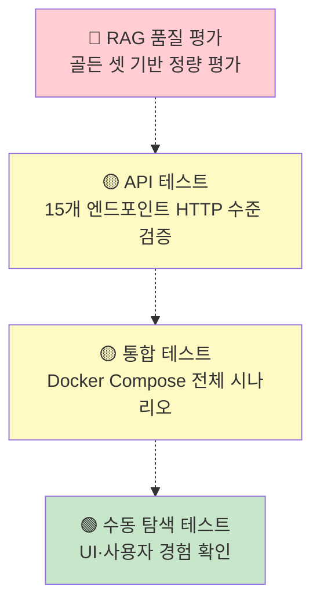
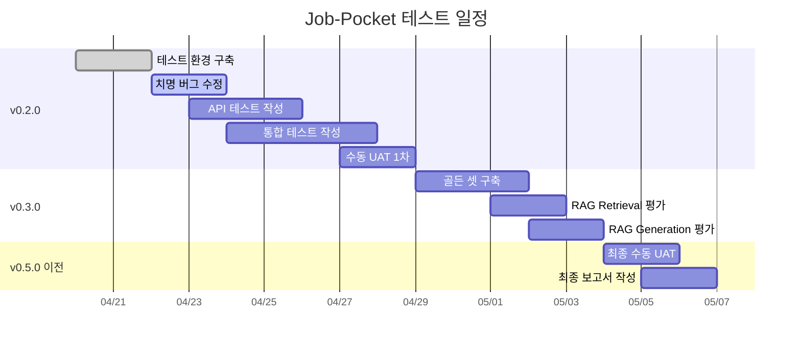

# 🧪 Job-Pocket 테스트 계획서

> **문서 목적**: Job-Pocket 서비스의 품질 보증을 위한 테스트 전략, 범위, 일정, 통과 기준, 리스크 관리 방안을 체계적으로 기술한다.
> **작성일**: 2026-04-22
> **버전**: v0.2.0
> **작성자**: 조라에몽 팀

---

## 1. 개요

### 1.1 문서 목적

본 문서는 Job-Pocket 서비스의 전체 테스트 활동을 계획하고 관리하기 위한 기준이다. 짧은 개발 기간과 팀 규모를 고려하여, 최소한의 투입으로 서비스 신뢰성을 확보할 수 있는 **통합 테스트 중심**의 실용적 전략을 채택한다.

### 1.2 대상 시스템

| 항목 | 내용 |
|---|---|
| 서비스명 | Job-Pocket — RAG 기반 자기소개서 피드백 서비스 |
| 버전 | v0.2.0 (통합 완료 단계) |
| 기술 스택 | Python 3.12, FastAPI, Streamlit, MySQL 9, LangChain, FAISS |
| 배포 환경 | Docker Compose (backend, frontend, database 3-컨테이너) |
| 주요 외부 연동 | OpenAI API, Groq API, RunPod Serverless, HuggingFace |

### 1.3 테스트 수행 원칙

**"돌아가는 것을 먼저 증명한다"**: 코드 내부 구현의 정확성을 함수 단위로 증명하기보다, 실제 사용자 시나리오 전체가 기대대로 동작하는지 확인하는 데 자원을 집중한다.

**"최소 필수 커버"**: 핵심 사용자 시나리오와 채점 핵심 기능을 우선 커버하고, 부가 기능은 수동 확인으로 갈음한다.

**"자동화 가능한 것만 자동화"**: 짧은 기간에 테스트 인프라 과투자를 경계한다. 반복 실행할 가치가 있는 시나리오만 자동화한다.

---

## 2. 테스트 전략

### 2.1 테스트 접근 방법

본 프로젝트는 **통합 테스트를 중심축**으로 하고, 자동화하기 어려운 영역만 수동 탐색으로 보완하는 구조를 택한다. 개발 기간이 짧고 팀 인원이 제한적이므로, 단위 테스트에 공수를 투입하지 않는다. 대신 실제 사용자 시나리오가 end-to-end로 동작함을 보증한다.



### 2.2 테스트 유형

**통합 테스트 (Integration Test)**: 여러 컴포넌트(FastAPI 라우터 + 서비스 + DB + Retriever)가 실제로 결합되어 동작하는지 검증한다. `pytest` + `httpx.TestClient` 기반으로 실제 FastAPI 앱에 HTTP 요청을 보내는 방식을 사용한다. 외부 LLM API는 mocking 처리한다.

**API 테스트 (API Test)**: FastAPI 엔드포인트 15개의 HTTP 입출력 형식을 검증한다. 통합 테스트와 기술적으로 겹치는 부분이 있으나, 본 문서에서는 "단일 엔드포인트의 스펙 준수" 검증을 API 테스트로, "여러 엔드포인트 조합 시나리오"를 통합 테스트로 구분한다.

**RAG 품질 평가 (Evaluation)**: 핵심 기능인 자소서 생성 품질을 정량 지표로 측정한다. 소규모 골든 셋 대비 Retriever의 검색 정확도와 LLM 생성 결과의 품질을 확인한다.

**수동 탐색 테스트 (Manual Exploratory)**: 자동화하기 어려운 UI 레이아웃, 오류 메시지 가독성, 실제 자소서의 읽기 자연스러움 등을 팀원이 직접 사용하며 확인한다.

### 2.3 테스트 제외 유형

**단위 테스트 (Unit Test)**: 본 프로젝트에서는 수행하지 않는다. 개발 기간이 짧고, 핵심 비즈니스 로직(`chat_logic.py`, `retriever.py`)이 LLM 응답에 의존하여 단위 수준 테스트 가치가 상대적으로 낮다. 통합 테스트에서 함께 검증한다.

**부하·스트레스 테스트**: v0.2.0 범위 외. v0.4.0 최적화 단계에서 별도 계획한다.

**보안 침투 테스트**: v0.5.0 배포 전 별도 수행.

### 2.4 테스트 우선순위 (위험 기반)

| 우선순위 | 대상 | 근거 |
|---|---|---|
| P0 (최상) | 자소서 생성 6단계 파이프라인 | 서비스 핵심 기능, 실패 시 서비스 가치 소실 |
| P0 | 인증 (로그인 / 회원가입) | 모든 후속 기능의 진입점 |
| P0 | HybridRetriever 검색 | 실패 시 RAG 전체 실패, 채점 핵심 |
| P1 | 이력 정보 CRUD | 파이프라인 입력 데이터 원천 |
| P1 | 채팅 이력 저장·로드 | UX 핵심, 실패 시 대화 유실 |
| P2 | 헬스체크 | 단순 가용성 |

---

## 3. 테스트 범위

### 3.1 In-Scope (포함)

**백엔드 API 전체**: 15개 엔드포인트의 정상 흐름(happy path)과 주요 예외 흐름(인증 실패, 존재하지 않는 리소스) 검증.

**RAG 파이프라인 6단계**: `parse → draft → refine → fit → evaluate → final`의 각 단계가 연쇄적으로 동작하는지 검증.

**프론트엔드 → 백엔드 연동**: Streamlit에서 API 클라이언트를 통해 실제 Backend를 호출할 때 요청·응답이 정상 처리되는지 수동으로 확인.

**Docker 인프라**: `docker compose up` 한 번으로 3-컨테이너가 정상 기동되고 서로 통신 가능한지 검증.

**DB 스키마**: 초기화 스크립트 4개가 순서대로 실행되어 테이블이 생성되고 외래키 제약이 올바르게 적용되는지 검증.

### 3.2 Out-of-Scope (제외)

**개별 함수의 내부 동작**: 단위 테스트 자체를 수행하지 않는다.

**외부 LLM 제공자의 응답 품질**: OpenAI·Groq·RunPod 서비스 자체 품질은 검증 대상이 아니다. 다만 네트워크 실패 시 fallback 동작은 확인한다.

**임베딩 모델 내부 정확성**: Qwen3-Embedding 모델 자체의 정확도는 HuggingFace 공개 벤치마크를 신뢰한다. 다만 로드·호출·정규화가 정상 동작하는지는 확인.

**브라우저 호환성·반응형 디자인**: Streamlit이 지원하는 최신 Chrome/Edge에서의 동작만 확인한다.

### 3.3 테스트 대상 매트릭스

| 영역 | 통합 | API | RAG 평가 | 수동 |
|---|:---:|:---:|:---:|:---:|
| `backend/routers/*` (15 endpoints) | ✓ | ✓ | — | — |
| `backend/services/chat_logic.py` | ✓ | — | ✓ | — |
| `backend/retriever.py` | ✓ | — | ✓ | — |
| `backend/auth.py`, `database.py` | ✓ | — | — | — |
| `frontend/views/*` | — | — | — | ✓ |
| Docker Compose 기동 | ✓ | — | — | ✓ |
| MySQL 스키마 초기화 | ✓ | — | — | — |

---

## 4. 테스트 환경

### 4.1 환경 구성

**로컬 통합 테스트 환경**: 개발자가 수시로 실행. `docker compose up -d database`로 DB만 띄워두고 backend는 로컬 Python 프로세스로 기동하여 `pytest` 실행.

**RAG 평가 환경**: FAISS 인덱스가 빌드된 상태의 로컬 환경. 실제 OpenAI API 키를 사용하므로 주기적 실행으로 제한한다.

**수동 UAT 환경**: `docker compose up`으로 전체 스택을 올린 뒤 브라우저로 Streamlit 접속.

### 4.2 테스트 데이터

| 유형 | 경로 | 규모 | 관리 |
|---|---|---|---|
| 통합 테스트용 fixture | `backend/tests/fixtures/*.json` | 각 영역당 5~10건 | Git |
| RAG 평가 골든 셋 | `evaluation/datasets/golden_qa.jsonl` | 20~30건 (현실적 목표) | Git |
| 테스트용 유저 계정 | fixture 내장 | 3~5명 | Git |

### 4.3 외부 의존성 처리

통합 테스트 수행 시 외부 LLM API는 `unittest.mock.patch`로 고정된 응답을 반환하도록 처리한다. 실제 API 호출은 비용과 속도 측면에서 RAG 평가에서만 수행한다.

```python
# 테스트에서 LLM 호출 mocking 예시
with patch("backend.services.chat_logic.llm_gpt") as mock_llm:
    mock_llm.invoke.return_value = "테스트용 고정 응답"
    response = client.post("/api/chat/step-parse", json={...})
```

### 4.4 격리 전략

DB는 프로덕션과 분리된 `job_pocket_test` 데이터베이스를 사용한다. 각 테스트 함수 종료 시 pytest fixture의 `yield` 이후에 테이블을 TRUNCATE하여 다른 테스트에 상태가 누출되지 않도록 한다.

---

## 5. 통과 기준 (Pass/Fail Criteria)

### 5.1 통합 테스트 통과 기준

| 지표 | 목표 |
|---|---|
| P0 대상 시나리오 통과율 | 100% |
| P1 대상 시나리오 통과율 | 90% 이상 |
| 전체 시나리오 통과율 | 85% 이상 |
| 전체 실행 시간 | 5분 이내 |
| Flaky 테스트 비율 | 5% 이하 |

### 5.2 API 테스트 통과 기준

| 지표 | 목표 |
|---|---|
| HTTP 상태 코드 일치율 | 100% |
| 응답 스키마 준수율 | 100% |
| 에러 응답 형식 일관성 | 100% |

### 5.3 RAG 평가 통과 기준 (v0.2.0 현실 기준)

| 지표 | 목표 | 최소 허용 |
|---|---|---|
| Retrieval Recall@3 | ≥ 0.60 | 0.50 |
| 품질 검증 통과율 (`score_local_draft`) | ≥ 75% | 60% |
| 과장 표현 검출률 (거짓양성) | ≤ 10% | — |
| LLM-as-Judge 평균 점수 | ≥ 3.5/5.0 | 3.0/5.0 |

골든 셋 규모가 제한적이므로 BLEU/ROUGE 같은 텍스트 일치 기반 지표는 참고용으로만 산출하고 통과 기준으로 쓰지 않는다.

### 5.4 수동 테스트 통과 기준

| 시나리오 | 통과 기준 |
|---|---|
| 회원가입 → 로그인 → 자소서 생성 → 로그아웃 | 전 과정이 에러 없이 완료됨 |
| 생성된 자소서 읽기 자연스러움 | 팀원 3인 이상이 "자연스럽다" 평가 |
| 수정 요청 1회 이상 반영 | 수정 사항이 실제 본문에 반영 확인 |
| 브라우저 새로고침 후 이력 유지 | 재로그인 시 이전 대화 로드됨 |

### 5.5 v0.2.0 Exit Criteria (서비스 공개 전 최소 통과 조건)

알려진 치명적 버그(`main.py` 라우터 주석, `database.py` SQLite, `api_client.py` BASE_URL) 수정이 완료되어야 한다. P0 시나리오 자동화 통합 테스트 최소 5개가 통과해야 하며, `docker compose up` 한 번으로 전체 스택 기동이 성공해야 한다. 최소 1회의 수동 end-to-end 시나리오(회원가입부터 자소서 생성까지)가 성공해야 한다.

---

## 6. 일정 및 마일스톤

### 6.1 테스트 활동 일정 (단기 집중형)



### 6.2 체크포인트

| 체크포인트 | 완료 조건 | 산출물 |
|---|---|---|
| CP1 — 환경 구축 완료 | pytest 실행 환경, DB 테스트 격리 구성 완료 | `pytest.ini`, `conftest.py` |
| CP2 — 핵심 시나리오 자동화 완료 | P0 시나리오 통합 테스트 통과 | `backend/test.md` |
| CP3 — API 전체 검증 완료 | 15개 엔드포인트 API 테스트 통과 | `test_report_final.md` 초판 |
| CP4 — RAG 평가 완료 | Retrieval 최소 허용 기준 달성 | `model/test.md`, `evaluation/results/REPORT.md` |
| CP5 — UAT 완료 | 수동 시나리오 전부 통과 | 최종 테스트 보고서 |

---

## 7. 역할과 책임

### 7.1 역할 정의

| 역할 | 책임 | 담당 |
|---|---|---|
| 테스트 리드 | 계획 수립, 진척 관리, 보고서 취합 | — |
| 백엔드 테스트 | 통합·API 테스트 작성 | BE 담당 |
| RAG 평가 | 골든 셋 구축, 평가 스크립트 실행 | LLM 담당 |
| 인프라 검증 | Docker 기동, CI 파이프라인 | Infra 담당 |
| 수동 탐색 테스트 | 실제 사용 시나리오 검증 | 전원 |

### 7.2 PR 리뷰 기준

머지 전 확인 사항은 세 가지로 제한한다. 첫째, 변경 사항이 기존 통합 테스트를 깨지 않아야 한다. 둘째, 신규 엔드포인트 추가 시 해당 API 테스트가 함께 추가되어야 한다. 셋째, CI가 정상 통과해야 한다. 이 기준은 과도한 테스트 요구로 PR이 지연되는 것을 방지하기 위해 의도적으로 간소화했다.

---

## 8. 리스크 및 완화 전략

### 8.1 식별된 리스크

| # | 리스크 | 영향 | 확률 | 완화 전략 |
|---|---|---|---|---|
| R1 | `main.py` 라우터 주석 버그로 통합 테스트 전면 실패 | 높음 | 확정 | v0.2.1에서 **즉시 수정** (최우선) |
| R2 | `database.py` SQLite 사용으로 컨테이너 MySQL과 불일치 | 높음 | 확정 | MySQL 9 기반으로 재작성 |
| R3 | `api_client.py` BASE_URL 하드코딩으로 Docker 배포 실패 | 중 | 확정 | 환경변수 분리 |
| R4 | LLM API 응답의 비결정성으로 테스트 flaky | 중 | 높음 | 통합 테스트에서 mocking 처리 |
| R5 | FAISS 인덱스 부재로 Retriever 테스트 불가 | 높음 | 확정 | 테스트용 mini 인덱스를 fixture로 준비 |
| R6 | 골든 셋 구축 시간 부족 | 중 | 높음 | 20~30건으로 현실적 규모 설정 |
| R7 | 테스트 작성 기간 부족으로 P2 이하 미커버 | 낮음 | 중 | 수동 확인으로 대체, 문서화 |
| R8 | LLM API 비용 누적 | 낮음 | 낮음 | RAG 평가는 주 1회 이하로 제한 |

### 8.2 우선순위

R1, R2, R3은 코드 레벨 **확정 블로커**로 테스트 수행 전 반드시 해결해야 한다. R5는 평가용 인덱스 구축으로 해결 가능. 나머지는 관리 수준에서 모니터링한다.

---

## 9. 도구 및 프레임워크

### 9.1 주요 도구

| 목적 | 도구 | 비고 |
|---|---|---|
| 테스트 러너 | pytest | `requirements.txt`에 이미 포함 |
| HTTP 테스트 클라이언트 | httpx (TestClient) | FastAPI 표준 |
| Mocking | unittest.mock | 표준 라이브러리 |
| RAG 평가 | RAGAS 또는 자체 스크립트 | 상황에 따라 선택 |
| LLM-as-Judge | OpenAI API (gpt-4o-mini) | 저비용 옵션 |
| CI | GitHub Actions | 이미 이슈 템플릿 활용 중 |

### 9.2 도구 선정 원칙

**이미 있는 것을 쓴다**: `requirements.txt`에 pytest, httpx가 이미 포함되어 있으므로 추가 설치 없이 바로 시작 가능하다.

**학습 비용 최소화**: 새 프레임워크 도입보다 pytest의 기본 기능(fixture, parametrize, monkeypatch)만으로 작성한다.

**외부 의존 최소화**: RAG 평가는 RAGAS 전용 라이브러리 대신 직관적인 자체 스크립트로 시작한다.

---

## 10. 산출물

### 10.1 테스트 관련 문서

| 문서 | 경로 |
|---|---|
| 테스트 계획서 | `docs/wiki/test/test_plan.md` (본 문서) |
| 테스트 케이스 명세 | `docs/wiki/test/test_cases.md` |
| 최종 테스트 보고서 | `docs/wiki/test/test_report_final.md` |
| 백엔드 테스트 결과 | `docs/wiki/backend/test.md` |
| 프론트엔드 테스트 결과 (수동) | `docs/wiki/frontend/test.md` |
| 모델·RAG 평가 결과 | `docs/wiki/model/test.md` |

### 10.2 테스트 코드

| 범주 | 경로 |
|---|---|
| 통합 테스트 | `backend/tests/integration/*.py` |
| API 테스트 | `backend/tests/api/*.py` |
| 공통 fixture | `backend/tests/conftest.py` |
| 테스트 fixture 데이터 | `backend/tests/fixtures/*.json` |

### 10.3 평가 아티팩트

| 범주 | 경로 |
|---|---|
| 골든 셋 | `evaluation/datasets/golden_qa.jsonl` |
| Retrieval 평가 스크립트 | `evaluation/run_retrieval_eval.py` |
| Generation 평가 스크립트 | `evaluation/run_generation_eval.py` |
| 평가 결과 리포트 | `evaluation/results/REPORT.md` |

### 10.4 CI 설정

| 파일 | 경로 |
|---|---|
| pytest 설정 | `pytest.ini` |
| CI 워크플로우 | `.github/workflows/ci.yml` |

---

## 11. Exit Criteria (종료 기준)

본 테스트 계획은 다음 조건을 모두 충족할 때 완료된 것으로 간주한다. 알려진 치명적 버그 3건(R1, R2, R3)이 수정 완료되고, P0 시나리오에 대한 통합·API 테스트가 100% 통과해야 한다. P1 시나리오 통합 테스트는 90% 이상 통과하고, RAG 평가 Retrieval Recall@3는 0.50 이상을 달성해야 한다. 최소 1회의 수동 end-to-end 시나리오가 완전히 통과하고, 본 계획서가 정의한 모든 산출물이 문서화되며, 팀 내부 리뷰 및 승인이 완료되어야 한다.

---

## 12. 개정 이력

| 버전 | 날짜 | 주요 변경 |
|---|---|---|
| 0.1 | 2026-04-22 | 초판 작성 (통합 테스트 중심, 단위 테스트 제외) |

---

## 13. 관련 문서

| 주제 | 문서 |
|---|---|
| 시스템 개요 | `docs/wiki/architecture/overview.md` |
| API 명세 | `docs/wiki/backend/api_spec.md` |
| RAG 파이프라인 | `docs/wiki/model/rag_pipeline.md` |
| 테스트 케이스 명세 | `docs/wiki/test/test_cases.md` |
| 최종 테스트 보고서 | `docs/wiki/test/test_report_final.md` |

---

*last updated: 2026-04-22 | 조라에몽 팀*
